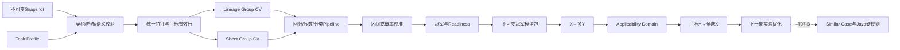

# AI配方预测与实验优化 T07-A完整实施报告

> 范围：T07-A、A.1、A.2、A.3、A.4、A.5  
> 完成日期：2026-09-04  
> 状态：上述T07-PRE阶段全部`COMPLETED`；`T07-B = PENDING`  
> 环境：`SYNTHETIC / DEVELOPMENT`；`productionEligible=false`；生产模型`NOT ACTIVE`

## 1. 实施结论

T07-PRE已在不依赖T03—T06的边界内完成算法核心。独立`jsd-aird-ai`目前具备：

1. 标准TrainingSnapshot、来源、配方语义与哈希校验；
2. UV/PU配方、工艺、环境和上下文特征工程；
3. Continuous目标的GP、RF、LightGBM、XGBoost、CatBoost五模型竞争；
4. Ordinal铅笔硬度的累积Logistic Pipeline；
5. Binary/Categorical目标的五分类器、概率校准和分类评分；
6. Formula Lineage与Source Sheet双Group CV、Readiness和Applicability Domain；
7. X→多Y正向预测、Y→X配方预测和下一轮实验优化；
8. BayBE四策略推荐、冲突解释、多样性、空间统计和Synthetic多轮回放；
9. 内容寻址模型包、FastAPI、CPU资源限制、wheel与Compose交付。

这表示Synthetic开发版“正向预测、配方预测、实验优化”均已形成闭环，不表示真实客户生产
闭环完成。当前没有连接PostgreSQL、T05、T06、客户接口、正式实验或模型激活。

| 阶段 | 状态 | 内容 |
|---|---|---|
| T07-A/A.1 | COMPLETED | 独立服务、快照、X→多Y、基础BayBE、黄金契约 |
| T07-A.2 | COMPLETED | 双Group CV、五回归模型、统一UQ、Ordinal、配置化门禁 |
| T07-A.3 | COMPLETED | OOD、嵌套Conformal独立验收、稳定性和批量性能 |
| T07-A.4 | COMPLETED | 实验优化四策略、冲突、多样性、空间统计和多轮回放 |
| T07-A.5 | COMPLETED | Binary/Categorical五分类器、校准、Readiness和OOD |
| T07-B | PENDING | REAL Snapshot、正式基线、规则、存储、激活和客户流程 |

## 2. 数据流与解耦边界



本阶段未接PostgreSQL、未新增Flyway、未读取T03—T06 Repository，未修改
`ExperimentAnalysisView`、Similar Case、ResearchRun或Java Hard Rules，也未创建正式实验。
Java侧只同步语言无关契约DTO，不包含控制器、数据库和业务流程。

## 3. 工程、依赖与运行边界

服务版本`0.5.0`，生产镜像目标Python 3.12；当前隔离环境使用兼容Python。A.5没有新增
第三方包，而是复用A.2固定的分类能力。

| 组件 | 版本 | 用途 |
|---|---:|---|
| FastAPI/Pydantic | 0.116.1/2.11.7 | 内部HTTP和契约 |
| pandas/PyArrow | 2.3.2/21.0.0 | 表格与标准Parquet |
| scikit-learn | 1.7.1 | GP、RF、Logistic、预处理、指标与校准 |
| LightGBM | 4.7.0 | 回归/分类challenger |
| XGBoost | 3.2.0 | 回归/分类challenger |
| CatBoost | 1.2.10 | 原生类别回归/分类challenger |
| BayBE | 0.15.0 | 约束空间多目标实验选择 |
| joblib | 1.5.1 | 冠军模型序列化 |

容器为CPU-only、非root、只读根文件系统、临时工作目录和capabilities清零；线程默认2且可
配置，禁止`n_jobs=-1`。在线评分只加载逐目标冠军，challenger不常驻内存。

## 4. `formula-model.v1`契约

Pydantic、JSON Schema与Java DTO继续共用`formula-model.v1`。新增字段均使用optional/default，
已有Continuous/Ordinal请求向后兼容。

| 接口 | 当前职责 |
|---|---|
| `POST /internal/v1/snapshots/validate` | 快照、哈希、来源、配方、上下文和目标覆盖 |
| `POST /internal/v1/models/train` | 双CV训练、校准、选择、模型卡和模型包 |
| `POST /internal/v1/models/score` | 连续区间、序数等级概率、分类概率和OOD |
| `POST /internal/v1/models/recommend` | 配方预测或下一轮实验优化 |
| `GET /internal/v1/health/live,ready` | 进程与算法依赖状态 |

请求绑定`contractVersion/requestId/taskProfileHash/snapshotHash/modelBundleHash/seed`。包内绑定
Snapshot、Task Profile、seed和算法库版本，任一不一致均拒绝评分。

| Target Type | 状态 | 输出 |
|---|---|---|
| CONTINUOUS | 已实现 | expected和90% calibrated interval |
| ORDINAL | 已实现 | 等级、各等级概率和90%等级区间 |
| BINARY | 已实现 | 类别、raw/calibrated概率、正类概率和阈值 |
| CATEGORICAL | 已实现 | 业务类别、各观察类别概率和置信度 |
| CENSORED_COUNT | RESERVED | `CENSORED_MODEL_NOT_IMPLEMENTED` |

真实钢丝绒出现“500次仍OK”必须表示`value=500/censored=true/censorType=RIGHT`，普通回归
不得静默训练。本次没有扩大范围实现Survival Analysis。

## 5. 400条UV/PU Synthetic黄金快照

| 项目 | 值 |
|---|---|
| Snapshot ID | `SYNTH-UVPU-APP-SHARED-PROCESS-20260903-V2-PYARROW1` |
| 性质/用途/资格 | `SYNTHETIC / DEVELOPMENT / false` |
| 行数/谱系/Sheet | 400 / 40 / 67 |
| measurements | 24列，SHA `041aea56cf0b7c969c102ff5c3d8298a8f204c1ee5f523b66bdc7edbc06d5c70` |
| source-map | 16列，SHA `6d95a955b5e5c4b9f0d6dc25de17facbf8a1bfbb018a1de0f7a36691cfcd2366` |
| Snapshot Hash | `7d6bacda2b75821e446d763856c0ee38e509019c1feacbd2d665f26e01f92cde` |

原自定义Parquet与PyArrow 21不兼容，因此保留原件，并从原Synthetic XLSX生成独立标准
PyArrow副本。训练只读manifest、measurements和source-map；XLSX仅用于追溯。XLSX展示值
有舍入，不能当作物理真值。

24列由实验版本ID、9个配方材料、6个数值工艺/环境、3个分类上下文和5个Y组成。

| Y | 类型 | 有效/缺失 | 语义 |
|---|---|---:|---|
| 初始翘曲 | CONTINUOUS | 378/22 | cm，越小越好 |
| 12小时翘曲 | CONTINUOUS | 371/29 | 25个0.0为真实结果 |
| 1kg铅笔硬度 | ORDINAL | 386/14 | H/2H/3H/4H；观察到H～3H |
| 500g钢丝绒 | CONTINUOUS | 380/20 | 明确失效次数 |
| 1kg钢丝绒 | CONTINUOUS | 306/94 | 缺失不填0、不插补 |

各目标独立过滤缺失；同一目标的所有算法使用完全相同的有效行、fold、Baseline和指标。

## 6. 配方、工艺、上下文与特征工程

任务档案为`UVPU_APPLICATION_FORMULATION / 1.0`。配方总量100±0.02，六种主树脂严格
六选一；DSP-3315和SS059/PC=1/1为添加剂，S-48为平衡组分。

| 材料 | 角色 | 档案边界/% | 步长 |
|---|---|---:|---:|
| SJ-230/SJ-231/SJ-232 | MAIN_RESIN | 45～75 | 0.1 |
| 三种WASHED主树脂 | MAIN_RESIN | 45～75 | 0.1 |
| DSP-3315 | ADDITIVE | 0.8～2.3 | 0.1 |
| SS059/PC=1/1 | ADDITIVE | 0.8～1.8 | 0.1 |
| S-48 | BALANCE | 20～55 | 0.1 |

搜索使用`S-48 = 100 - 主树脂 - DSP-3315 - SS059/PC=1/1`派生，避免总和漂移和完全
共线；接口仍保留9材料宽表。

| 字段 | 类型/单位 | Synthetic范围或类别 | Sheet共享 | 当前可调 |
|---|---|---|---|---|
| coatingSolidsPct | 数值/% | 38～42 | 是 | 否 |
| uvaIntensityMwCm2 | 数值/mW·cm⁻² | 145～185 | 是 | 否 |
| uvEnergyMjCm2 | 数值/mJ·cm⁻² | 650～950 | 是 | 否 |
| filmThicknessUm | 数值/μm | 7.32～12.46 | 否 | 否 |
| temperatureC | 数值/℃ | 23～29 | 是 | 否 |
| humidityRhPct | 数值/%RH | 50～75 | 是 | 否 |
| substrate | 类别 | PET_100UM_OPTICAL | 是 | 否 |
| applicationMethod | 类别 | WIRE_BAR_ROLL_COAT_40UM | 是 | 否 |
| curingSource | 类别 | MERCURY_LAMP_UV | 是 | 否 |

九材料压缩为`__MAIN_RESIN_CODE`、`__MAIN_RESIN_PCT`、两个添加剂和S-48，再加入工艺、
环境与上下文。GP/RF/LightGBM/XGBoost/Logistic使用统一OneHot Pipeline；CatBoost原生处理
主树脂、基材、施工方式和固化光源。两种表示共享完全相同的训练/验证行。

## 7. A.2：双Group CV、Baseline和五回归模型

每个目标同时执行默认5折Lineage GroupKFold与5折Source Sheet GroupKFold。同谱系不得跨
Lineage训练/验证，同Sheet不得跨Sheet训练/验证。随机KFold仅供诊断。67个Sheet全部包含
多个lineage，最大6个；两套CV不能互相替代，Readiness要求两侧同时达标。

开发Baseline固定为：

```text
type = DEVELOPMENT_KNN
version = group-knn-v1
```

生产要求`T06_SIMILAR_CASE`，所以击败KNN仍返回`FORMAL_BASELINE_REQUIRED`。

Continuous候选为GP/RF/LightGBM/XGBoost/CatBoost。所有超参数选择仅在外层训练折内最多
3折Group CV进行。冠军最小化两套CV中较差NMAE，并检查Baseline、UQ、类型、eligibility和
训练状态；NMAE差<0.01才按`GP > CatBoost > XGBoost > LightGBM > RF`近似平局顺序。
GP/RF最低30条，三Boosting最低150条；当前四目标均全员参赛。

### 7.1 400条五模型核心结果

下表为Lineage/Sheet NMAE；PICP采用A.3外层独立验收口径。完整MAE、RMSE、R²、Spearman、
fold指标、参数、区间和耗时保存在模型卡。

| Target | GP | RF | LightGBM | XGBoost | CatBoost | Champion |
|---|---:|---:|---:|---:|---:|---|
| 初始翘曲 | .09685/.09259 | .11535/.11215 | .10816/.10246 | .10745/.10345 | .10791/.10043 | GP |
| 12h翘曲 | .06082/.06009 | .07234/.06733 | .07147/.06452 | .07138/.06452 | .07952/.06724 | GP |
| 500g钢丝绒 | .05251/.05209 | .07210/.06866 | .06492/.06213 | .06708/.06496 | .05807/.05999 | GP（近似平局） |
| 1kg钢丝绒 | .07780/.07658 | .09772/.10196 | .09870/.09271 | .09069/.08832 | .08814/.08945 | GP |

Baseline NMAE依次为0.13496/0.12883、0.24292/0.17482、0.16565/0.14139、
0.16733/0.16024；冠军最差侧改善约28.1%、65.6%、63.2%、52.2%。这只证明固定Synthetic
Snapshot上的统一验证结果，不能推断GP最适合真实客户，也不能删除其他challenger。

### 7.2 Ordinal硬度

H/2H/3H/4H仅在内部编码1/2/3/4；模型训练K-1个`P(Y>level)` Logistic阈值分类器，做
累计概率单调修正后恢复等级概率。缺少4H仍可训练；观察等级少于2则`MODEL_NOT_READY`。

| CV | gradeMAE | ±1 Accuracy | Spearman | PICP90 | 等级宽度 |
|---|---:|---:|---:|---:|---:|
| Lineage | .2176 | 1.0000 | .6960 | 1.0000 | .8187 |
| Sheet | .1917 | 1.0000 | .7174 | 1.0000 | .8083 |

## 8. A.3：UQ、Applicability Domain与稳定性

连续90%区间不使用全量训练残差。每个外层折只用该折训练集内部的分组OOF绝对残差校准，
再在未参与校准的外层验证行统计PICP；最终部署半径来自完整外层OOF。GP另存posterior/raw
interval，其他模型raw interval为`null`。生产PICP门禁为0.85～0.95。

四个GP冠军的A.3 Lineage/Sheet PICP依次为0.8968/0.9206、0.9461/0.9084、
0.9158/0.9132、0.9379/0.8856。A.3后覆盖率不再机械地都约0.905，证明校准与验收隔离。

适用域逐目标检查未知类别、数值观察范围/稳健边界、统一空间最近训练距离，并返回最近行ID、
阈值和触发字段。结果为`IN_DOMAIN/NEAR_BOUNDARY/OUT_OF_DOMAIN`；OOD时
`modelUsable=false`。分类目标复用同一门禁。

稳定性制品固定有效行ID、Lineage/Sheet fold、OOF摘要、参数、seed和依赖版本。评分工具支持
1/20/100/1,000/20,000行；当次20,000行约40.43秒、494.68行/秒、Python跟踪峰值
431.4MiB，仅是开发机基准，不是生产SLA。

## 9. A.4：配方预测和下一轮实验优化

`FORMULA_PREDICTION`主要找最可能满足Y的X；`EXPERIMENT_OPTIMIZATION`同时考虑预测性能、
保守边界、不确定性、覆盖不足、历史距离、批次多样性和信息价值，二者不是同一排序函数换名。

Sobol/类别枚举候选先过主树脂互斥、材料边界、步长、S-48和总量，再去重；只针对本次请求
目标执行A.3适用域。OOD在冠军评分前剔除，Near Boundary只允许受控探索。响应记录原始数、
配方淘汰、重复、OOD、Near、历史近重复、多样性淘汰、可评分数和空间不足原因。

| 策略 | 定义 |
|---|---|
| CONTROL | 原baseline复测；不合规则明确`NEAREST_FEASIBLE_BASELINE` |
| CONSERVATIVE | 靠近当前好配方并优先强制目标保守区间 |
| BALANCED | 多目标desirability最优并解释冲突/退让 |
| EXPLORATORY | 非OOD、有基本潜力、有信息/覆盖价值，且远离历史和同批候选 |

候选返回配方差异、预测Y/区间、domainStatus、最近训练/历史/baseline距离、desirability、
目标改善/退让和选择理由，不输出容易误作因果的SHAP说明。

多轮回放只读400条Snapshot：100条Round 0，每轮推荐4组、通过独立ExtraTrees Synthetic
oracle取得Y、只加入内存并重训，连续5轮；随机可行和局部扰动维护独立历史。原快照哈希
前后相同。

| 等预算20实验 | AI | Random | Local |
|---|---:|---:|---:|
| 最佳新实验desirability | .7197 | .7025 | .6775 |
| 新实验均值 | .6507 | .5212 | .6469 |
| 强制目标命中率 | 70% | 55% | 100% |
| 首次命中实验数 | 1 | 3 | 1 |
| Pareto新增贡献 | 4 | 4 | 0 |

Round 0已有全局最高0.7336，三策略全历史最佳改善均为0。探索点即时收益均为负，但仅加入
探索点后五轮held-out NMAE平均改善+0.000637、IN_DOMAIN覆盖变化+0.00267，区间宽度略
变差-0.00192。信息收益微弱且混合，不能声称AI稳定优于基线或代表真实研发效果。

## 10. A.5：Binary/Categorical Pipeline

### 10.1 契约、模型、指标和Readiness

Binary要求恰好两个`classLabels`、`positiveClass`和默认0.5阈值；Categorical要求至少两个
无序业务类别且不得配置正类。两者都竞争LogisticRegression、RandomForestClassifier、
LightGBMClassifier、XGBoostClassifier和CatBoostClassifier；使用balanced sample weight。
前四者OneHot，CatBoost原生类别，所有模型共享target mask、类别编码和双CV fold。

Binary指标：ROC-AUC、PR-AUC、log loss、Brier、precision、recall、F1、少数类recall和
confusion matrix。Categorical指标：macro/weighted F1、balanced accuracy、log loss、
per-class precision/recall/F1和confusion matrix。分类不使用R²/NMAE。

| 类型 | minSamples | 类别与组门槛 |
|---|---:|---|
| Binary | 80 | 少数类≥20；Lineage/Sheet各≥12；AUC/PR/F1/logloss/Brier双CV |
| Categorical | 80 | 观察类≥2、每类≥10；Lineage/Sheet各≥12；macroF1/BalAcc/logloss双CV |

LR/RF eligibility为30条，三Boosting分类器为80条。单类别、少数类/某观察类不足返回
`MODEL_NOT_READY`。单challenger失败不连坐。Binary冠军综合校准log loss、PR-AUC、F1和
少数类recall；Categorical综合macro-F1、balanced accuracy和校准log loss，不能只按accuracy。

### 10.2 概率校准与缺类安全

每个外层Lineage/Sheet折内，参数选择和Platt/Isotonic校准只读外层训练行；校准概率来自
内层Group OOF，外层验证行只用于最终指标。全量部署校准器使用完整外层OOF。模型卡保存
raw/calibrated log loss、Brier、ECE和`GROUP_ISOLATED_OOF`来源。外层fold缺类别时通过
局部类别对齐/Dummy策略安全处理，不改全局业务编码。

### 10.3 独立Synthetic分类fixture

A.5未修改400条黄金快照。工具复制其中前120条X到内存，以固定seed生成两个独立分类Y：

| Target | 类别计数 |
|---|---|
| `Y__SYNTHETIC_PASS_FAIL` | PASS 64、FAIL 56 |
| `Y__SYNTHETIC_DEFECT_MODE` | CRACK 57、NO_DEFECT 26、BLISTER 21、PEEL 16 |

fixture为`SYNTHETIC/DEVELOPMENT/productionEligible=false`；Snapshot Hash
`78b4891607e8f86a15eb2653d2dd3e36ee07b80516dcbf6c5913a78fd6f6daa3`，Task Profile Hash
`03004041359af0612f4fd0d5f486a6a984135800e79ec576c6785d3c37c4b405`。

### 10.4 Binary五模型结果

| Model | Lineage AUC/PR/F1/Cal-LL | Sheet AUC/PR/F1/Cal-LL | 训练s |
|---|---|---|---:|
| LogisticRegression | .8781/.9028/.8031/.4517 | .8786/.9028/.8209/.4489 | 1.10 |
| RF | .7746/.7978/.7287/.5682 | .7999/.7976/.8062/.5634 | 10.58 |
| LightGBM | .7813/.7840/.7500/.5659 | .8022/.7985/.7200/.5492 | 1.25 |
| XGBoost | .7673/.7779/.7258/.5787 | .7882/.7704/.7460/.5671 | 3.34 |
| CatBoost | .7405/.7811/.7442/.5925 | .7352/.7571/.7023/.6256 | 521.16 |

Binary冠军为LogisticRegression；最差侧综合分0.340369，为最低值。

### 10.5 Categorical五模型结果

| Model | Lineage MacroF1/BalAcc/Cal-LL | Sheet MacroF1/BalAcc/Cal-LL | 训练s |
|---|---|---|---:|
| LogisticRegression | .4891/.5262/.7296 | .4667/.4831/.8693 | 1.77 |
| RF | .4706/.5001/.8082 | .4313/.4594/.8489 | 11.35 |
| LightGBM | .4859/.5097/.7704 | .4462/.4499/.7792 | 2.26 |
| XGBoost | .4514/.4859/.7741 | .4565/.4618/.7745 | 5.43 |
| CatBoost | .4449/.4960/.7804 | .4319/.4416/.7439 | 566.79 |

#### 10.5.1 Champion selection核对（2026-09-05）

Categorical使用“越低越好”的统一误差分数。四分类的单侧CV分数为：

```text
macroLoss       = 1 - macroF1
balancedLoss    = 1 - balancedAccuracy
normalizedLogLoss = calibratedLogLoss / ln(4)
sideScore       = 0.40 * macroLoss
                + 0.25 * balancedLoss
                + 0.35 * normalizedLogLoss
selectionScore  = max(lineageSideScore, sheetSideScore)
```

Macro-F1和Balanced Accuracy先转成损失，方向正确；calibrated log loss本身越低越好，按
`ln(类别数)`归一化，均匀随机四分类的log loss对应归一化值1。log loss不做截断，因此极差
概率可以大于1，不会被错误压平。三个权重为0.40/0.25/0.35，总和为1。

Lineage侧的归一化值、加权贡献和最终侧分数如下；括号中为乘权重后的贡献：

| Model | `1-MacroF1` ×.40 | `1-BalAcc` ×.25 | `Cal-LL/ln(4)` ×.35 | Lineage score |
|---|---:|---:|---:|---:|
| LogisticRegression | .510891 (.204356) | .473781 (.118445) | .526281 (.184198) | .507000 |
| RF | .529406 (.211762) | .499880 (.124970) | .582986 (.204045) | .540777 |
| LightGBM | .514092 (.205637) | .490264 (.122566) | .555714 (.194500) | .522703 |
| XGBoost | .548636 (.219454) | .514074 (.128518) | .558397 (.195439) | .543412 |
| CatBoost | .555076 (.222030) | .504000 (.126000) | .562956 (.197035) | .545065 |

Sheet侧采用完全相同的转换和权重：

| Model | `1-MacroF1` ×.40 | `1-BalAcc` ×.25 | `Cal-LL/ln(4)` ×.35 | Sheet score |
|---|---:|---:|---:|---:|
| LogisticRegression | .533280 (.213312) | .516884 (.129221) | .627102 (.219486) | .562019 |
| RF | .568718 (.227487) | .540630 (.135158) | .612337 (.214318) | .576963 |
| LightGBM | .553841 (.221536) | .550131 (.137533) | .562053 (.196719) | .555788 |
| XGBoost | .543521 (.217409) | .538227 (.134557) | .558716 (.195551) | .547516 |
| CatBoost | .568087 (.227235) | .558430 (.139608) | .536579 (.187803) | .554645 |

最终取Lineage/Sheet较差的一侧。A.5冻结修正后，最低`selectionScore`同时就是最终冠军；
`Δchampion = selectionScore - 0.547516`。原0.01近似平局带仅作为诊断信息，不再改变排序：

| Model | Lineage | Sheet | selectionScore | Δchampion | 原0.01诊断带 |
|---|---:|---:|---:|---:|---|
| LogisticRegression | .507000 | .562019 | .562019 | +.014503 | 否 |
| RF | .540777 | .576963 | .576963 | +.029447 | 否 |
| LightGBM | .522703 | .555788 | .555788 | +.008272 | 是 |
| XGBoost | .543412 | .547516 | **.547516** | .000000 | 是 |
| CatBoost | .545065 | .554645 | .554645 | +.007129 | 是 |

冻结前逻辑会将XGBoost、CatBoost、LightGBM放入0.01近似平局集合，再按固定算法顺序选择
CatBoost。这虽然符合旧配置，但会让固定名称顺序覆盖数值更优且显著更便宜的XGBoost，因此
已在A.5内部修正。冻结后的**数值最优模型和最终冠军均为XGBoost**，模型卡选择原因固定为：

```text
lowest worst-group classification score 0.547516;
categorical approximate tie tolerance is diagnostic-only and cannot override the numeric best
```

Categorical只有在最低分真实相等时才进入决胜：`rel_tol=0`、`abs_tol=1e-12`。顺序依次为：

1. 双CV fold稳定性：`max(std(lineageFoldScores), std(sheetFoldScores))`越低越好；
2. 概率质量：Lineage/Sheet较差侧calibrated log loss越低越好；
3. 成本：`trainingTime + predictionTime`越低越好；
4. 前三项仍完全相同时，才使用确定性`categoricalTieBreakOrder`保证可重复。

因此`tieScoreTolerance=0.01`仍可保留作历史兼容和诊断展示，但不再允许覆盖Categorical的
最低分模型；Binary选择逻辑保持不变。本次黄金训练中XGBoost训练5.43秒，CatBoost训练
566.79秒，CatBoost约为XGBoost的104倍，更没有成本理由覆盖更低分的XGBoost。

这也解释了LogisticRegression与CatBoost的表面矛盾：Logistic在两侧Macro-F1、两侧
Balanced Accuracy和Lineage calibrated log loss上都更好，但其Sheet log loss归一化贡献
为.219486，CatBoost为.187803，CatBoost在该项减少.031683；这超过Logistic在Sheet两个
分类指标贡献上的合计优势.024309，使CatBoost的worst-side分数仍比Logistic低.007374。
Logistic与最低分相差.014503，没有进入tie-break，未被CatBoost顺序直接覆盖。

核对结论：指标方向、四分类log loss归一化、权重和worst-side计算保持不变；本次只修正
Categorical最后一步冠军选择，不修改Binary/Continuous/Ordinal/OOD/BayBE。Synthetic fixture、
Snapshot Hash、Task Profile Hash和seed未变，并已重新执行完整五分类器双CV黄金训练。

CatBoost耗时显著更高，真实数据必须继续评估收益/成本。多分类Logistic Lineage
raw→calibrated log loss为.88→.73，CatBoost Sheet为.84→.74；Binary部分模型校准后略变差，
raw/calibrated均原样记录。

分类包仅保存两个冠军：Binary LogisticRegression、Categorical XGBoost。新包149,629 bytes，SHA
`efe8fb5be443c4e288be7cc87e913d4075fdbceb152df88c04ca0099afdea4db`。未知基材实测时，
两类预测仍返回诊断概率，但都标`OUT_OF_DOMAIN/modelUsable=false`，不得绕过回退。
完整分类训练JSON为66,581 bytes，SHA
`9214d7394732dcf3fdfc3bc56c0dd26eba822eafee189785adcbfcd11b2e2521`，包含每个challenger的
双CV、raw/calibrated概率指标、最终参数、耗时、冠军和阻断原因。

## 11. 正向预测

同一Continuous/Ordinal请求可返回4个连续Y和1个序数Y。固定黄金X结果：

| Y | expected/类别 | 90%区间 | scorer |
|---|---:|---:|---|
| 初始翘曲cm | 2.5867 | [2.1907,2.9826] | GP |
| 12h翘曲cm | 3.0896 | [2.5536,3.6257] | GP |
| 500g钢丝绒 | 226.2882 | [161.5507,291.0257] | GP |
| 1kg钢丝绒 | 52.6298 | [18.2688,86.9907] | GP |
| 铅笔硬度 | 2H | [2H,3H] | ORDINAL_CUMULATIVE_LOGIT |

硬度概率为H .0027、2H .9331、3H .0642、4H 0。Binary/Categorical在独立
`classificationPredictions`返回业务类名、raw/calibrated概率、正类概率、阈值、置信度、
scorerType和OOD。所有输出都是模型预测，不是实验实测。

## 12. 模型包、哈希与可重复性

Schema SHA：`6c37a8db437fbc8dd53806b5e9361c76ba68f2466bfa1984c02b7f38f8d23dd1`。正式UVPU开发
Task Profile Hash：`0f7b83313310dee15d6d75469852b28ecf5cd26b33e5dba4768a5afbf2f77666`。

A.4冠军权重仅因Schema/default字段扩展执行受控重封装；函数强制除schemaHash外完整语义
一致。新包2,295,871 bytes，SHA
`d6c56b40d8775268c4f8387c4ad627ba2d17a52eec45e8fa4ab00bdb41b5b1b6`。

包内固定manifest、joblib payload、model card和task profile，逐文件哈希通过后才反序列化。
损坏、恶意路径、错误Snapshot/Profile/seed/算法版本均拒绝。耗时从算法等价身份剥离，避免
机器快慢导致虚假不等价；数据、fold、参数和依赖变化仍改变身份。

## 13. 修改文件

- Python：`contracts.py`、新增`classification.py`、`modeling.py`、`snapshot.py`、
  `readiness.py`、`service.py`、新增`synthetic_classification.py`；
- 工具：新增分类黄金训练和score黄金刷新工具；
- 配置：Task Profile分类eligibility/selection/calibration、版本0.5.0、Compose镜像；
- 契约：JSON Schema、score request/response黄金fixture、Java DTO与测试；
- 测试：`test_t07_a5_classification.py`当前26项（含6项Champion selection专项核对）；
- 文档：README、开发任务总表、详细设计和本完整报告。

## 14. 测试与构建

| 项目 | 结果 |
|---|---|
| A.5专项（当前） | 26 passed，0 failed；24.73秒 |
| Champion selection专项核对 | 6 passed，0 failed；已包含在上述26项内 |
| A.5固定seed黄金重训 | 通过；Binary=LogisticRegression，Categorical=XGBoost |
| A.5完成时Python全量基线 | 113 passed，0 failed |
| compileall | 通过 |
| pip check | No broken requirements found |
| lock一致性 | 83/83，0差异 |
| wheel | `jsd_aird_ai-0.5.0-py3-none-any.whl`，87,316 bytes |
| wheel SHA | `59315d14de5de8d8019017c1813da7fac6a35d655eead516f30a6d863d265c11` |
| Compose config | 退出码0，镜像`jsd-aird-ai:0.5.0` |
| Java DTO JDK21独立编译 | 通过 |

A.5测试覆盖五分类器竞争/固定seed、单类别/少数类阻断、外层fold缺类、校准无外层验证泄漏、
raw/calibrated指标、业务类名、分类OOD、每种算法可成为冠军、单challenger失败隔离和包加载。
专项测试逐项固定Categorical方向、`ln(4)`归一化、0.40/0.25/0.35权重、黄金候选
selectionScore、worst-side、近似容差不得覆盖更低分，以及真实同分时稳定性、概率质量、成本、
固定顺序四级决胜。全量基线还覆盖Continuous、Ordinal、多Y、哈希/篡改、A.3 OOD和A.4
BayBE回放。本次按原Snapshot、Task Profile和seed重新执行A.5分类黄金训练并重建模型包；
没有重跑或改写Continuous/Ordinal/A.3/A.4制品。

仓库Maven在JDK21下仍被既有非T07代码阻断：`ResearchTestService.java:47`调用不存在的
`ExperimentImportService.parseSourceFile(...)`。本任务未越界修改T03—T06。Compose仅有本机
Docker配置权限警告，解析退出码仍为0；未伪造Docker daemon启动结果。

## 15. 当前不可生产原因与T07-B入口

不可生产原因：数据是Synthetic，Snapshot是Development且资格false；连续Baseline不是T06
Similar Case；分类fixture不是客户标签；没有REAL Snapshot、Java硬规则、客户权限、正式实验、
反馈回灌、数据库版本/激活/回退和线上监控；CENSORED_COUNT仍未实现；Synthetic oracle也不是
物理真值。

全部Synthetic训练明确包含：

```text
SYNTHETIC_DATA_NOT_PRODUCTION_ELIGIBLE
SNAPSHOT_PURPOSE_NOT_PRODUCTION_ELIGIBLE
SNAPSHOT_PRODUCTION_ELIGIBLE_FALSE
```

T07-B应复用现有Target Registry、Feature/Validation/UQ/OOD/Selection、Model Bundle、BayBE和
FastAPI，只替换T05 REAL Snapshot并接T06正式Baseline、Java规则、对象存储授权、异步训练、
数据库历史、人工激活/回退、客户任务和正式反馈。

## T07-A.6 第5批整体回放与冻结（2026-09-10）

第5批使用第1～4批已经冻结的Synthetic/Development制品执行整体回放，没有重新训练模型、没有使用CatBoost、没有激活模型，也没有修改历史快照、历史模型包、候选档案1.2或T07-B生产档案。

独立回放制品位于：

`UVPU_APPLICATION_FORMULATION_Synthetic_Model_Development_Batch5_Replay_V1_PyArrow`

回放覆盖历史Schema 1.0、Extended Schema 1.1、18个目标列、PC/PET与附着力条件隔离、范围/缺失/结构零/删失语义、基础/增强模型卡哈希、T06同折案例基线、正向评分和5轮优化回放。

关键结果：

- 历史V3 Excel、旧快照三制品及第4批模型制品哈希保持不变。
- Extended V1保持400条唯一`analysis_row_id`；UV表干为`322 OK / 78 NOT_OK`；12个新增目标保持`INSUFFICIENT_DATA`。
- T06回放使用同一不可变验证折，验证样本不会成为自身邻居，输出4316条按目标/fold组织的观察记录。
- 5轮Synthetic优化回放通过，输入快照前后未发生变化。
- 所有Synthetic模型仍为`productionEligible=false`、`NOT ACTIVE`。

本批已知限制继续保留：第4批按要求省略CatBoost；UV表干Logistic候选因PR-AUC浮点边界校验失败而隔离；仓库既有全量Python回归的历史Schema哈希基线不一致未在本批改写。详细证据见[第5批整体回放与冻结实施报告](./AI配方预测与实验优化_T07-A.6第5批整体回放与冻结实施报告.md)。

```ini
T07-A/A.1/A.2/A.3/A.4/A.5 = COMPLETED
T07-B = PENDING
T07 overall = NOT COMPLETED
environment = SYNTHETIC / DEVELOPMENT
productionEligible = false
productionModel = NOT ACTIVE
```
