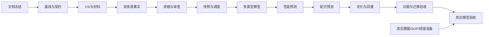

# AI研发模块开发任务总表

> 文档状态：持续维护  
> 当前版本：V3.1（R10执行中）<br>
> 最后更新：2026-09-17<br>
> 适用范围：模板中心、数据中心、实验本、配方预测、性能预测、实验优化、模型中心（模型列表、建模设置）<br>
> 唯一生效路径：`docs/AI实验优化、配方预测/AI配方预测与实验优化_开发任务总表.md`
>
> `docs`根目录下的同名文件是被`.gitignore`忽略的历史副本，不作为开发依据。
> 当前设计：[AI研发模块_页面与后端重构详细设计_V4.1.md](./AI研发模块_页面与后端重构详细设计_V4.1.md)<br>
> R01实施报告：[R01_数据库基线、一次性升级与契约冻结_实施报告.md](./R01_数据库基线、一次性升级与契约冻结_实施报告.md)<br>
> R02实施报告：[R02_YX输入方案、材料字典与建模设置_实施报告.md](./R02_YX输入方案、材料字典与建模设置_实施报告.md)<br>
> R03实施报告：[R03_实验双入口导入、双来源事实与统一样本_实施报告.md](./R03_实验双入口导入、双来源事实与统一样本_实施报告.md)<br>
> R04实施报告：[R04_资格引擎、覆盖率、漏斗与人工审查_实施报告.md](./R04_资格引擎、覆盖率、漏斗与人工审查_实施报告.md)<br>
> R05/R06联合实施报告：[R05_R06_训练快照、多类型模型与模型管理_联合实施报告.md](./R05_R06_训练快照、多类型模型与模型管理_联合实施报告.md)<br>
> R07实施报告：[R07_多目标正向性能预测与页面_实施报告.md](./R07_多目标正向性能预测与页面_实施报告.md)<br>
> R08实施报告：[R08_模型驱动配方搜索与配方预测页面_实施报告.md](./R08_模型驱动配方搜索与配方预测页面_实施报告.md)<br>
> R09实施报告：[R09_实验优化、草稿创建与实测回灌_实施报告.md](./R09_实验优化、草稿创建与实测回灌_实施报告.md)<br>
> R10实施报告：[R10_全链路功能验收、迁移演练与废弃逻辑清理_实施报告.md](./R10_全链路功能验收、迁移演练与废弃逻辑清理_实施报告.md)<br>
> 历史设计：[轻量版AI配方预测与实验优化详细设计方案_V1.0.md](./轻量版AI配方预测与实验优化详细设计方案_V1.0.md)

## 0. 当前生效决策与执行入口（2026-09-13）

本节、第13～16节及当前V4.1详细设计是本轮实施依据。第2～12节保留T00～T08历史范围、实现说明和原验收记录；其中“只做两个入口、实验本唯一供数、归一化到100%、CASE_STAT_RULE/HYBRID在线降级、保持旧接口/Schema兼容”等已被本轮决策替代，不得据历史章节恢复这些规则。

R00已完成文档冻结，R01已完成数据库基线、一次性升级工具与契约冻结，R02已完成Y/X、输入方案、材料字典和建模设置，R03已完成双入口导入、来源互通和统一事实，R04已完成资格引擎，R05/R06已完成训练快照、多类型训练和模型管理，R07已完成多目标正向性能预测，R08已完成模型驱动配方搜索，R09已完成实验优化、草稿创建与实测回灌；旧T08不再是当前执行入口。

当前状态：**R00～R09已完成，R10执行中，R11等待真实输入**。快速定位：[当前任务R00～R11](#current-tasks) · [R10实施报告](./R10_全链路功能验收、迁移演练与废弃逻辑清理_实施报告.md)。R10 已在独立 PostgreSQL 临时集群完成 V1～V63 真实迁移、旧表删除、旧链接证据保全和保护数据哈希核对，并完成客户模板导入、实验来源跳转、正向预测、配方预测4候选及优化候选到客户模板 DRAFT 的浏览器核对；Java 全量回归仍有既有 ArchUnit/Word 固件失败，因此暂不标记 R10。独立临时 PostgreSQL 迁移和恢复作为正式证据。R11 因真实来源文件、SOP、阈值、类别、材料身份和适用域资料未齐，标记 `WAITING_INPUT`。合成模型继续保持 `production_eligible=false`。

### 0.1 已确认规则

| 决策 | 当前口径 | 任务落点 |
|---|---|---|
| 页面范围 | 配方预测、性能预测、实验优化、模型中心四个顶级入口整体重构；模型中心内部保留模型列表与建模设置两块职责 | R02、R04、R06～R09 |
| 目标范围 | UV/PU目标，配置可扩展；保留18个目标语义并补充60°光泽；不扩展合成路线优化 | R02、R06 |
| 多类型 | 连续、序数、二分类、多分类功能验收；光泽、硬度、UV表干为业务代表 | R06、R10、R11 |
| 数据来源 | 数据中心确认提交、实验本当前COMPLETED版本统一供数 | R03 |
| 常规审核 | 复用数据中心确认提交，不额外建立训练数据集审核；异常/未知材料等专项审查 | R03、R04 |
| 同源关系 | 一个逻辑样本只计一次，正式实验完成后优先；修订/作废不复活旧导入 | R03、R05 |
| 配方比例 | 明确百分比98.8%保留原值并提示，可通过其他门禁后使用；不自动补齐/归一化 | R04、R06～R09 |
| Y与X | Y、输入方案、材料字典、预处理独立版本化；预测使用ACTIVE绑定方案 | R02、R05～R07 |
| 训练发布 | 自动训练、人工启用；同组织同Y最多一个ACTIVE | R05、R06 |
| 正式结果 | 三个业务入口必须有可用模型；历史案例仅作证据与离线验证基线 | R07～R09 |
| 清理策略 | 保留模板、来源、实验、材料、公共审计；重建旧AI数据，不保留旧契约兼容 | R01、R10 |
| 验收策略 | 功能验收与真实模型验收分开；SYNTHETIC不能生产启用 | R10、R11 |

### 0.2 当前事实与历史证据的区别

- 代码已有T07-B模型构建、快照、目标级激活和Python计算链路；没有四个顶级入口及模型中心双主页签的新页面和新业务规则完整实现。
- 2026-09-12核查的本地库曾处于V52，缺少`rnd.experiment`及新模型表，另一个5433配置端口未启动；该条是R01开始前的历史快照。2026-09-14按R01 foundation DDL补齐缺失基础表并由Flyway迁移至V57，API和worker已使用当前`.env`成功启动。
- 此结论只针对该本地连接，不能推断其他环境；旧测试报告中的真实导入ID、样本数量与测试数量保持为历史记录，不表示该本地库当前仍有这些数据。
- R01必须先处理新环境缺失领域基线与迁移前置依赖，不能直接运行后续迁移后假定实验本完整。
- 旧T00～T07的COMPLETED保留其历史含义。本轮没有重跑业务测试，不将旧通过数算作R00或新重构验收。

### 0.3 资料与冲突处理

用户确认规则优先，其次为V4.1业务文档、V3.7最终生效交互（含文件尾部V3.7.1修订）、V3.5补充交互。性能分类仅为Y标签，建模设置只保留Y与X两个管理对象。参考文档表结构和基础设施选型不直接照搬，保留React、Java、独立Python、PostgreSQL Worker、对象存储和现有IAM。

真实SOP、类别、样本、材料字典内容、误差/概率阈值和适用域依据在R11收集与批准，不能拿原型示例数值当生产常量。物理DDL及接口Schema在R01落实时不得改变以上业务决策。

---

## 1. 文档用途

本文件是AI研发模块后续开发任务的唯一维护入口。

- 任务范围、依赖、接口、状态和验收标准以后都在本文件维护。
- T00、T01、T02实施报告只作为已完成证据，不再承担后续规划。
- 详细设计文档说明整体方案；本文件说明“下一步开发什么、做到什么算完成”。
- 用户确认的新规则应及时写入当前决策区；历史文件不能覆盖用户本次明确指令。
- 每完成一个任务，必须在本文件记录实际变更、测试结果、顺延内容和下一任务入口。

状态定义：

| 状态 | 含义 |
|---|---|
| `COMPLETED` | 已实现并取得验证结果 |
| `IN_PROGRESS` | 当前正在开发，同一时间只允许一个主任务处于该状态 |
| `READY` | 依赖满足，可以开始 |
| `BLOCKED` | 存在明确阻断条件 |
| `PENDING` | 依赖尚未满足 |
| `SUPERSEDED` | 原任务被新任务替代，不再作为执行入口；保留历史范围与证据 |

---

## 2. 历史总体决策（T00～T07基线，非本轮当前规则）

> 以下记录解释旧实现及其验收背景。与第0节冲突的规则已失效；其余可复用能力也必须按R任务重新验证。

### 2.1 客户功能

客户最终只使用两个AI功能：

1. **AI配方预测**：输入目标性能和限制条件，输出4个候选配方。
2. **AI实验优化**：选择现有实验或候选配方，输出下一轮最值得开展的4组实验。

客户不操作训练数据集、模型参数、训练任务、模型发布或模型版本。研发Agent只负责理解用户目标、调用系统能力和解释结果，不建设单独的算法工作台。

当前首期业务任务固定为：

| 项目 | 当前范围 |
|---|---|
| 业务名称 | UV/PU应用性能配方预测与实验优化 |
| 内部任务档案代码 | `UVPU_APPLICATION_FORMULATION`，为兼容T07-A既有契约暂不改名 |
| 主要真实数据来源 | 应用测试报告及其关联的正式实验版本 |
| 模型学习内容 | 配方组成、共享工艺和应用条件与应用性能结果之间的统计映射关系 |
| 配方预测输出 | 根据目标应用性能和限制条件生成候选配方 |
| 实验优化输出 | 推荐下一轮最值得验证的应用配方实验 |
| 本期不包含 | 含氟树脂合成路线、合成工艺优化及其独立模型包 |

“含氟树脂合成”和“UV/PU应用性能”是两类不同研发任务。即使以后复用同一平台，也应分别建立任务档案、数据规则和模型版本，不能把两类数据直接混入当前模型包。

### 2.2 数据职责

```text
模板中心发布模板
→ 数据中心明确选择模板并上传
→ Sheet、字段、异常和数据确认
→ 保存结构化字段及来源坐标
→ 按需同步为实验本DRAFT
→ 人工审核成为COMPLETED
→ 案例分析、模型训练和实验优化
```

- 模板中心负责可复用地解释Excel结构和字段语义。
- 数据中心是表格文件解析、字段映射、校验和来源追溯的唯一责任点。
- 实验本中的XLSX、XLS、CSV入口必须复用数据中心，不再独立实现一套映射逻辑。
- 实验本是唯一正式实验主数据；只有`COMPLETED`实验版本可以作为正式案例或模型输入。
- `data.data_record/data.data_value/data.source_anchor`保留为结构化明细和来源证据，不等于正式实验。
- `ai.training_dataset/ai.training_dataset_record`保留兼容，但新方案不消费它们。
- 不新增持久化`ExperimentCase`；运行时使用只读`ExperimentAnalysisView`。

### 2.3 Excel导入入口

- 数据中心保留现有模板选择、解析、映射、异常处理、预览和提交流程。
- 用户明确选择已发布模板；系统不自动代替用户选择模板。
- 数据中心不增加“去模板中心新建模板”入口。
- 实验本表格上传入口只负责选择模板、实验分类和文件，随后进入同一个数据中心工作台。
- Word、PDF和图片OCR暂时继续走现有实验本导入流程，不属于T03～T04的表格统一范围。

### 2.4 分类

以下分类职责不同，继续独立，禁止按名称自动映射：

- 模板分类：模板中心归档模板。
- 来源归档分类：数据中心归档文件和导入结果。
- 实验分类：实验本组织研发实验。

生成实验草稿前必须明确选择目标实验分类。

### 2.5 缺失字段与实验审核

- Excel模板不一定包含配方、工艺、测试结果、实验目的、主要结论、负责人或实验日期。
- 缺少上述任一业务内容时，模板中心和数据中心均不阻断、不提示“模板不完整”。
- T04仍可生成信息不完整的实验草稿：配方、工艺和测试可为空；来源未提供负责人或实验日期时保持为空；当前导入人和导入时间仅作为`importedBy/importedAt`来源元数据；标题使用模板名称和来源标识生成；目的和结论保持为空。
- “实验目的”和“主要结论”只在用户提交实验审核时按现有实验本规则补齐，不属于模板发布或数据导入要求。

### 2.6 迁移约束

- T01和T02未增加数据库迁移。
- 当前仓库迁移已使用到`V52__allow_same_document_reparse_sha.sql`。
- T03不需要数据库迁移。
- T04及后续任务不得预占固定迁移号。开始实施前重新扫描迁移目录，并使用当时下一个可用版本；本次核对时下一个可用版本为V53。
- T03～T06不得创建、覆盖或重建现有`rnd.experiment*`表；若目标数据库与代码模型不一致，应先形成差异报告。

### 2.7 2026-09-05代码与交付物核对结论

- 当前`TemplateImportContractCompiler`已经输出`importContractVersion: 8`，V8属于现有简化区域导入契约，不能再作为T03的新版本号。
- 当前V8没有`templateUsage`、`experimentImport`和`experimentField`；既有V7/V8模板继续按普通数据模板处理。
- 数据中心已有导入主链路和来源坐标，但没有导入意图、目标实验分类、实验同步任务或`data.import_experiment_link`。
- T02的实验编辑模型V2、稳定`itemId`、`sourceRefs`、未知字段保留和版本锁定均已存在。
- T07-A已经交付独立Python服务、`formula-model.v1`契约、Java传输DTO、任务档案、训练、评分、适用域判断和BayBE推荐；Java业务客户端、正式实验快照、研究运行持久化、模型激活/回退和客户页面尚未交付。
- T07-A的模拟数据和模型包用于验证“UV/PU应用性能：配方/共享工艺/应用条件→应用性能结果”的技术链路，不代表含氟树脂合成任务。
- T07-A标准开发夹具为[PyArrow修复快照](./UVPU_APPLICATION_FORMULATION_Synthetic_Shared_Process_V3_Package/UVPU_APPLICATION_FORMULATION_Synthetic_TrainingSnapshot_V2_Shared_Process_PyArrow/README.md)。它包含400条模拟记录、40个配方谱系和67个来源Sheet，并明确标记`SYNTHETIC`、`DEVELOPMENT`、`production_eligible=false`。
- 原自定义Parquet目录只保留为问题证据；后续Synthetic回归测试和模拟集成测试固定使用PyArrow修复目录，REAL生产快照必须由T05正式实验投影生成。
- 本轮只更新本任务表，不修改代码、数据库、模板或模拟数据。

---

## 3. 历史任务依赖与状态（新任务见第15节）

```mermaid
flowchart LR
    T00["T00 基线核对<br/>COMPLETED"] --> T01["T01 实验本基线加固<br/>COMPLETED"]
    T01 --> T02["T02 编辑模型V2<br/>COMPLETED"]
    T02 --> T03["T03 实验语义V9<br/>COMPLETED"]
    T03 --> T04["T04 数据中心同步实验本<br/>COMPLETED"]
    T04 --> T05["T05 正式实验分析视图<br/>COMPLETED"]
    T05 --> T06["T06 案例/统计/规则基线<br/>COMPLETED"]
    T06 --> T061["T06.1 问答与结构化确认<br/>COMPLETED"]
    T061 --> T07B["T07-B 模型生产集成<br/>COMPLETED"]
    T02 --> T07A["T07-A 算法与契约闭环<br/>COMPLETED"]
    T07A --> T07A1["T07-A.1 正向预测交付<br/>COMPLETED"]
    T07A1 --> T07A2["T07-A.2 生产门禁对齐<br/>COMPLETED"]
    T07A2 --> T07A3["T07-A.3 适用域门禁<br/>COMPLETED"]
    T07A3 --> T07A4["T07-A.4 搜索质量闭环<br/>COMPLETED"]
    T07A4 --> T07A5["T07-A.5 分类目标扩展<br/>COMPLETED"]
    T07A5 --> T07A6["T07-A.6 字段与目标增强<br/>第1～5批 COMPLETED"]
    T07A5 --> T07B
    T07B --> T08["T08 原真实数据闭环<br/>SUPERSEDED"]
```



| 任务 | 名称 | 状态 | 主要交付 |
|---|---|---|---|
| T00 | 系统基线核对 | `COMPLETED` | 现状、缺口和复用结论 |
| T01 | 实验本代码基线加固 | `COMPLETED` | 来源、状态、权限和测试 |
| T02 | 实验编辑模型V2与版本锁定 | `COMPLETED` | V2模型、稳定itemId、无损保存 |
| T03 | 基于现有V8的实验语义与V9导入契约 | `COMPLETED` | 实验语义、V9契约和数据中心就绪信息 |
| T04 | 数据中心提交与实验本同步 | `COMPLETED` | 文件级实验草稿组装、来源组/上下文分离、来源追溯和任务内幂等 |
| T05 | 正式实验事实与UV/PU分析投影 | `COMPLETED` | RND事实端口、`AnalysisRow`、案例与快照投影 |
| T06 | 案例、统计与规则基线及客户研究功能 | `COMPLETED` | 降级基线、研究运行、两个客户页面 |
| T06.1 | AI配方预测与实验优化混合交互 | `COMPLETED` | 问答整理、条件确认卡、结构化抽屉和安全执行边界 |
| T07-A | 配方模型算法与契约骨架 | `COMPLETED` | 独立计算服务、共享契约、任务档案和开发快照 |
| T07-A.1 | 正向预测开发交付闭环 | `COMPLETED` | 内容寻址模型包、评分接口和黄金契约 |
| T07-A.2 | 生产算法门禁对齐 | `COMPLETED` | 双Group验证、多模型竞争、统一不确定区间和序数目标 |
| T07-A.3 | 适用域与泛化门禁 | `COMPLETED` | OOD证据、分组区间校准、稳定性和批量基准 |
| T07-A.4 | BayBE搜索质量闭环 | `COMPLETED` | 四策略、搜索空间统计、多样性和多轮模拟回放 |
| T07-A.5 | 二分类和多分类目标扩展 | `COMPLETED` | 分类模型竞争、概率校准、Readiness和OOD |
| T07-A.6 | UV/PU字段语义与目标增强 | 第1～5批`COMPLETED` | 字段定义、18个目标契约、Schema 1.1扩展开发快照、基础/增强特征视图、同折比较、混合目标概率重排及整体回放冻结已完成 |
| T07-B | 配方模型生产集成 | `COMPLETED` | 正式快照、同批同折基线、Java接入、目标级模型生命周期和混合运行；生命周期修正及完整黄金回归已通过 |
| T08 | 客户数据接入与真实闭环验收 | `SUPERSEDED` | 原范围由R03～R11承接，不再直接启动旧流程 |

---

## 4. T00：系统基线核对

**状态：`COMPLETED`**  
**依赖：无**

### 已完成内容

- 核对模板中心、数据中心、实验本、AI问答、Worker、权限、数据库和测试现状。
- 确认实验本是唯一正式实验主数据，数据中心尚未同步实验本。
- 明确结构化明细、来源证据、正式实验和遗留训练候选的边界。

### 完成证据

T00实施基线核对报告（本工作区未找到；原引用：`../AI配方预测与实验优化_T00实施基线核对报告.md`，待补齐）

---

## 5. T01：实验本代码基线加固

**状态：`COMPLETED`**  
**依赖：T00**

### 已完成内容

- 统一实验来源、状态机、权限和审计操作者。
- 修复已提交、已完成和已作废实验的原地修改问题。
- 合并实验和项目同事的最新实现，增加定向测试。

### 完成证据

T01实验本代码基线实施报告（本工作区未找到；原引用：`../AI配方预测与实验优化_T01实验本代码基线实施报告.md`，待补齐）

---

## 6. T02：实验编辑模型V2与版本锁定

**状态：`COMPLETED`**  
**依赖：T01**

### 已完成内容

- `edit_model_jsonb`增加`schemaVersion: 2`。
- 配方、工艺和测试项增加稳定`itemId`和`sourceRefs`。
- 配方项增加`materialId/materialCode/rawValue/rawUnit`。
- 测试项增加`testMethod/testCondition/substrate`。
- 前后端保留未知扩展字段，完成版本必须创建修订草稿后修改。
- 历史V1实验兼容读取，不批量覆盖历史JSON。

### 验证结果

- 后端定向测试15项通过。
- 前端编辑模型测试6项通过。
- TypeScript、相关Lint和`git diff --check`通过。

### 完成证据

T02实验编辑模型V2实施报告（本工作区未找到；原引用：`../AI配方预测与实验优化_T02实验编辑模型V2实施报告.md`，待补齐）

---

## 7. T03：基于现有V8的实验语义与V9导入契约

**状态：`COMPLETED`**
**依赖：T02**  
**预计工程量：1～2周**

### 目标

让模板中心能够明确“这些已解析字段将来怎样组装成实验草稿”，并让数据中心判断模板是否具备实验同步条件。

T03只建立模板语义、V9不可变契约和就绪检查，不创建实验草稿、不增加数据库迁移、不修改T02模型。

### 7.1 版本、兼容和任务边界

- 普通数据模板继续编译为V8；新发布且启用实验语义的模板编译为V9。
- 已发布V7、V8契约内容和哈希不得重编译或改写，继续支持既有数据导入。
- V9只增加实验组装语义，不替换现有区域、绑定、记录方向和来源坐标模型。
- 本期处理结构化表格模板链路，真实验收使用XLSX；Word/PDF/图片OCR继续现有实验本导入流程。
- 首期业务固定为“UV/PU应用性能配方预测与实验优化”，真实来源是应用测试报告及其关联正式实验，不包含含氟树脂合成路线优化。

V9模板级契约：

```json
{
  "importContractVersion": 9,
  "templateUsage": "EXPERIMENT_DATA",
  "experimentImport": {
    "recordMode": "SINGLE_FILE",
    "identities": [
      {
        "identityType": "EXPERIMENT_NO",
        "sourceKind": "BINDING",
        "componentId": "component-sheet-1",
        "bindingId": "binding-sheet-1-experiment-no"
      },
      {
        "identityType": "EXPERIMENT_NO",
        "sourceKind": "BINDING",
        "componentId": "component-sheet-2",
        "bindingId": "binding-sheet-2-experiment-no"
      }
    ]
  }
}
```

固定枚举：

- `templateUsage`：`GENERAL_DATA`、`EXPERIMENT_DATA`。
- `recordMode`：新发布实验模板固定为`SINGLE_FILE`；`BY_IDENTITY`只作为已发布历史V9契约兼容值保留，不再决定实验数量。
- `identityType`：`EXPERIMENT_NO`、`SAMPLE_NO`、`FORMULA_NO`、`BATCH_NO`。
- `sourceKind`：`BINDING`、`RECORD_IDENTITY`。

Excel编号只作为`sourceIdentity`和后续关联证据，不是逻辑样品主键；实验本内部`experimentNo`仍由实验服务生成。多Sheet分别配置身份binding，不增加`recordSet`。

`recordKey`和`sourceIdentity`必须分离：

- `recordKey`是数据中心单条物理抽取记录的稳定唯一标识，V9格式固定为`IMPORT:STRUCT:{sheetId}:{componentId}:{shape}:{relativeRecordOrdinal}`。
- `sourceIdentity`是文件内部实验编号、样品编号、配方编号或批次编号，允许跨Sheet相同，但只用作业务标签和关联证据。
- 相同编号出现在不同Sheet时必须产生不同`recordKey`和相同`sourceIdentity`；T03不合并物理记录，T04把整份文件装入一条实验草稿并保留不同来源组，不得仅根据编号建立逻辑样品关联。
- V7、V8保留现有记录键行为。T04不得从`recordKey`反推业务编号。

### 7.2 复用现有区域与字段绑定

不新增`recordSet`、第二套区域模型或第二套分组模型。继续复用：

- `componentId/parentBindingId`
- `recordIdentity`
- `recordAxis/repeatAxis`
- `recordProjection`
- `dataPath`
- Sheet、单元格和`source_anchor`

一个现有component可能同时包含基础信息、配方、工艺、测试和小结，因此不强制每个component只能选择一个`businessType`。V9按binding保存`experimentField`，分组仍由现有字段模型统一维护。

```json
{
  "bindingId": "binding-material-code",
  "experimentField": {
    "domain": "FORMULA",
    "field": "MATERIAL_CODE"
  }
}
```

受控语义范围：

- `BASIC`：来源编号、标题、目的、方案、日期、负责人。
- `FORMULA`：材料ID、编码、名称、比例、实际量、单位、原始值和原始单位。
- `PROCESS`：步骤号、操作、温度、时长、`APPLICATION_CONDITION`及可扩展工艺字段。
- `TEST`：测试项目、结果、单位、判定、方法、条件和基材。
- `CONCLUSION`：结果状态、主要结论和失败分类。
- `OTHER`：进入`dynamicValues`，不得丢弃。

`experimentField.domain/field`是V9唯一权威、长期稳定的业务语义。`targetPath`若保留，只能由后端编译派生，前端不可编辑，也不得用于binding身份或后续业务分支。

列表项身份继续复用现有结构：

- 已有测试等明细binding使用`BINDING:{parentBindingId}:{bindingId}`作为`itemSourceKey`，项目名称依次取已确认字段名称、`labelPath`末级或固定标签。
- 应用测试报告的材料名称`C17:C25`和配方值`D17:I25`当前未被已有binding完整覆盖，因此在现有component内增加轻量`listProjection`，不新增`recordSet`。
- 配方投影保存`listProjectionId/domain/componentId/parentBindingId/recordAxis/itemAxis/labelRange/valueRange/labelSemantic/valueSemantic`；动态项使用`MATRIX:{listProjectionId}:{relativeItemOrdinal}`作为`itemSourceKey`。
- 材料名称和值必须从同一材料行和当前实验列无歧义对齐，并分别保留来源单元格；空材料标签不得生成配方项。

### 7.3 模板中心改动

实验语义与现有区域字段识别合并执行，不建设逐字段设置工作台：

```text
现有分组确定业务领域
→ 字段名称确定组内角色并处理明确例外
→ 同一次REGION_FIELDS调用补充少量语义和歧义候选
→ 后端校验真实候选、结构和矩阵关系
→ 高可信结果自动采用
→ 只有异常项需要管理员处理
```

分组优先规则：

| 现有分组或路径 | 默认实验领域 |
|---|---|
| 基本信息、基础信息、项目信息 | `BASIC` |
| 配方、实验配方、配方明细、原料信息 | `FORMULA` |
| 施工、工艺、固化条件、应用条件 | `PROCESS` |
| 性能测试、干膜性能测试、树脂物性 | `TEST` |
| 结果、结论、小结 | `CONCLUSION` |
| 无法判断 | `OTHER` |

字段名称可以修正分组默认值。例如`实测固含（120度烘烤1小时）`保存为`TEST.VALUE`，`涂料固含`保存为`PROCESS.APPLICATION_CONDITION`；测试区内的“测试方法”和“判定”分别保存为`TEST.TEST_METHOD`和`TEST.JUDGEMENT`。“状态”“备注”等无法唯一判断的名称只进入异常列表。

区域字段识别内部协议升级为V4，在已有输出上增加：

- 模板用途、整份文件聚合方式和内部来源标识建议。
- 已存在字段候选的`experimentFieldSuggestion`、完整`itemLabel`、置信度和最多两个歧义候选。
- 已存在矩阵候选的配方矩阵语义建议。

模型只能引用后端给出的`candidateRef`和`matrixCandidate`，不能返回坐标、`targetPath`、数据库ID、自动接受状态或新造区域。置信度不低于0.90、分组/字段/结构没有冲突且后端校验通过时才自动确认。自动确认只影响本次新识别运行，不改写历史结果。

配方矩阵采用“几何候选＋业务判断”：后端从真实单元格生成材料标签、实验列和值矩阵候选，大模型只判断候选是否为配方矩阵，后端再次校验并生成内部`listProjection`。正常情况下管理员不配置坐标；只有矩阵无法严格对齐时，才复用现有Excel框选能力修正材料区域和值区域。

模板页面改为“实验数据识别结果”摘要，显示识别用途、聚合方式、自动确认数量、异常数量和已识别业务内容。实验数据固定为“整份文件一个实验”；无异常时只需查看并发布，有异常时只显示相关字段或矩阵，不显示`BASIC/FORMULA/TEST`、`bindingId`或`targetPath`等技术字段。

只阻断结构性错误：

- 实验模板没有聚合方式。
- 标识来自不稳定的明细值。
- 明细区域引用不存在的父区域或记录边界无法确定。
- 多个binding映射到同一个不可重复单值字段。
- 列表投影跨Sheet、超出所属component、标签和值维度不一致或覆盖来源标识行。

缺少配方、工艺、测试、目的、结论、负责人或日期时，不阻断，也不显示“模板不完整”提示。

### 7.4 数据中心改动

模板列表和导入任务摘要增加只读信息：

```json
{
  "importContractVersion": 9,
  "templateUsage": "EXPERIMENT_DATA",
  "experimentImportReady": true,
  "recordMode": "SINGLE_FILE",
  "identityTypes": ["EXPERIMENT_NO"],
  "identityCount": 2
}
```

- 保持用户明确选择模板，不自动选中模板。
- 保持现有Sheet确认、字段映射、异常、预览、提交和结构化明细逻辑。
- 页面只展示模板是否“可生成实验草稿”、“整份文件一个实验”和文件内部来源标识，不要求用户补不存在的业务字段。
- V9提交保存唯一结构`recordKey`、独立`sourceIdentity`、列表项身份、实验字段语义及标签/值来源坐标。
- T03提交导入后不得创建实验记录。

### 7.5 代码范围

后端重点：

- `TemplateImportContractCompiler`及其契约测试。
- 模板发布校验、工作区服务和Schema保存模型。
- `TemplateDataImportFacade`。
- 数据中心模板列表和导入摘要DTO。

前端重点：

- 模板工作区的实验语义识别摘要和异常处理。
- 矩阵异常时复用现有Excel区域框选。
- 发布就绪和结构错误提示。
- 数据中心模板选择及导入任务的只读语义摘要。

### 7.6 测试与验收

自动测试：

- 现有V7/V8模板继续解析和提交，契约哈希不被改写。
- 新实验模板生成稳定V9契约和确定性哈希。
- 普通数据模板不要求实验语义。
- 现有分组能够稳定映射五类实验领域，字段名称能够处理明确例外。
- V4只能引用已有字段和矩阵候选，虚构ID、坐标或范围必须被拒绝。
- 高可信且通过后端校验的语义自动确认；中低可信、冲突和非法矩阵只进入异常列表。
- `SINGLE_FILE`无需来源编号即可发布。
- 来源标识存在时必须能够稳定引用真实binding；没有来源标识仍可按整份文件发布。
- 行式和列式记录均复用现有`recordIdentity`。
- 同一实验编号跨Sheet产生相同`sourceIdentity`、不同且稳定的结构`recordKey`。
- `targetPath`只能由后端根据`experimentField`派生，客户端输入不能覆盖。
- 同一component中的多类字段可分别编译。
- 已有测试binding能够稳定恢复测试项目；配方矩阵能够无歧义恢复材料名称、比例以及标签和值来源。
- 测试值始终保留稳定项目名称、完整分组路径、单位和来源坐标；T03不决定机器学习X/Y。
- 未识别字段保留为`OTHER/dynamicValues`。
- 缺少任意业务区域或业务字段不产生完整性警告。
- T02回归测试继续通过。

真实页面以`C:/Users/Administrator/Desktop/0729杰事达资料/测试报告/应用测试报告.xlsx`及“应用测试报告模板”的新修订版本验证：

1. 新建识别运行，确认现有`REGION_FIELDS`阶段同时给出实验模板、来源编号、业务字段和配方矩阵建议。
2. 正常识别结果自动形成实验数据V9草稿；管理员不逐字段选择语义，也不手写材料区和配方值区坐标。
3. 发布V9版本，在数据中心明确选择该模板并上传真实文件。
4. 选择两个包含相同实验编号的真实数据Sheet，完成现有映射、异常和提交流程。
5. 当前真实文件每个已填充Sheet的非空编号是`G-6563`至`G-6568`，每个Sheet 6条；两个Sheet应产生12条物理记录、12个唯一`recordKey`和6个各重复一次的`sourceIdentity`。
6. 验证配方材料和值无错位；`实测固含`和`涂料固含`语义不同；翘曲、硬度、钢丝绒和附着力保留完整项目名称、条件及来源坐标；页面显示“可生成实验草稿”。
7. 验证`/`和空白保持缺失；若制造“状态/备注”歧义或矩阵错位，只显示对应异常并允许局部修正。
8. 验证本阶段没有创建任何实验，且实施前后的历史V7、V8契约内容及哈希完全不变。

记录数量不得在代码中写死为C～I、6或7，必须以选中Sheet内实际非空身份值为准。

### 完成标准

- V7/V8兼容，V9实验语义可发布、可稳定重编译。
- 数据中心能可靠判断是否具备实验同步条件。
- 不增加第二套区域或记录模型，不增加数据库迁移。
- 默认采用“分组优先、字段修正、同次AI补充、代码校验”，常规模板无需逐字段人工设置。
- 前后端自动测试和真实页面测试通过。
- 生成T03实施报告，并将本任务改为`COMPLETED`、T04改为`READY`。

### 实施结果（2026-09-05）

- 已将现有`REGION_FIELDS`识别协议升级为内部V4；同一次识别同时产生分组、字段语义、来源身份和矩阵建议，没有增加识别Agent或额外模型调用。
- 已实现分组优先、字段规则修正和后端确定性校验；真实模板共识别64个字段，62个自动确认，仅两个“备注”异常交由管理员确认。
- 已发布“应用测试报告模板”V1为V9实验导入契约，契约包含2个来源身份规则、2个配方矩阵投影和6个现有数据区域。
- 该已发布V9历史契约的`recordMode=BY_IDENTITY`及哈希按不可变规则保留；业务粒度纠正后，T04运行时不再用它拆分实验，新发布实验模板固定编译为`SINGLE_FILE`。
- V9来源身份统一引用现有重复区域根`bindingId`；识别期`blk-*`仅作为证据，不再混入发布契约的组件身份。
- 数据中心真实导入任务`96849d2b-af26-46f9-91c0-61059aa029d5`已完成：两个有效Sheet生成12条主实验来源记录、12个唯一结构`recordKey`、6个`sourceIdentity`，每个编号跨Sheet出现两次；另有4条文件/小结上下文记录，不参与该12条计数。
- 配方矩阵已验证`C17:C25`材料标签与当前实验列数值逐行对应，并同时保留标签和值单元格；空白保持缺失，合计行不生成材料项。
- `实测固含（120度烘烤1小时）`确认为`TEST.VALUE`，`涂料固含`确认为`PROCESS.APPLICATION_CONDITION`；翘曲、硬度、钢丝绒、附着力及外观保留完整项目名称和来源坐标。
- 数据中心页面显示“可生成实验草稿”，但T03没有执行同步；验收前后`rnd.experiment`均为4条、`rnd.experiment_version`均为6条。
- 历史20份V7契约聚合哈希在发布前后均为`e479f18f96944eff99ed27248567d476`；当前库没有历史V8实例，V8兼容由自动测试覆盖。
- 后端定向及T02回归共87项通过；前端T03及T02回环共22项通过，涉及文件的ESLint检查通过。标准Maven编译生命周期仍受本机JDK“无法关闭编译器资源”影响，但生成后的测试类直接执行全部通过。
- 详细证据见《T03实施报告》（本工作区未找到；原引用：`../AI配方预测与实验优化_T03实验模板语义与V9导入契约实施报告.md`，待补齐）。

---

## 8. T04：数据中心提交与实验本V2草稿同步

**状态：`COMPLETED`**
**依赖：T03**  
**预计工程量：2～3周**

### 目标

把数据中心已经确认并提交的结构化数据组装为实验本V2草稿，建立来源追溯、幂等和冲突处理，不复制数据中心映射页面。

### 8.0 本期边界与已知后续缺口

- 实验型数据中心导入与实验本采用同一业务粒度：一份Excel、一个`importJob`只对应一条`Experiment`草稿。
- `data_record/recordKey`表示文件内部物理来源记录；`sourceGroupKey`表示一组确定的物理来源事实；`sourceIdentity`是可重复的外部业务标签。三者都不是拆分`rnd.experiment`的依据。
- Experiment V2原先只有平铺明细数组，缺少显式子记录关系。T04仅增加向后兼容的可选`sourceGroupKey/sourceContextKey/sourceIdentity/sourceIdentityType/sourceRecordKey/logicalSampleKey`以及顶层`sourceGroups[]/sourceContexts[]`；`sampleKey/sampleGroups[]`仅作兼容别名，不表示已确认的跨Sheet逻辑样品。
- 当前实验本通过“空白新建、从已发布模板新建、实验直接上传”形成的`documentSnapshot`，不会自动保证同步形成完整的`formulaItems[]/processSteps[]/testResults[]`。
- 当前实验V2已经具备上述结构数组、稳定`itemId`和`sourceRefs`容器；T04只负责将数据中心中已提交的V9来源事实组装进去，不顺手改造其他实验创建路径。
- T05不得因为实验状态已经是`COMPLETED`，就默认该实验已经具备案例分析或模型训练所需的结构化数据。
- 后续必须增加“实验结构化就绪/质量门禁”：只有正式、已确认且来源可追溯的结构化实验事实，才能进入正式`ExperimentAnalysisView`或`TrainingSnapshot`。
- 从已发布V9实验模板创建并编辑的实验，后续优先复用V9确定性解析规则形成结构化事实；完全自由的Excel或Word无法确定性解析时，不得静默猜测或自动进入模型训练。
- 上述缺口属于T05前置边界，本期T04不扩展实现自由文档结构化、实验本存量回填或训练质量判断。

### 8.1 数据库与异步任务

T04实施时扫描迁移目录后使用V53，已增加：

- 导入用途：`DATA_ONLY`或`EXPERIMENT_DRAFT`。
- 目标实验分类。
- `data.import_experiment_link`。
- 异步任务类型`DATA_TO_EXPERIMENT_SYNC`。

关联表至少保存：导入任务、文件级AssemblyPlan、全部稳定来源记录键、来源内容哈希、实验及版本、同步状态、处理结果和审计信息。一个实验型导入任务最多只有一个有效文件级组装计划和一条实验关联。

同步状态固定为：

```text
READY / NEEDS_REVIEW / BLOCKED → RUNNING → SYNCED / ALREADY_CREATED / FAILED / SKIPPED
```

`ALREADY_CREATED`仅保留对已执行V53历史数据的兼容；新流程不再以跨`importJob`内容哈希生成该状态。

### 8.2 模块边界和统一入口

- 数据模块只读取已提交记录、binding和source anchor，不直接操作RND Repository。
- RND模块提供明确的应用层入口，用V2模型创建或修订实验草稿。
- 普通数据中心上传默认`DATA_ONLY`；使用V9实验模板时可选择“仅保存数据”或“同时生成实验草稿”。
- 实验本表格入口选择模板、实验分类和文件后，创建`EXPERIMENT_DRAFT`导入任务并进入现有数据中心工作台。
- Word、PDF和图片OCR继续保持当前实验本导入方式。
- 生成草稿还需`experiment.create`；涉及已有实验修订时还需相应更新权限。

### 8.3 实验组装

实现`ExperimentImportAssembler`：

- 只读取V9已确认的`experimentField`、身份规则、列表投影和来源事实，不再次调用大模型解释Excel，也不根据`targetPath`字符串判断业务含义。
- T04运行时的Experiment聚合边界固定为整个文件/`importJob`；历史V9中`BY_IDENTITY`只表示如何识别文件内部来源记录，不决定Experiment数量，也不改写已发布契约或哈希。
- 文件内所有Sheet、公共信息和物理记录共同进入该草稿，且不覆盖、丢弃或伪造来源事实。
- 每条带身份的物理抽取记录首先形成独立`sourceGroupKey`；同一`sourceIdentity`跨Sheet默认仍是不同来源组，防止两套互斥配方被静默归为同一样品。
- 每个Sheet生成稳定`sourceContextKey`，保留当前Sheet中共享的工艺、基材和施工条件，不与其他Sheet的上下文混合。
- 只有V9契约、明确业务规则或人工确认能证明多个来源组属于同一内部样品时，才生成共同`logicalSampleKey`；当前V9没有这种规则，T04因此不自动关联。
- 配方、工艺和测试项生成稳定`itemId`，保留`sourceGroupKey/sourceContextKey/sourceIdentity/sourceIdentityType/sourceRecordKey/logicalSampleKey/rawValue/rawUnit/sourceRefs`和未知`dynamicValues`。

缺失字段默认值：

- 标题：优先文件中的实验标题，没有时使用来源文件名。
- 缺失负责人和实验日期时，实验事实字段保持为空；仅把导入人和导入时间保存为来源元数据`importedBy/importedAt`，不得映射成负责人或实验日期。
- 配方、工艺和测试：允许空数组。
- 实验目的、主要结论：保持空白，在提交实验审核时由用户补充。

### 8.4 幂等和冲突

- 创建幂等仅限定为同一`organizationId + importJobId + assemblyKey`的重复点击或Worker重试：返回已有实验关联，不重复创建。
- 不同`importJob`即使文件内容、模板版本和契约哈希完全相同，在用户明确允许重复导入时也必须视为新实验；跨导入内容哈希只用于重复提示和风险检测。
- `sourceIdentity`相同或不同都不触发实验拆分，也不触发跨Sheet逻辑样品合并；文件内值差异按各自`sourceGroupKey/sourceRecordKey`完整保留。
- 已完成实验只能创建修订草稿或新实验。
- 同一导入任务重新计算导致`data_record.id`变化时，仍按当前任务的稳定结构来源键恢复组装计划。
- 组装计划变化、重复命中和失败原因必须审计。

### 8.5 接口

```http
GET  /api/v1/data/import-jobs/{id}/experiments
POST /api/v1/data/import-jobs/{id}/experiment-sync
GET  /api/v1/data/import-jobs/{id}/experiment-sync-status
```

创建导入任务的请求增加导入用途和目标实验分类；旧客户端不传时默认`DATA_ONLY`。

### 8.6 测试与完成标准

- 一行或一列表示文件内部记录时，整份文件都只生成一个实验草稿。
- 同Sheet多区域、多Sheet的全部物理记录进入同一文件级AssemblyPlan；一个导入任务不得生成多条实验。
- 同`sourceIdentity`、不同Sheet、不同配方必须保留不同`sourceGroupKey/sourceContextKey`，不得静默共用一个逻辑样品键。
- 同一`importJob`重复同步不重复创建；两个不同`importJob`即使内容哈希相同，用户明确允许重复导入时也不能复用旧实验。
- 无`experiment.create`权限或目标实验分类不属于当前组织时必须拒绝。
- 可缺少配方、工艺、测试、目的、结论、负责人或日期并成功生成草稿。
- V2字段、未知字段和来源坐标保存后不丢失。
- 数据中心和实验本可以互相查看来源关系。
- 自动生成的实验只能是`DRAFT`，不得自动提交审核或完成。
- Worker失败可重试，确定性冲突不重复重试。
- 自动测试和真实页面测试通过，生成T04实施报告。

### 8.7 实际完成与验收证据

- 已实现V53导入用途、目标实验分类和`data.import_experiment_link`；目标数据库已成功校验53个迁移，当前Schema版本为53。
- 已实现`ExperimentImportAssembler`、`ExperimentAssemblyService`、`DATA_TO_EXPERIMENT_SYNC` Worker处理器和RND专用导入草稿入口。
- 整份Excel固定生成一个文件级AssemblyPlan和一条Experiment V2 `DRAFT`；历史中间版的按来源组装记录只作为`SKIPPED`审计保留，不再创建多条实验。
- 实验上传页面的XLSX/XLS/CSV已复用数据中心；Word/PDF/图片继续使用现有OCR直导路径。
- 数据中心页面显示“整份文件生成一条实验草稿”、物理来源记录数、独立来源组数、Sheet上下文数、不同来源编号数、同步状态及实验草稿链接。
- 草稿保存已允许来源未提供的负责人和实验日期保持为空；来源真实提供时保留原值，`importedBy/importedAt`仅作为来源元数据。
- 原首次真实导入任务`96849d2b-af26-46f9-91c0-61059aa029d5`已生成历史草稿`EXP-20260907-E548D6`；该历史草稿保持原样，不被本次语义修正覆盖。
- 使用相同真实文件显式允许重复导入，最终验收任务`importJob=45ef1d41-8f1b-4d54-b7f6-7fc40f2eb3d5`创建了不同的实验`EXP-20260907-E6FF80`（`experimentId=177c24b5-110a-4740-bdad-e0fae611293b`），证明不同导入不会被内容哈希错误复用。
- 新草稿保留16条物理来源记录、12个独立`sourceGroup`、2个`sourceContext`和6个可重复`sourceIdentity`，`logicalSampleCount=0`；同编号跨Sheet的不同配方没有被合并。
- 文件中点号日期原文`2026.7.8`保留，实验主字段正确归一为`2026-07-08`。
- 真实页面连续保存后，108条配方项和194条测试项的`sourceRefs`全部保留；9个`/`保留原文，标准值仍为`null`，未转成0。
- 同一导入任务的有效关联始终只有1条`SYNCED`和1个实验；同步重试是无声幂等操作，不再创建新草稿。
- 后端T04来源组、幂等、权限、组织隔离、V2归一化及路由定向测试通过；前端相关ESLint通过。
- 标准Maven编译生命周期仍复现当前Windows/JDK的“无法关闭编译器资源”收尾异常，但无Java源码编译错误，已生成的测试类直接执行全部通过。
- 详细证据见《T04实施报告》（本工作区未找到；原引用：`./AI配方预测与实验优化_T04数据中心与实验本同步实施报告.md`，待补齐）。

---

## 9. T05：正式实验事实与UV/PU分析投影

**状态：`COMPLETED`**

**依赖：T04**
**预计工程量：2周**

### 目标和边界

建立唯一正式数据链路：

```text
RND当前COMPLETED实验
→ CompletedExperimentFactsProvider
→ AI UvpuAnalysisProjectionService
→ AnalysisRow
→ T06案例分析 / T07-B训练快照
```

RND只提供当前正式实验事实，不理解`taskProfileCode`、`targetKey`、X/Y、案例资格、模型资格或配方谱系。AI配方模块负责UV/PU任务解释。两层均为非持久化只读对象，不创建`ExperimentCase`表，不读取遗留`ai.training_dataset`。

本任务不修改历史`COMPLETED`实验，不重编译历史V7/V8/V9契约，不新增数据库迁移，不修改T07-A Python代码，不生成Parquet或训练模型，也不新增客户页面。

### 9.1 RND正式实验事实端口

在`rnd.api`提供`CompletedExperimentFactsProvider`。查询仅负责：

- 当前版本和实验聚合状态都必须为`COMPLETED`，实验未软删除。
- 使用当前组织，并按`experiment.view`及项目、分类等有效数据范围过滤。
- 历史V1编辑模型只在内存中兼容为V2，不回写历史数据。
- 返回实验ID、当前版本ID、项目、分类、来源类型、`sourceGroups/sourceContexts`、配方、工艺、测试、动态字段及全部`sourceRefs`。
- 不跨Sheet合并，不根据`sourceIdentity`推断逻辑样品，不解释UV/PU任务。

### 9.2 新导入来源格式证据

今后的新Excel导入在既有JSON来源元数据中透传：

```json
{
  "cellValueType": "NUMERIC",
  "rawNumericValue": "0.4",
  "displayValue": "40.00%",
  "numberFormat": "0.00%",
  "fractionRepresentation": true
}
```

传递路径固定为`Excel解析结果 → 数据中心字段包装 → T04 sourceRefs → CompletedExperimentFacts`。不修改表结构和已发布契约哈希，不补写历史实验。历史数据已有`40.00%`时按明确文本处理；只剩模糊`0.4`且无格式证据时返回`PERCENT_REPRESENTATION_UNKNOWN`。

### 9.3 AI层分析行和身份

`ExperimentAnalysisFacade`位于AI配方模块，由`UvpuAnalysisProjectionService`实现。每个`sourceGroupKey`生成一条`AnalysisRow`，相同`sourceIdentity`跨Sheet不得合并。

`analysisRowId`为以下规范JSON的SHA-256：

```json
{
  "schema": "analysis-row-id.v1",
  "experimentVersionId": "uuid",
  "effectiveSourceGroupKey": "SOURCE_GROUP:..."
}
```

手工实验仅在整个版本只有一套无歧义配方、上下文和测试事实时使用`MANUAL:{experimentVersionId}`；事实互斥或无法归属时返回`CONFLICTING_FACTS`，不得依赖`itemId`猜测分组。

每行明确区分：

- `analysisRowId`：分析行身份。
- `experimentVersionId`：正式实验版本身份。
- `sourceGroupKey`：来源事实边界。
- `sourceContextKey`：Sheet共享条件边界。
- `sourceIdentity`：可重复的客户业务标签。
- `formulaSignature`：完整规范化配方的精确指纹。
- `formulaLineageGroup`：正式谱系或AI层版本化近似规则形成的谱系。

### 9.4 统一AI分析配方、工艺和百分比投影

对于分析档案确认属于`PERCENT_SUM_100`的完整封闭配方，原始数值表示各组分相对组成。T05同时保留原始配方和派生的AI分析配方：

```text
实验本原始比例（不修改）
→ T05按SUM_TO_100_V1同比例折算
→ 统一的AI分析比例，合计为100
→ T06案例比较 / 配方指纹 / 近似谱系 / T07-B快照共同消费
```

`AnalysisRow.formula[*].rawRatio`保存原始比例，现有`ratioPercent`固定表示规范化后的AI分析比例；行级只增加`rawFormulaTotal`、`normalizationApplied`、`normalizationFactor`和`normalizationRuleVersion`。原始合计是否接近100只作为来源事实，不再作为案例或模型资格的硬门禁。

归一化只判断配方事实能否被可靠理解：配方基准明确、全部比例为有效数值或有依据的`STRUCTURAL_ZERO`、没有真正`MISSING`或负值且合计大于0。归一化资格与当前模型材料范围分离；`MATERIAL_OUT_OF_PROFILE`仍可得到AI分析配方并供案例使用，但对应目标的模型资格为`false`。同一`sourceGroupKey`、同一配方基准下重复出现的同一`materialCode`继续按比例聚合，不把“分次加入”一律视为冲突。

分析档案发布`uvpu-analysis.v1.2`并显式配置`SUM_TO_100`规则；旧档案保留不变。T07-A的`±0.02`不再解释为客户原始配方准入要求，只校验T07-B未来输出的最终规范化模型向量。T07-B只复核、固化T05分析比例，不建立第二套归一化规则。

T05只在已经确认的`PROCESS`事实内运行确定性`UvpuProcessFactParser`，不扫描其他自由文本：

- `26°C`、`67%RH`分别标准化为温度和湿度。
- 绕丝棒辊涂文本拆出施工方式和`applicatorSpecUm`。
- 固化条件文本拆出汞灯UV、UVA光强和UV能量。
- 绕丝棒规格不得误写成膜厚，测试说明中的数字不得误提取成工艺。
- 每个派生值保存原工艺`itemId`、原文、来源引用、解析规则版本、标准值/单位和解析状态。

膜厚`9-10μm`保留最小值9、最大值10，并按`RANGE_MIDPOINT_V1`得到模型值9.5。百分比仅在Excel底层数值和格式明确为fraction representation时将`0.4`解释为`40%`；文本`0.4%`仍为`0.4%`。空白、`/`和未测试为`MISSING`，只有明确数值0或版本化`structuralZero`规则才能得到0。

### 9.5 TargetDefinition和结果规则

T05不临时拼接`targetKey`，而是匹配版本化UV/PU任务档案中的预注册`TargetDefinition`。定义唯一绑定测试项目、方法、基材、阶段/前处理、条件、标准单位、结果类型和解析规则，并保持T07-A当前`targetKey`字符串不变。

- 翘曲以绝对高度作为Y，方向另存`FORWARD/REVERSE/NONE`；明确“不翘”转换为0并保留原文。
- 初始翘曲和12小时翘曲是不同目标，PET/PC和不同方法不得混合。
- 硬度取最高通过等级，例如`2H通过、3H失败 → 2H`。
- 钢丝绒结果区分`EXACT/LOWER_BOUND/AT_OBSERVATION/QUALITATIVE`；`500次无丝痕`是下界，不伪装成精确失效值，当前普通回归不使用。
- 无法唯一匹配时返回`TARGET_UNSUPPORTED`、`TARGET_AMBIGUOUS`或`TEST_CONTEXT_MISSING`。

### 9.6 资格、谱系和防泄漏

每个目标分别输出：

```text
structuredReadiness
caseEligibilityByTarget[targetKey]
modelEligibilityByTarget[targetKey]
```

已有标准编码但不属于UV/PU范围使用`MATERIAL_OUT_OF_PROFILE`；身份未确认使用`MATERIAL_UNMAPPED`。案例可用和模型可用分别判断。

`formulaSignature`是聚合后的AI分析配方精确哈希。`formulaLineageGroup`优先使用正式谱系；没有正式谱系时，AI层在完整授权候选集合上按版本化近似规则分组：配方基准相同、主树脂家族相同、材料集合兼容、分析比例L1距离不超过2个百分点。谱系完成后再分页。相同比例关系即使原始总量不同，或同一材料由多个配方项分次记录，也应得到一致的指纹和谱系。

每行输出防泄漏键：

```text
EXPERIMENT_VERSION:{experimentVersionId}
FORMULA_LINEAGE:{formulaLineageGroup}
SOURCE_CONTEXT:{sourceContextKey}
LOGICAL_SAMPLE:{logicalSampleKey}   // 存在时才添加
```

`sourceIdentity`不参与配方指纹、谱系或验证分组。

### 9.7 内容哈希和下游契约

`analysisRowContentHash`包含分析档案版本、按材料编码聚合后的AI分析配方、规范化工艺/上下文、`targetKey`以及标准化目标值、类型、单位和缺失状态；原始比例通过`rawRatio/sourceRefs`追溯，不重复进入分析内容指纹。哈希不包含请求人、时间、分页、谱系、验证分组和展示顺序。

T06只消费`caseEligibilityByTarget[targetKey]=true`；T07-B只消费`modelEligibilityByTarget[targetKey]=true`，后续由T07-B升级Schema 1.1并以`analysis_row_id`作为训练快照行键。

### 9.8 测试和验收

自动测试至少覆盖：RND接口无AI语义、当前`COMPLETED`/软删除/组织/权限过滤、12个来源组生成12行、跨Sheet同编号不合并、B6/B7确定性解析、膜厚与绕丝棒规格分离、百分比证据、缺失不补0、目标上下文隔离、翘曲/硬度/钢丝绒解析、精确指纹与近似谱系、防泄漏键以及稳定哈希。

真实验收使用基于《应用测试报告.xlsx》制作的独立虚拟文件，覆盖两个Sheet各六个编号、跨Sheet同编号不同配方、0.5%近似配方、百分比格式、空白/明确零/`/`、膜厚范围、翘曲、硬度、钢丝绒下界、超范围材料和未映射材料。流程必须完成`导入 → 一个实验DRAFT → 审核成为COMPLETED → RND事实 → 12条AnalysisRow`，并分别验证当前版本改为DRAFT及软删除后的不可见性。

### 完成标准

- 100%分析行可追溯到当前`COMPLETED`实验版本、来源组和单元格事实。
- 缺失不补0，不同测试方法、基材、条件和单位不混合。
- 案例与模型资格按正式`targetKey`分别给出原因。
- 相同输入产生相同身份和内容哈希，分页与请求人不影响结果。
- 不修改T07-A、历史实验和历史模板契约。
- 原始合计不等于100但事实完整可靠的封闭配方能够生成合计100的AI分析配方；真正缺失、负值或非正合计不能被归一化掩盖。
- 后端测试、虚拟数据真实页面流程通过，并生成T05实施报告。

### 实施结果

- 已建立`CompletedExperimentFactsProvider`与`ExperimentAnalysisFacade`两层只读边界，RND不接收任务档案、目标、X/Y或模型资格条件。
- 新导入Excel已贯通`cellValueType/rawNumericValue/displayValue/numberFormat/fractionRepresentation`来源证据；未修改历史实验、V7/V8/V9契约、契约哈希或数据库表。
- 已实现按`sourceGroupKey`拆分分析行、UV/PU工艺与结果解析、预注册目标匹配、案例/模型分目标资格、配方精确指纹、近似谱系、防泄漏键和稳定内容哈希。
- 已发布`uvpu-analysis.v1.2`：完整封闭配方保留原始比例并生成合计100的统一AI分析比例；原始总量偏差不再直接阻断资格，真正缺失、负值和非正合计仍会阻断。
- `MATERIAL_OUT_OF_PROFILE`配方仍可规范化并供案例使用，只对当前模型资格产生影响；同材料分次记录按分析比例聚合后形成统一指纹、谱系和内容哈希。
- 真实页面使用独立虚拟《应用测试报告》完成`数据中心导入 → 一条实验草稿 → 审核完成 → 12条AnalysisRow → 创建修订后不可见 → 软删除后仍不可见`闭环。
- 完成态验收得到12条唯一分析行、12个唯一来源组和6个跨Sheet重复来源编号；同编号的不同配方未合并，0.5个百分点近似配方进入同一谱系。
- 12条分析行全部结构化就绪；虚拟文件故意包含空白配方格、未映射材料、任务档案外材料及缺失结果，因此模型资格保持为0，证明安全门禁没有把空白补0或为验收强行放行。
- 后端T05及上下游定向测试49项通过；前端编辑模型7项与本次页面ESLint通过。全量TypeScript检查仍被当前合并分支中`ProjectRelationTarget`名称字段不一致阻断，与T05无关。
- 本次相对组成归一化收口的核心测试8项、T05及格式证据上下游定向回归40项均通过，失败0；Maven标准编译仍只在完成class生成后出现既有“无法关闭编译器资源”收尾异常。
- 模块边界测试只报告仓库原有RND直接依赖TPL/KB内部实现的问题，本次新增AI配方模块只通过`rnd::api`读取正式事实，未引入新的跨模块违规。
- 详细证据见《T05实施报告》（本工作区未找到；原引用：`./AI配方预测与实验优化_T05正式实验事实与UVPU分析投影实施报告.md`，待补齐）。

---

## 10. T06：案例、统计与规则基线及客户研究功能

**状态：`COMPLETED`**
**依赖：T05**  
**预计工程量：3周**

### 目标

交付两个客户页面、稳定的研究运行接口和模型不可用时仍能工作的案例/统计/规则基线。该基线不是第三个客户产品，而是T07-B必须依赖的安全降级和模型对比标准。

### 10.1 研究运行与数据表

实施前使用当时下一个可用迁移版本增加：

- `ai.research_run`：配方预测或实验优化运行。
- `ai.research_candidate`：候选配方、工艺、估算、规则和证据。
- `ai.research_experiment_link`：候选、实验草稿和完成实验的反馈关系。

运行模式契约预留：`CASE_STAT_RULE`、`MODEL`、`HYBRID`。T06只执行`CASE_STAT_RULE`，但响应结构必须允许T07-B无破坏地增加模型结果和降级原因。

### 10.2 案例、统计和规则

- T06不扩展T05 `AnalysisRow`；通过`experimentVersionId`组合RND只读业务元数据形成内部`ResearchCaseView`。
- 每个`targetKey`独立筛选`caseEligibilityByTarget[targetKey]=true`的正式案例，最多返回20条；配方、工艺和上下文相似度权重分别为60%、25%和15%。
- 实验时间和证据完整度只用于同分排序和可信度说明，不进入化学相似度。
- 1～2条案例只展示事实、不输出综合点估计；3～4条展示简单范围或有依据的趋势；至少5条精确可比较案例才输出加权中位数和Q25～Q75。`CASE_STAT_RULE`最高为中可信度。
- 钢丝绒`LOWER_BOUND`只作为“至少达到”证据，不得当成精确失效次数参与点估计、分位数或普通连续误差。
- 在候选生成前后都执行Java权威硬规则：必选、禁用、固定比例、总量、组合禁忌、工艺范围、成本、库存和权限。
- `CONTROL`只表示用户明确选择的真实基线；无基线时使用`REFERENCE`。另可生成`CONSERVATIVE`、`BALANCED`和处于案例支撑范围内的`EXPLORATORY`，候选不足4个时返回实际数量。
- 大模型只负责把自然语言整理成已注册目标和限制，不得自行生成材料比例或性能数值；大模型不可用时结构化表单继续可用。

### 10.3 T07生产基线

T06必须输出可复现的`T06_SIMILAR_CASE`基线：

- 与目标模型使用相同有效行、相同谱系分组和相同来源Sheet分组。
- 直接消费T05 `leakageGroupKeys`，不按`sourceIdentity`重新猜测分组。
- 覆盖连续、序数和二分类目标，评价口径分别与T07-A的连续、Ordinal和Binary指标保持一致。
- 保存预测、误差、分组方式、样本哈希和基线版本；删失下界不进入普通连续点预测误差。
- T07-B只能在模型满足任务档案门槛且优于该基线时启用目标评分项。

### 10.4 客户页面和接口

页面：

- `/assistant/formula-prediction`
- `/assistant/experiment-optimization`

接口：

```http
GET  /api/v1/ai/formulation-readiness
POST /api/v1/ai/research-requests/parse
POST /api/v1/ai/formula-predictions
POST /api/v1/ai/experiment-optimizations
GET  /api/v1/ai/research-runs/{runId}
POST /api/v1/ai/research-runs/{runId}/experiment-drafts
```

- AI配方预测输入目标、上下文和限制，输出候选配方。
- AI实验优化必须选择已完成实验或预测候选，输出下一轮实验。
- 两个页面采用“问答驱动＋结构化确认”：自然语言只整理研究请求草稿，精确目标、材料、比例、工艺、基线和草稿归属仍由结构化控件确认。
- 按Enter只解析和更新条件，不创建研究运行；只有用户点击确认按钮后才执行T06确定性计算。
- 用户主动确认后才能创建实验本`DRAFT`；AI不得自动形成正式实验或正式配方。
- AI草稿负责人默认当前创建人并可修改，页面填写计划实验日期；AI来源仅通过`ai.research_experiment_link`追溯，不写入实验科学事实JSON。

### 完成标准

- 两个页面和公共接口完整可用。
- 没有生产模型时仍能输出有证据、可解释且通过规则的候选。
- 无可行候选时返回结构化冲突，不输出违规结果。
- 产生与T07-A任务档案兼容的`T06_SIMILAR_CASE`基线。
- 权限不足的数据不能出现在候选、证据或基线中。
- 历史研究运行不可被后续算法更新改写。
- 自动测试和真实页面测试通过并生成T06实施报告。

### 10.5 实际完成与验证

- 已使用`V54__ai_formula_research_runs.sql`增加研究运行、候选和实验关联表；运行请求、计算结果和候选均按组织隔离并保持历史不可变。
- 已实现`RESEARCH_RUN`异步处理、相同幂等键同请求复用、同键不同请求冲突，以及研究运行查询和候选创建实验草稿链路。
- 已实现按目标筛选、最多20条的相似案例检索；主要相似度只使用AI分析配方、工艺和应用上下文，时间和完整度只用于同分排序与证据说明。
- 已实现0、1～2、3～4、5～20条的分级统计；只有至少5条精确可比较结果才输出完整统计，删失下界和非精确钢丝绒结果不冒充精确次数。
- 已实现`CONTROL/REFERENCE/CONSERVATIVE/BALANCED/EXPLORATORY`语义、候选去重和Java硬规则双重检查；不足4个合法候选时返回实际数量。
- 已实现连续、序数和二分类目标的`T06_SIMILAR_CASE`基线评价服务，并直接使用T05防泄漏键；数据不足时返回结构化`INSUFFICIENT_DATA`。
- 已上线`/assistant/formula-prediction`和`/assistant/experiment-optimization`。客户只能看到案例、统计、规则、候选、可信度和来源证据，不显示训练或模型工作台。
- 真实页面使用已完成实验`EXP-20260907-E6FF80`验证：初始翘曲等目标有6条案例时展示完整统计和中可信度；钢丝绒1KG只有3条且均非精确结果时只展示真实案例并保持低可信度；UV表干和PC拉伸率以“已登记、暂不可预测”显示。
- 配方预测实际返回3个合法候选并明确提示“不足4个、不凑数”；实验优化选择`G-6563`基线后正确返回`CONTROL`、`CONSERVATIVE`和`BALANCED`。
- 已从配方预测候选创建实验草稿`EXP-20260908-2D281C`：V2编辑模型、负责人`admin`、计划日期`2026-09-08`、主要结论为空；实验事实中没有`aiOrigin`，来源仅通过`ai.research_experiment_link`关联。
- 后端T06及上下游定向测试37项通过；前端页面和权限测试4项通过；TypeScript、T06定向ESLint、生产构建和bundle门禁通过。

完成证据见AI配方预测与实验优化 T06实施报告（本工作区未找到；原引用：`./AI配方预测与实验优化_T06案例统计规则与客户研究功能实施报告.md`，待补齐）。

### 10.6 T06.1：问答驱动与结构化确认

**状态：`COMPLETED`**
**依赖：T06**

本改造不改变T06算法、研究运行、候选、统计和硬规则，只重构客户交互：

- 复用现有`AiConversationWorkspace`，问答成为目标描述、追问修改和结果解释的主入口。
- 后端解析接口接收`runType + currentDraft + text`，返回合并后的研究请求草稿、未解决项、警告和确认状态。
- 已接入项目现有Spring AI模型客户端；大模型只输出目标增删、目标方向/重要度、普通材料必选/禁用和基材的增量解释建议。
- 每条大模型建议必须通过已注册`targetKey/materialCode`白名单、用户原文证据、显式数字和受控枚举校验；未通过的建议丢弃，模型不可用或输出非法时自动使用确定性解析器。
- 解析响应保留`LLM_ASSISTED/DETERMINISTIC_FALLBACK`、提示词版本和受控降级原因，仅用于后端诊断和审计；客户页面不显示“大模型已理解”或“规则解析”等技术路径。
- 连续追问只覆盖明确提及的条件；未提及目标、上下文、材料限制和候选数量保持不变。
- AI实验优化没有唯一基线时保持`NEEDS_INPUT`，确认按钮不可用。
- 材料使用受控选择器；精确比例、范围、工艺限制、目标值、重要度和必达条件保留在结构化抽屉中。
- 结果追问只解释已有不可变研究运行中的案例、统计、规则和候选证据，不重新计算或改写数值。
- 不增加聊天消息表，不向实验编辑模型写入`aiOrigin`，不调用Python或Synthetic模型。
- 基线ID、精确材料比例、材料/工艺范围、候选配方、性能估算和实验创建不进入大模型输出契约，仍由结构化控件与确定性服务负责。

实际验证：

- 自然语言“用于100μm PET光学膜，初始翘曲最重要，硬度至少达到2H，不使用DSP-3315，给我3组方案”一次得到两个目标、PET上下文、禁用材料和3个候选设置；按Enter后仅出现确认卡，未创建运行。
- 点击确认后使用原T06接口完成`CASE_STAT_RULE`运行；禁用关键材料时无合规候选且系统未凑数。
- 追问“有哪些相似实验支持这个判断”只引用本次运行的6条案例证据；继续说“把硬度改成必达3H”后，初始翘曲、PET、禁用材料和候选数量均被保留。
- 实验优化未选基线时按钮禁用；结构化选择`EXP-20260907-E6FF80 / G-6565`后才允许生成，并实际返回`CONTROL`、`CONSERVATIVE`、`BALANCED`三种方案。
- 选择对照方案后必须再次确认实验分类和计划日期，真实创建实验草稿`/experiments/50c4c3e6-8619-49b8-af4e-e337826167d9`，页面提示来源通过研究运行关联追溯。
- LLM接入收口验证覆盖：自然语言可映射已注册目标、模型虚构数值被丢弃但合法目标仍保留、未配置/停用模型确定性降级、Enter不创建运行，以及客户页面不显示解析技术路径。
- 后端T05/T06/T06.1配方分析全链定向测试42项通过，其中本次LLM接入定向测试14项通过；前端混合交互、研究草稿和展示测试8项通过；TypeScript与定向ESLint通过。Maven标准测试生命周期在测试类生成后仍出现仓库既有的javac“无法关闭编译器资源”收尾异常，直接执行已生成测试类全部通过。

完成证据见AI配方预测与实验优化 T06.1实施报告（本工作区未找到；原引用：`./AI配方预测与实验优化_T06.1混合交互实施报告.md`，待补齐）。

---

## 11. T07：配方模型与BayBE增强

**状态：T07-A～T07-A.5 `COMPLETED`；T07-A.6第1～5批`COMPLETED`；T07-B `COMPLETED`**

**T07-B依赖：T05、T06、T06.1、T07-A.5**
**T07-B预计工程量：3～5周**

详细算法设计见[T07详细设计](./T07_AI配方预测模型与BayBE增强_详细设计方案_V1.0.md)。

### 11.1 T07-A已交付基线

- 独立`jsd-aird-ai` FastAPI计算服务，不访问业务数据库。
- 内部接口：快照验证、模型训练、评分、推荐和健康检查。
- `formula-model.v1` JSON Schema、Python契约和Java传输DTO。
- `UVPU_APPLICATION_FORMULATION`任务档案，对外业务名称固定为“UV/PU应用性能配方预测与实验优化”。
- 连续、序数、二分类和多分类目标流程；删失计数完整模型继续后置，不能静默当作普通回归。
- 分组验证、`DEVELOPMENT_KNN`开发基线、模型竞争、不确定区间、适用域/OOD、内容寻址模型包和防篡改校验；正式`T06_SIMILAR_CASE`基线由T06提供。
- BayBE候选搜索、四策略选择、多目标排序、候选多样性和结构化冲突解释。
- 模拟数据只验证算法和接口闭环，不证明客户真实模型效果。

子任务交付对应关系：

| 子任务 | 已完成交付 |
|---|---|
| T07-A | Python服务、契约、任务档案、快照校验和基础训练推荐链路 |
| T07-A.1 | 正向预测模型包、评分命令、HTTP评分和Java/Python黄金数据 |
| T07-A.2 | Lineage/Source Sheet双Group验证、五模型竞争、统一UQ和序数目标 |
| T07-A.3 | 逐目标适用域、OOD降级证据、嵌套区间校准和运行基准 |
| T07-A.4 | 配方预测与实验优化的不同排序、四类候选、约束和多样性闭环 |
| T07-A.5 | Binary/Categorical训练、概率校准、生产门禁和分类OOD |

完成证据统一使用：[T07-A完整实施报告](./AI配方预测与实验优化_T07-A完整实施报告.md)。不存在的T07-A.2/A.3/A.4分散报告不再作为链接。

### 11.2 T07-A当前明确未交付内容

- Java调用Python服务的生产客户端、鉴权、超时和错误映射。
- 从正式实验生成不可变Parquet快照及对象存储授权。
- 模型版本、激活指针、训练任务和回退记录的数据库持久化。
- 与T06研究运行、Java硬规则和客户页面的组合。
- 使用客户真实数据的生产验证和模型激活。

因此T07-A完成不等于客户功能已经接入，也不等于生产模型已经可用。

### 11.3 T07-A.6：UV/PU字段语义与目标增强

**状态：第1～5批`COMPLETED`**

**性质：Synthetic开发增强支线；不替代T06，也不阻塞现有五个目标的T07-B首版生产集成**

字段定义统一见UV/PU应用配方字段业务定义V1.0（本工作区未找到；原引用：`./UVPU应用配方字段业务定义_V1.0.md`，待补齐）。

#### 第1批：字段盘点与业务定义冻结（已完成）

- 已复核400条Synthetic工作簿、当前PyArrow快照、T05分析档案、T07-A任务档案和真实《应用测试报告》结构。
- 冻结基础输入：配方比例、涂料固含、UVA光强、UV能量、温湿度、基材、施工方式、固化光源和独立绕丝棒规格。
- 冻结增强输入：与当前候选树脂或批次绑定的树脂实测固含、粘度、含水率和分子量；它们不是基础模型必填项。
- 冻结辅助事实：120℃×1h后的树脂表干性和树脂外观；它们不是首期UV应用性能目标。
- 冻结正式新增目标：UV固化后表干性，按`OK/NOT_OK`二分类；Synthetic标签只用于开发验证。
- 登记PC拉伸率为正式应用性能目标：角色统一为`TARGET_Y`，标准字段`FILM.PROPERTY.ELONGATION`、连续值、单位`%`；当前V3未包含，等待T05 REAL标签达到门槛后由T07-B训练。
- 冻结外观处理：涂料外观首期仅作辅助事实，漆膜外观保留原文和多标签语义，暂不训练互斥单分类。
- 冻结膜厚三项语义：`applicatorSpecUm`是施工工具规格，`targetFilmThicknessUm`是实验前可选设定，`actualFilmThicknessUm`是实验后实测的条件型X。
- 现有T07-A的400条开发模型继续使用原`filmThicknessUm`，不修改旧任务档案、快照、模型包或哈希；正式生产定义不再要求实测膜厚是基础模型必填输入。

第1批只形成领域和字段定义，没有改变T05、T07-A运行行为，也没有训练或激活新模型。

现有V3工作簿、V3 PyArrow快照、V3生成器和T07-A开发模型包全部冻结。不得为了补齐PC拉伸率或附着力而回改V3；普通连续目标链路已经由现有目标验证。只有验证二分类、增强X、多标签或新材料空间等新路径时，才创建独立的V4 Extended Synthetic Fixture。

2026-09-10范围调整：新识别的《阳离子单体、树脂的性能及应用测试》模板进一步区分了PC/PET基材翘曲，以及初始、85℃水煮1小时后、再沸水煮1小时后的分基材附着力。该发现不重新打开第1批，也不改变现有五目标模型；第2～5批必须把这些细分目标和已经登记的PC拉伸率一并纳入目标契约、资格判断及后续目标级训练验证。

#### 第2批：共享字段与新增目标契约对齐（已完成）

- 发布新版本T05分析档案、T06研究目标目录和T07任务档案，不覆盖现有版本；现有五个`targetKey`及活动模型保持不变。
- 在T05分析行中区分绕丝棒规格、目标膜厚和实际膜厚，解除实际膜厚作为基础模型必填项。
- 增加与主树脂/树脂批次绑定的可选物性结构；缺少增强输入时使用基础配置，不补零或借用其他树脂物性。
- 增加UV固化后表干性的正式`TargetDefinition`和确定性标签词典。
- 增加PC膜、PET膜的UV后干膜翘曲目标定义。只有测试方法、基材规格、测试阶段、条件和标准单位与现有目标完全一致时，数据才允许进入同一`targetKey`；不能仅因都叫“翘曲度”而并入现有PET 100μm初始翘曲目标。
- 增加分条件附着力目标定义：`INITIAL`、`WATER_85C_1H`、`REBOIL_WATER_1H`分别建模，并在每个条件下继续按PC膜、PET膜、PMMA/PC复合板等实际基材拆分。不同基材或处理条件绝不合并为一个“附着力”目标。
- 附着力继续使用标准字段`FILM.PROPERTY.ADHESION`保存原文；只有测试方法和等级制明确时才解析为可比较的序数结果。方法、等级制或关键条件缺失时保留案例事实，但`modelEligibilityByTarget=false`并返回明确原因。
- 将PC拉伸率加入T05正式`TargetDefinition`：标准字段`FILM.PROPERTY.ELONGATION`、PC基材、热拉测试上下文、连续值、单位`%`；不得与其他基材或其他拉伸方法的数据混用。
- 所有新增目标统一以“测试项目 + 测试方法 + 基材/材料上下文 + 阶段/前处理 + 测试条件 + 标准单位”确定目标身份；模板显示名称不是目标身份。
- 保持字段原文、单位、方法、来源坐标和预测时可用性可追溯。

第2批实施结果：

- T05默认分析档案升级为`uvpu-analysis.v1.4`，所有目标均通过显式`parserCode`确定解析方法；范围观测保留最小值、最大值和派生规则。
- T06研究目标目录升级为`uvpu-research.v1.1`，登记18个中文目标；模糊“附着力”返回歧义，只有带基材和处理条件的名称才能确定目标。
- 新建非活动候选任务档案`UVPU_APPLICATION_FORMULATION / 1.2`，与T05/T06的18个`targetKey`完全一致；当前生产档案仍为`1.1.2`且仍只有原5个活动目标。
- 完整`labelPathSegments`已从模板契约贯穿到数据记录、实验测试事实和`sourceRefs`；`PMMA/PC复合板`优先于通用`PC膜`识别。
- PC/PET卷曲角度、PET翘曲高度、9个分基材分处理条件附着力、PC热拉伸率和UV固化后表干性均已形成独立契约，互不混合。
- `20–30%`按范围保存，带百分比格式证据的底层`0.3`按30%解析；`/`和空白保持缺失。
- 树脂批次物性作为与唯一主树脂绑定的可选分析事实保存，缺少或无法绑定时不阻断基础模型；实际膜厚继续只作实验后观测事实。
- 修复真实模板配方矩阵候选读取：模板槽位`C10:C15 × D10:I15`可以被识别为6×6结构，但不会把模板容量当成实际实验数；实际材料和来源记录数仍在数据导入时按有效内容确定。
- 本批没有训练、生成快照、激活新模型、修改历史V9契约或增加数据库迁移。

#### 第3批：扩展Synthetic开发快照（已完成）

- 新建不可变开发快照`SYNTH-UVPU-APP-EXTENDED-20260910-V1`，目录为`UVPU_APPLICATION_FORMULATION_Synthetic_TrainingSnapshot_Extended_V1_PyArrow`；采用Schema 1.1并以400个确定性`analysis_row_id`作为行键。
- 三制品继续为`measurements.parquet`、`source-map.parquet`和`manifest.json`。候选任务档案固定为`UVPU_APPLICATION_FORMULATION / 1.2`，快照继续标记`SYNTHETIC`、`DEVELOPMENT`和`productionEligible=false`。
- 测量数据包含任务档案1.2的9种配方材料、9项基础工艺/上下文和18个目标列。现有5个目标保持来源语义；UV表干新增322条`OK`和78条`NOT_OK`；其余12个新增目标全部保持缺失，没有制造训练标签。
- `applicatorSpecUm=40`作为基础X；`targetFilmThicknessUm`保持缺失；`actualFilmThicknessUm`作为实验后辅助观测保存；删除扩展快照中含义模糊的`X_PROCESS__FILM_THICKNESS_UM`。
- 树脂批次编号、外观、实测固含、120℃×1h表干性、粘度、含水率和分子量各保留400条，并逐行绑定实际使用的唯一主树脂；它们是辅助分析事实，不会被特征工程自动读作基础X。
- 来源映射保存底层数值、展示值、数字格式、百分比表示、完整标签路径、Sheet/单元格、观测类型、范围和树脂绑定。原始工作簿中的明确0继续是`EXACT`，不是`STRUCTURAL_ZERO`。
- 500G钢丝绒的63条“达到次数仍无明显丝痕”按`LOWER_BOUND`保留在来源证据中，并从普通连续训练列排除；该列保留317条精确结果。
- 新增非训练契约夹具`uvpu-added-targets.v1.json`，验证PC/PET卷曲、PET翘曲高度、9个附着力目标、PC热拉伸率范围和Excel百分比、UV表干、膜厚范围、缺失、结构零及钢丝绒下界互不混合。夹具固定为`CONTRACT_TEST/trainingEligible=false/productionEligible=false`。
- Python快照校验器已修正：目标基材为空表示不按基材拆分；没有数据或低于开发门槛的序数目标返回`INSUFFICIENT_DATA`。辅助字段可以保留，但模型特征仍只读取任务档案声明列。
- 扩展生成器连续构建两次得到完全相同的三制品哈希；候选档案1.2校验通过。历史V3工作簿及旧PyArrow三制品哈希保持不变，生产档案1.1.2和活动模型未修改。

完成证据见第3批扩展Synthetic开发快照实施报告（本工作区未找到；原引用：`./AI配方预测与实验优化_T07-A.6第3批扩展Synthetic开发快照实施报告.md`，待补齐）。

#### 第4批：基础/增强模型与混合目标推荐（已完成）

- 在相同有效行和相同分组验证下比较基础配置与增强配置，增强配置无改善时如实保留基础模型。
- 训练UV固化后表干性开发二分类模型；Synthetic结果只说明分类链路可运行。
- 对PC/PET翘曲、各分基材分条件附着力和PC拉伸率分别计算样本数、独立组数、T06同批同折基线和生产资格；只训练达到对应目标门槛的目标，未达门槛时保持“已登记、案例可用或数据不足、模型未激活”。
- 连续目标（翘曲、PC拉伸率）使用预测值和区间；序数目标（方法与等级制明确的附着力、硬度）使用达到指定等级的概率；UV表干使用`OK`概率。
- 新目标按`targetKey`独立训练、比较、激活和回退，不触发无关现有目标重新训练；不得让某个基材或处理条件的数据替另一个目标凑样本数。
- 必达目标没有可用模型时明确拒绝或降级，不能静默忽略后宣称满足全部目标。

第4批实施结果：

- 新增可哈希`model-feature-view.v1`契约和两个不可变定义：`BASE_V1`与`ENHANCED_RESIN_BATCH_V1`。增强视图仅允许读取Synthetic生成器V3口径的树脂固含、粘度、含水率和分子量，明确标记为开发期专用；实测膜厚、热处理表干和外观未进入任一模型特征。
- 新增`TrainRequest.featureView`可选字段，模型包和模型卡记录特征视图代码、哈希、范围及开发属性；旧请求和旧模型包继续默认使用`BASE_V1`，不改变历史哈希。
- 新增`run_t07_a6_batch4.py`开发构建工具，固定从Extended V1快照生成同一份验证折，使用同一目标样本、同一分组和同一随机种子分别训练基础/增强配置，并输出比较报告、目标就绪报告和混合目标回放描述。增强视图如果改变有效样本集合会直接停止比较。
- Java研究运行增加可选`minimumProbability`，对活动硬度/二分类目标执行目标级概率评分与必达门禁；BayBE仍只搜索连续目标，混合候选由Java重新排序并再次执行全部硬规则。UV表干显示`P(OK)`，硬度使用累计等级概率；增强模型禁止进入推荐链。
- readiness契约补充序数等级、二分类正类和默认概率门槛；前端完整条件抽屉支持可选必达概率，结果卡显示分类达标概率。客户仍不看到内部`targetKey`或特征视图细节。
- 保持候选任务档案1.2、Extended V1三制品、生产档案1.1.2、T05/T06档案、历史模型和活动指针不变；本批新增模型全部为`SYNTHETIC/DEVELOPMENT/productionEligible=false/NOT ACTIVE`。
- 本次开发构建为控制时长按要求跳过CatBoost；GP、RF、LightGBM、XGBoost及序数专用模型仍按两种分组验证和两个特征视图完成，省略不改变生产候选策略。UV表干Logistic候选因PR-AUC浮点边界校验失败被记录为失败，其余分类候选完成并产出可用结果。

实施报告见第4批基础/增强模型与混合目标推荐实施报告（本工作区未找到；原引用：`./AI配方预测与实验优化_T07-A.6第4批基础增强模型与混合目标推荐实施报告.md`，待补齐）。

#### 第5批：整体回放与冻结（已完成）

- 回放快照校验、字段覆盖、训练资格、分组验证、模型竞争、正向评分和混合目标推荐。
- 同时验证旧黄金快照不回归、扩展Synthetic闭环以及缺失/范围/删失/未知材料等限制场景。
- 增加目标隔离验收：PC与PET翘曲不混合；初始、85℃水煮1小时后、再沸水煮1小时后附着力不混合；PC、PET和PMMA/PC复合板附着力不混合；PC热拉拉伸率不与其他基材或方法混合。
- 增加低样本验收：新增目标即使没有达到训练门槛也能保留正式事实并进入允许的T06案例展示，但不得生成虚假模型结果或强行激活。
- 已完成历史V3/Extended V1快照、目标隔离、模型制品、T06同折基线、评分与5轮优化回放；回放前后历史制品哈希一致。
- 回放制品位于`UVPU_APPLICATION_FORMULATION_Synthetic_Model_Development_Batch5_Replay_V1_PyArrow`，包含快照校验、目标隔离、模型制品、T06基线、评分、优化和哈希审计文件。
- 结果已补入[T07-A完整实施报告](./AI配方预测与实验优化_T07-A完整实施报告.md)及第5批实施报告（本工作区未找到；原引用：`./AI配方预测与实验优化_T07-A.6第5批整体回放与冻结实施报告.md`，待补齐）；所有Synthetic模型继续保持生产模型`NOT ACTIVE`。

T07-B现有五个目标的生产集成仍只依赖T05、T06和T07-A.5。UV固化后表干性、PC/PET新翘曲目标、分基材分条件附着力和PC拉伸率均属于新增目标；它们要进入正式分析、训练、推荐或生产激活，必须先完成T07-A.6第2～5批中对应的契约、快照、基线和目标级验收。新增目标的实施不得改变现有五个目标的历史快照、模型包、哈希或活动指针。

### 11.4 T07-B：生产集成任务

**状态：`COMPLETED`**

#### 正式快照

生产任务档案固定为`UVPU_APPLICATION_FORMULATION / 1.1`。它继承1.0的材料空间和首版五个目标，但`actualFilmThicknessUm`只保留为T05实验后观测事实，不作为基础模型必填X；基础模型使用实验前可确定的配方、涂料固含、UV工艺、温湿度、基材、施工方式、绕丝棒规格和固化光源。T07-A 1.0档案、Synthetic快照及历史模型包保持不变。

从T05中对应目标`modelEligibilityByTarget[targetKey].eligible=true`的分析行生成不可变Schema 1.1制品：

```text
measurements.parquet
source-map.parquet
manifest.json
validation-folds.json
t06-similar-case-baseline.json
```

- `analysis_row_id`是Schema 1.1唯一行键；同一实验版本允许包含多条来源组分析行。
- 直接使用T05已经生成的AI分析配方，不再次归一化；最终模型向量只复核`100±0.02`技术约束。
- `actualFilmThicknessUm`可以保留在来源追溯中，但缺失时不得阻断1.1基础模型快照。
- 钢丝绒`LOWER_BOUND`结果不进入普通连续训练。
- Java负责权限过滤、正式实验版本选择、制品固化、对象存储和内容哈希。
- Python只通过授权对象引用读取制品，不访问业务数据库。
- 快照必须记录`taskProfileHash`、Schema、材料范围、目标、分组、随机种子、内容哈希和权限证据。
- 历史快照不得覆盖；来源或规则变化必须创建新快照。
- Schema 1.0继续兼容，历史快照及哈希不得重写。

#### 同批同折验证

Python使用现有分组验证算法生成不可变`validation-folds.json`。每个目标按自己的模型可用行集合，分别保存`FORMULA_LINEAGE`和`SOURCE_CONTEXT`两套折分配：

```text
analysisRowId + targetKey + validationScheme + foldIndex + groupKey
```

- 同一目标、同一验证方案的一条记录只能属于一个验证折，同一`groupKey`不能跨训练侧和验证侧。
- T06基线、GP、RF、LightGBM、XGBoost、CatBoost和序数模型必须消费同一目标样本及同一不可变折，任何算法不得自行重新切分。
- T06为每个验证样本只在其他折的训练侧搜索Top-20合法案例；禁止自邻居、同验证折邻居和目标样本集合外的数据。
- `t06-similar-case-baseline.json`逐样本保存实际值、预测值或概率、折、分组、样本哈希和验证折哈希。
- Python训练前必须核对快照、任务档案、目标行集合、实际值、样本哈希、折分配及基线哈希；任一不一致均停止训练。

#### Java与Python集成

- Python新增`POST /internal/v1/snapshots/validation-folds`，并继续提供快照校验、训练、评分和推荐接口。
- Java内部客户端使用Bearer令牌；快照校验15分钟、训练4小时、在线评分/推荐60秒；网络及5xx最多重试2次，契约、哈希、权限和数据错误不重试。
- `FORMULA_MODEL_BUILD`异步任务按“REAL快照→验证折→同折T06基线→Python训练→模型包/模型卡”执行；任务重试必须复用已经冻结的快照、折和基线。
- 对象存储键固定在`ai/formula-models/{organizationId}/{taskProfileCode}/{snapshotId}/`下，已有对象不得覆盖。
- Python依赖在Windows开发环境使用同版本CPU wheel `xgboost-cpu==3.2.0`；服务本身不使用XGBoost GPU路径。

#### 模型生命周期

V55增加`ai.formulation_task_profile`、`ai.formula_model_snapshot`、`ai.formula_model_version`、`ai.formula_model_target`和`ai.formula_model_activation`，并登记`ai.model.manage`权限。V56为目标激活记录增加`PAUSED`状态，用于模型制品故障或质量漂移后的人工复评，不重写V55。客户不建设训练或发布工作台。

```text
    CANDIDATE → ACTIVE / REJECTED / FAILED
    ACTIVE → PAUSED / REPLACED / ROLLED_BACK
    PAUSED → 人工复评后重新激活或人工回退
```

- 模型包内每个`targetKey`独立保存资格和指标；Synthetic即使指标合格也不得激活。
- 首个生产模型由实施方按目标人工启用；后续模型不做跨目标综合评分，也不使用“整体提高5%”。
- 候选目标必须通过当前Target Profile门禁，并至少优于同批同折`T06_SIMILAR_CASE`规定幅度。
- 新旧模型能够在同批同折复评时，按目标类型的主指标比较；不能公平复评、结果持平或各有优劣时保留当前活动模型，候选继续为`CANDIDATE`等待人工判断。
- 新模型不覆盖旧模型、旧快照或历史预测。
- 网络、超时、Python服务不可用、5xx或对象存储临时异常属于`INFRA_FAILURE`：只让本次目标回退T06并告警，活动模型指针保持不变，不累计模型回退次数。
- 模型包损坏、哈希异常、加载失败或版本不兼容属于`MODEL_ARTIFACT_FAILURE`：暂停对应目标。暂停后由实施方复评并决定重新激活或人工回退，系统不自动切换旧模型。
- 最近10个可比较回灌实验的误差超过验证误差1.5倍时记录`MODEL_QUALITY_DRIFT`并暂停对应目标等待人工复评，不自动回退；每周只检查新增10条或增长20%的重建建议，不自动训练或切换。
- Schema或哈希校验失败时立即拒绝相关制品。

#### 与T06研究运行结合

- `MODEL`：请求中的目标都由合格且适用的模型评分。
- `HYBRID`：部分目标由模型评分，其余目标使用案例/统计基线。
- `CASE_STAT_RULE`：无合格模型、超出适用域、服务失败或数据不足时使用T06。
- Python候选返回Java后必须再次通过权威硬规则；模型和BayBE不能绕过规则。
- 保持T06客户接口和页面不变，只增加模型来源、预测区间、适用域证据和降级原因。
- 连续目标可以直接驱动BayBE；硬度目标用于候选评分和重排。只请求硬度时由T06生成候选、硬度模型评分，运行模式为`HYBRID`，不得声称BayBE直接优化序数目标。

#### 运维接口

受`ai.model.manage`保护：

```http
POST /api/v1/ai/formula-models/builds
GET  /api/v1/ai/formula-models/builds/{buildId}
POST /api/v1/ai/formula-models/{versionId}/targets/{targetKey}/activate
POST /api/v1/ai/formula-models/targets/{targetKey}/rollback
GET  /api/v1/ai/formula-models/status
```

### 11.5 模型最低门槛

门槛以版本化任务档案为唯一权威来源，文档不得用较低数字覆盖代码配置。当前任务档案为：

| 目标类型 | 开发起步 | 生产最低样本 | 生产最低分组 | 其他关键条件 |
|---|---:|---:|---:|---|
| 连续值 | 30条、5组 | 80 | 12 | 必须优于`T06_SIMILAR_CASE`至少10%，并满足误差和区间门禁 |
| 序数等级 | 30条、5组 | 100 | 12 | 每个已观测等级至少10条 |
| 二分类 | 30条、5组 | 80 | 12 | 少数类至少20条，并满足分类与概率质量门禁 |
| 多分类 | 30条、5组 | 80 | 12 | 每类至少10条，至少两个类别 |

- 开发起步只允许产生开发模型卡，不代表可生产启用。
- 测试方法、单位、上下文和来源分组必须一致或已受控建模。
- 模型没有优于`T06_SIMILAR_CASE`时，继续使用T06，不为验收强行启用。
- 模拟数据即使指标合格也必须保持`production_eligible=false`。

### 11.6 T07-B测试与完成标准

- Task Profile 1.1缺少`actualFilmThicknessUm`时仍可生成合法基础模型行。
- Schema 1.1以`analysis_row_id`为唯一行键，Schema 1.0黄金快照保持兼容。
- 同一目标的T06和所有候选模型使用完全相同的样本及验证折；验证样本不会成为自己的邻居。
- 修改任一折分配、目标值、样本哈希或制品哈希后，基线或训练契约校验失败。
- 不同目标允许有不同有效行集合和折分配。
- 使用PyArrow模拟快照完成Java→快照校验→验证折→T06基线→训练→评分→推荐→Java硬规则复核的集成测试。
- 重建隔离Python环境并根据`requirements.lock.txt`执行T07-A完整测试；不直接沿用旧报告中的测试数量作为本轮通过证据。
- 模拟快照和模拟模型不能进入`ACTIVE`。
- 正式快照每一行可追溯到有权限的`COMPLETED`实验版本。
- 契约或哈希不一致时明确失败，不静默继续。
- OOD、目标无模型、服务不可用和模型失败均能按目标降级。
- 所有最终候选通过Java硬规则复核。
- 挑战模型只按单个目标决定是否替换，不计算跨目标整体提升值。
- 历史模型、快照和研究结果不可变。
- 生成T07-B实施报告，并将T08改为`READY`。

---

## 12. T08：客户数据接入与真实闭环验收（已被本轮替代）

**状态：`SUPERSEDED`**<br>
**替代时间：2026-09-12**<br>
**承接任务：R03～R10工程闭环，R11真实数据与生产模型验收**

> 以下目标、工作内容和完成标准保留为旧计划记录，不再执行。旧“实验本唯一供数”“继续CASE_STAT_RULE/HYBRID”“保持旧页面接口”等要求已被第0节替代。旧预计2～4周不适用于本轮四个顶级入口整体重构，不据此承诺新工期。

### 目标

使用客户真实历史实验和新实验结果，完成从模板、数据导入、实验审核、案例/模型分析、推荐到结果回灌的生产闭环。

### 工作内容

- 盘点客户Excel模板、来源编号、材料别名、比例基准、单位、测试方法和上下文。
- 本期只接入UV/PU应用性能配方任务，主要处理应用测试报告及其关联实验，不按Excel模板分别训练模型。
- 含氟树脂合成数据暂不进入当前真实快照、案例基线或生产模型；以后需要时另建任务档案。
- 通过T03 V9模板和T04同步链路导入历史数据。
- 由客户审核实验草稿，形成`COMPLETED`正式版本。
- 通过T05生成案例和建模投影，通过T07-B生成真实快照。
- 验证T06案例基线和生产候选模型，只启用通过当前任务档案门槛的目标。
- 用真实实验验证4组建议并关联回原研究运行。
- 根据实际误差、适用域和用户反馈调整规则、可信度及提示文案。

### 完成标准

- 每条模型输入都能追溯到有权限的`COMPLETED`实验版本。
- 至少完成一个真实目标的生产级验证；通过门槛的目标允许激活，未通过的保持`CASE_STAT_RULE/HYBRID`。
- AI配方预测输出合规候选，AI实验优化输出下一轮实验建议。
- 建议只能创建实验草稿，不能自动成为正式实验或正式配方。
- 新实验结果能关联原候选并进入下一轮分析。
- 即使全部模型未达到生产门槛，只要真实数据闭环、门禁和降级路径验收通过，T08仍可完成，但生产模型必须保持`NOT ACTIVE`，不得为验收强行启用。
- 形成真实数据验收报告、模型卡和运维说明。

---

## 13. 下一步执行入口

下一执行任务为 R10“全链路功能验收、迁移演练与清理验收”。R05、R06 已完成不可变训练快照、多类型训练、Candidate 注册、发布门禁和模型管理；R07 已完成多目标正向性能预测，R08 已完成模型驱动配方搜索，R09 已完成实验优化、草稿创建、实测反馈以及组织并发/租约 fencing 验收。详见[R09实施报告](./R09_实验优化、草稿创建与实测回灌_实施报告.md)。

R05/R06 完成口径：

1. 只读取 R04 已完成的资格运行和冻结配置，Snapshot 不重新解释在线事实。
2. 同一业务指纹只产生一个逻辑训练任务，重试复用原 Snapshot，并使用租约令牌与 generation fencing 阻止迟到结果覆盖。
3. Python `formula-model.v2` 分别实现连续、序数、二分类和多分类训练，失败或不支持类型不得产生 Candidate。
4. 训练成功只登记 Candidate；启用、暂停和回退由人工操作并保持每组织每 Y 最多一个 ACTIVE。
5. 模型中心的模型列表与结构化训练策略表单已交付，普通页面不展示 UUID、哈希或 Worker 术语。
6. 数据库、Java、Python、Web、Worker 和真实浏览器验收完成；R05～R09 标为 `COMPLETED`，当时的下一项 R10 标为 `READY`（历史记录；当前状态以第0节和第15.12节为准）。

---

## 14. 后续维护规则

每次开始任务前：

1. 核对上一任务状态、当前代码、目标数据库迁移和验收结果。
2. 将当前任务从`READY`改为`IN_PROGRESS`。
3. 根据最新合并调整文件范围和删除清单，保持本轮“不兼容旧版”的已确认边界。
4. 区分仓库事实、历史报告和用户当前决策；遇到新业务冲突及时确认并更新第0节。

每次完成任务后：

1. 记录实际完成、未完成和顺延内容。
2. 记录数据库迁移、接口和契约变化。
3. 记录自动测试、真实页面测试及未能执行的验证。
4. 更新完成证据链接和下一任务状态。
5. 不把模拟数据效果描述为客户生产效果。

---

<a id="current-tasks"></a>

## 15. V4.1重构任务总表（当前任务）

### 15.1 状态与依赖

| 任务 | 名称 | 状态 | 依赖 | 完成输出 |
|---|---|---|---|---|
| R00 | 现状核对、详细设计与任务总表冻结 | `COMPLETED` | 无 | 两份文档及第16节文档校验结果 |
| R01 | 数据库基线、建库/升级方案与契约冻结 | `COMPLETED` | R00 | 差异报告、基线/迁移脚本、API/Schema、保护清单 |
| R02 | Y/X、输入方案、材料字典与建模设置基础页 | `COMPLETED` | R01 | 可发布定义与方案、字段库、配置页面和权限 |
| R03 | 双来源事实、修订、样本身份与同源去重 | `COMPLETED` | R02 | 正式供数端口、来源版本、接管与失效规则 |
| R04 | 资格引擎、覆盖率、漏斗与人工审查 | `COMPLETED` | R03 | 三态资格、原因、审查API及页面 |
| R05 | Snapshot、自动训练调度与幂等恢复 | `COMPLETED` | R04 | 冻结值、任务/Outbox、租约与重试 |
| R06 | 多类型训练、模型注册与模型管理页面 | `COMPLETED` | R05；与R05联合实施 | 类型化模型、验证、人工发布/回退 |
| R07 | 多目标正向性能预测与页面 | `COMPLETED` | R06 | 动态输入、逐目标门禁、结果与追溯 |
| R08 | 模型驱动配方搜索与配方预测页面 | `COMPLETED` | R07 | 约束搜索、不同模型评分、候选对比 |
| R09 | 实验优化、草稿创建与实测回灌 | `COMPLETED` | R08 | 基线优化、幂等草稿与模型反馈 |
| R10 | 全链路功能验收、迁移演练与清理验收 | `IN_PROGRESS` | R09 | F01～F24证据、清理清单、功能验收报告 |
| R11 | 真实数据与生产模型验收 | `WAITING_INPUT` | R10及真实数据准备 | 真实代表Y验收报告与人工启用决定 |



任务按以上依赖执行；各任务内的前后端工作可按同一契约配合，不把所有页面推迟到最后才接API。数据资料收集可提前进行，但不把R11的生产验收提前标完成。本表不沿用旧T08的工期估算。

### 15.2 R00：现状核对、详细设计与任务总表冻结

- **目标/范围**：核对当前React/Java/Python、数据库与新旧资料，记录已确认规则；只修改本详细设计和现有任务总表。
- **依赖**：无；本次用户已确认四个顶级入口、模型中心双主页签、双来源、同源优先、98.8%原值、正式模型门禁及清理/验收边界。
- **接口/数据设计输出**：新业务API与formula-model.v2契约范围、领域关系、状态机、组织唯一性、来源修订和迁移顺序。
- **前后端交付**：四个顶级入口及模型中心双主页签的页面流程和服务职责设计规格，不生成业务实现。
- **删除项**：只制定旧服务/表/接口/契约删除清单，不执行删除；废弃旧T08当前入口。
- **测试/校验**：规则覆盖、任务依赖、Markdown链接、状态一致性、文档diff及改动文件范围；旧报告缺失如实标注。
- **完成标准**：两份文件已写入，校验通过；R00改COMPLETED、R01改READY，其余保持PENDING。
- **完成证据**：第16节；不得将本次文档校验写成业务或算法测试通过。

### 15.3 R01：数据库基线、建库/升级方案与契约冻结

- **目标/范围**：解决新环境缺实验领域基线的已知部署限制，冻结一次性升级及新API/数据契约。
- **依赖**：R00。
- **接口/数据变更**：落实详细设计第12～13章Schema、错误码、权限和DTO；给出缺失rnd/mdm前置表与当前Repository的一致性证据、新领域表约束及迁移顺序。
- **前端交付**：五页接口类型、结果联合类型和状态字典，不生成模拟成功业务页面。
- **后端交付**：显式领域基线初始化脚本、增量迁移、只读预检、保全/恢复脚本设计与契约文件。空库路径明确为历史迁移至V52→缺失领域基线→V53～V56→本轮迁移。
- **删除项**：形成精确旧AI表、外键、对象存储引用和端点清单；保全已进入实验的AI来源证据；不泛化删除整个ai Schema。
- **测试**：F22；空库和已有事实库分别演练；Java/Python契约样例、外键与组织范围检查。
- **完成标准**：新空库可按显式步骤初始化；已有环境差异可解释、脚本不覆盖正式事实；实施前扫描后使用唯一空闲版本V57且不篡改历史校验和；契约评审和保护清单齐备。
- **边界**：不训练、不发布模型，不把本地空库当作其他环境可清空依据；后续每项功能在本任务冻结契约上实现。
- **完成记录**：详见[R01实施报告](./R01_数据库基线、一次性升级与契约冻结_实施报告.md)。按用户确认仅新增单一V57；PostgreSQL 18.4隔离实例完成空库与重复升级、V30历史升级、事实库哈希保护、旧AI实验证据保全、不兼容结构写前阻断、数据库约束和完整备份恢复。Java、Python、Web契约验证通过；R01改为COMPLETED，R02改为READY。

### 15.4 R02：Y/X、输入方案、材料字典与建模设置基础页

- **目标/范围**：从静态UV/PU档案转为可发布的Y、X字段版本、来源映射和输入方案，复用材料主数据。
- **依赖**：R01。
- **接口/数据变更**：targets、input-fields、source-mappings、input-schemes、training-policies接口；对应版本表、材料别名与字典；细粒度IAM权限。
- **前端交付**：建模设置Y/X两个Tab、定义/来源映射/方案编辑、只读权限态；性能分类作为标签。
- **后端交付**：版本冻结、字段时点/类型校验、组织唯一性、现有18目标语义迁入及60°光泽草稿；未确认定义不得伪装已发布。
- **删除项**：静态TaskProfile注册和旧FeatureView只能追加X的运行时限制，原型演示配置与假权限。
- **测试**：F09、F21；发布版本不可覆盖、实验后字段拒绝、不同Y选择不同X、材料别名冲突。
- **完成标准**：新Y可通过配置登记，方案可冻结；当前训练方案与旧ACTIVE方案能区分；字段/材料身份有单一权威来源。
- **完成记录**：详见[R02实施报告](./R02_YX输入方案、材料字典与建模设置_实施报告.md)。已实现`/assistant/modeling-settings`双页签、Y/X/映射/方案/策略/材料配置服务、显式19目标目录初始化、细粒度权限、结构化错误和真实“待评估”空态；单一V57隔离库迁移与约束演练、Java定向测试、Web类型检查/R02 Lint/9项测试及生产构建通过。真实服务与浏览器验收进一步通过IAM登录、目录初始化、Y/X列表、60°光泽详情、方案预览及冻结门禁，浏览器控制台无错误或警告；同时修复默认配置启动、侧栏选中和表格布局问题。全仓库既有Lint、后端架构测试和一项旧页面测试失败单独记录，不计作R02通过证据；R02改为COMPLETED，R03改为READY。

### 15.5 R03：实验双入口导入、双来源事实、样本身份与同源去重

- **目标/范围**：实验本保留自由上传入口，原文件解析后进入实验工作台，由Univer查看、编辑和保存，不在自由上传路径增加字段识别、实验边界或样本拆分工作台；按模板导入时复用数据中心同款字段数据、字段结构和字段映射确认工作台。数据中心确认提交直接供数，实验本当前已完成版本供数，统一逻辑样本和来源优先级。实验本自由上传不创建数据中心正式Submission；实验模板导入按明确用途组装实验草稿。
- **依赖**：R02。
- **接口/数据变更**：自由上传继续使用实验导入任务和实验草稿来源引用；模板导入使用`data.import_job`的`EXPERIMENT_DRAFT`用途及数据中心字段映射接口；data/rnd正式事实端口与事件，confirmed_submission、training_sample、sample_source、sample_revision及来源映射；模板组装按`importJobId + experimentBoundaryId`保存来源关联。
- **前端交付**：实验上传页提供“自由上传/按模板导入”二选一。自由上传任务详情不显示字段数据、字段结构和字段映射，只在完成后进入实验工作台；按模板导入进入数据中心详情同构的`DataWorkbenchShell`、源数据画布、字段数据、字段结构和字段映射面板；数据中心正式修订/重新确认与来源状态提示，样本来源详情及实验跳转；不增加独立训练数据集上传页。
- **后端交付**：自由上传复用文件、Office/PDF/OCR解析和实验草稿生成能力，不调用复杂自由识别确认流程；模板导入复用DataImportService的模板解析、映射、校验和实验组装能力；统一保存来源文件、版本、坐标、原始值、修正值和内容哈希，继续处理实验接管、修订/作废失效、定期对账。
- **删除项**：正式供数必须先建实验的AI限制；拆开旧DataProjection中的长表投影与训练数据集生成，保留data_value/source_anchor。
- **测试**：F01～F05；自由上传Excel/Word/PDF/图片不出现字段识别面板并能进入Univer实验工作台；按模板导入进入数据中心同款字段数据/结构/映射工作台并能生成实验草稿；同文件重导、同编号不同样本、独立重复实验、来源乱序事件、一个实验多个来源组。
- **完成标准**：自由上传和按模板导入入口职责清晰；按模板路径复用字段映射工作台，自由路径不显示字段映射；两类来源各自可进入统一事实；同源不双计；实验接管后修订或作废不自动使用旧导入；来源坐标、原始值和版本链完整。
- **完成记录**：详见[R03实施报告](./R03_实验双入口导入、双来源事实与统一样本_实施报告.md)。实验本自由上传保留原文件并进入Univer工作台，实验模板导入与数据中心复用字段映射；`logicalSampleKey`/`sampleBoundaryId`与物理`sourceGroupKey`分离，重复测量保存`observationId`/`replicateGroupKey`/`measurementIndex`。模板确认提交后由后端自动组装实验草稿，确认页不再显示“创建实验草稿”卡片或“导入已确认”固定提示，仅保留阻断原因和实验跳转。本机 foundation + V57、API/worker、Java/Web测试及真实页面模式验收完成；浏览器使用两份明确标识的虚拟工作簿完成模板导入、字段映射、自动组装、数据中心来源展示与实验跳转，R03改为`COMPLETED`，R04改为`READY`。客户真实文件和正式模板数据不在本轮伪造验收。

### 15.6 R04：资格引擎、覆盖率、漏斗与人工审查

- **目标/范围**：按Y版本和输入方案得到可解释三态资格，处理异常和未知材料。
- **依赖**：R03。
- **接口/数据变更**：eligibility、reviews、方案preview；资格版本、审查问题与追加决定表。
- **前端交付**：Y详情的训练数据与输入X、覆盖率、漏斗、逐样本原因、材料/异常/身份审查与来源修正跳转。
- **后端交付**：语义与值校验、缺X、材料、比例、异常和身份规则；服务端分页；98.8%警告不排除，缺比例不填0。
- **删除项**：运行时boolean资格作为唯一依据、前端推算样本数、训练审查直接覆盖原始事实的旧路径。
- **测试**：F06～F09；原因顺序、同一样本多个缺失不重复扣漏斗、审查版本失效、并发决定。
- **完成标准**：最终可训练数可从列表逐条核对；审查不能绕过缺X或语义错误；正常样本不被无关待审查样本阻止训练。
- **当前实施记录**：详见[R04实施报告](./R04_资格引擎、覆盖率、漏斗与人工审查_实施报告.md)。V58资格表、重算任务、三态评估、原因/覆盖率/漏斗接口、人工审查追加决定、Y详情资格面板和样本来源详情已实现；合成样本已验证可训练、缺X、未知材料、98.8%比例警告、异常审查和身份问题。资格 Worker 已改为按运行冻结配置执行，重算请求具备命令回执幂等和并发入队保护，自动重算复用既有任务时不会重复创建运行记录，规则单测补齐 Y 多匹配、下界/文本观测、主原因优先级和审查校验；漏斗已改为累计单调阶段，资格 upsert 增加新旧运行胜出保护。Java定向测试25/25、API编译、Web `typecheck`、页面Lint、Web生产构建、Python V2黄金契约5/5及浏览器流程通过；V1～V58在本机隔离 PostgreSQL 18 临时集群迁移演练通过。Web构建使用4GB Node堆完成，默认堆会在Vite分块阶段内存不足。
- **完成判定**：独立 PostgreSQL 临时集群、全新临时数据库、V1～V58 真实迁移与数据库断言作为 R04 正式迁移证据；R04 已完成。合成数据验收仍不代表生产模型达标。

### 15.7 R05：Snapshot、自动训练调度与幂等恢复

- **目标/范围**：按批准策略自动冻结训练数据并后台执行，关闭浏览器不影响任务。
- **依赖**：R04。
- **接口/数据变更**：training-jobs、snapshots、reevaluate/retry/cancel；快照项、任务attempt、artifact与Outbox事件。
- **前端交付**：建模设置中的后台进度、任务详情、状态恢复；重试/取消权限态。
- **后端交付**：事务内冻结实际值、指纹幂等、物化制品、同Y互斥、组织并发控制、租约和fencing、失败重试/取消与漏事件补偿。
- **删除项**：随机模型ID作为业务幂等依据、只日志提示不触发训练的旧维护机制、重试读取最新在线数据。
- **测试**：F10～F12、F24；并发触发、Snapshot冻结中修订、对象存储失败、进程退出、迟到结果。
- **完成标准**：一个业务指纹只产生一个逻辑job；重试消费同一Snapshot；无批准策略不训练生产模型；失败不动ACTIVE。
- **完成记录**：详见[R05/R06联合实施报告](./R05_R06_训练快照、多类型模型与模型管理_联合实施报告.md)。V59 在独立 PostgreSQL 18 临时库完成真实迁移；Snapshot、Parquet、来源清单、Outbox、租约、generation fencing、幂等、重试、取消和恢复均由最新 API/Worker 实际运行验证。4 个合成目标生成 4 个成功任务和 4 个不可变 Snapshot，48 条条目保留 98.8% 原值。R05 标记为 `COMPLETED`。

### 15.8 R06：多类型训练、模型注册与模型管理页面

- **目标/范围**：单Y/单方案训练、类型化验证、制品注册、人工启用/回退和模型管理。
- **依赖**：R05。
- **接口/数据变更**：formula-model.v2训练/校验契约，models/comparison/activate/rollback/pause；模型版本与发布历史。
- **前端交付**：模型列表、任务历史、Candidate类型化指标、公平比较、当前模型、暂停/回退和输入方案证据。
- **后端交付**：材料稀疏比例编码、动态X、多类型模型竞争和分组验证、同折基线、干净环境制品加载、组织+Y唯一ACTIVE及原子切换。
- **删除项**：固定9材料/单主树脂/100总量的通用算法假设、v1兼容加载、旧五目标大包与formula_model_target依赖。
- **测试**：F13～F15、F21；不同等级词表、概率校准、下界排除、Synthetic激活拒绝、并发发布和回退。
- **完成标准**：四类型功能链路有证据；类型特定门禁生效；训练成功仅产生Candidate；无公平比较不替换当前正式模型。
- **完成记录**：详见[R05/R06联合实施报告](./R05_R06_训练快照、多类型模型与模型管理_联合实施报告.md)。连续、序数、二分类、多分类训练均以 `formula-model.v2` 实际生成 Candidate；模型比较保持 `NOT_COMPARABLE`，`SYNTHETIC` 模型的生产资格为 false，启用接口返回 `MODEL_NOT_PRODUCTION_ELIGIBLE`。`/assistant/model-center?tab=models` 已完成模型目录、训练任务、详情、高级信息、权限门禁、刷新恢复和重复检查浏览器验收；R06 标记为 `COMPLETED`，R07 标记为 `READY`。

### 15.9 R07：多目标正向性能预测与页面

- **目标/范围**：独立性能预测页面，按各Y正式模型输入方案逐目标推理。
- **依赖**：R06。
- **接口/数据变更**：prediction-context、predictions、prediction-records；不可变输入、模型映射和逐目标结果日志。
- **前端交付**：结构化配方、动态输入并集、Y选择、预检查、类型化结果卡、部分成功和证据抽屉。
- **后端交付**：请求开始固定模型映射、必需X/材料/适用域门禁、类型化结果、权限过滤和审计关联。
- **删除项**：预测页临时改X、旧CASE_STAT_RULE/HYBRID正式预测降级、固定演示值和概率。
- **测试**：F06、F07、F15～F17、F21；发布期间推理、多Y部分失败、无模型/服务失败无prediction。
- **完成标准**：每个成功Y可追溯到Y/X、Snapshot与模型；失败Y不给数值或概率；98.8%输入不被归一化。
- **完成记录**：详见[R07实施报告](./R07_多目标正向性能预测与页面_实施报告.md)。V60 在独立 PostgreSQL 18 临时库完成真实迁移；复用 `ai.modeling_policy_version(kind=QUALITY)`，未新增质量策略表。Java、Python V2、Web 类型检查/Lint/构建、权限与契约测试通过。浏览器已验证四类结果多目标全成功、部分成功、全部业务阻断、计算服务 503、逐 Y 门禁、并发同键 202、终态重放、不同请求体 409、刷新恢复和证据抽屉。隔离库 19 个合成模型为 ACTIVE 供验收使用但 `production_eligible=false`，生产启用接口正确返回 `MODEL_NOT_PRODUCTION_ELIGIBLE`；R07 标记为 `COMPLETED`，R08 标记为 `READY`。

### 15.10 R08：模型驱动配方搜索与配方预测页面

- **目标/范围**：目标与约束反向搜索，支持各Y来自不同模型版本和分类单目标。
- **依赖**：R07。
- **接口/数据变更**：research-requests/parse、formula-designs、research-runs；research_run_v2与candidate_v2、类型化目标和搜索空间。
- **前端交付**：目标选择、连续/等级/类别目标编辑、材料约束与总量、条件确认、候选对比和运行恢复。
- **后端交付**：可行域交集、BayBE/受控候选池搜索、统一模型评分、必达过滤与偏好排序、多样性、Java终审。
- **删除项**：先生成T06候选才能使用模型的依赖、不同模型包不能联合搜索的限制、无模型候选降级及固定材料补余量。
- **测试**：F17～F19、F21、F24；目标冲突、全分类目标、材料交集为空、固定约束矛盾、不足4候选。
- **完成标准**：所有正式候选均有请求目标对应模型证据；无可行域明确失败，不擅自忽略目标；新配方总量按确认请求执行。
- **完成记录**：详见[R08实施报告](./R08_模型驱动配方搜索与配方预测页面_实施报告.md)。V61 在独立 PostgreSQL 18 临时库完成真实迁移；新增研究运行/候选的执行与业务状态分层、模型和搜索请求冻结、幂等运行、候选内容哈希及 Java 终审。`formula-model.v2` 推荐契约支持多目标联合评分，页面已按结构化“目标与约束→条件确认→候选对比”实现。真实 API 验证了多目标成功、部分候选、全阻断、计算服务失败、模型制品损坏、OOD、固定约束冲突、100%/98.8%总量、同键并发202/终态重放/409及刷新恢复；真实浏览器验证了目标选择、动态材料、4/4候选、无解状态和故障提示。QUALITY 复用`ai.modeling_policy_version(kind=QUALITY)`，未新增第二套质量生命周期；合成 ACTIVE 仅用于隔离验收且`production_eligible=false`。Java、Python、OpenAPI、Web类型检查、定向Lint、生产构建和bundle gate通过；R08标记为`COMPLETED`，R09标记为`READY`。本轮不创建实验草稿。

### 15.11 R09：实验优化、草稿创建与实测回灌

- **目标/范围**：从正式实验、确认数据样本或候选出发优化，完成建议到实测的关联。
- **依赖**：R08。
- **接口/数据变更**：experiment-optimizations、research-runs/{id}/experiment-drafts；研究实验链接与model_feedback、实验完成事件。
- **前端交付**：基线选择、固定/可变参数、控制/保守/平衡/探索对比、选择方案建草稿、实测反馈展示。
- **后端交付**：锁定基线与模型版本、默认保留基线实际总量、草稿幂等、实测语义可比性校验和新轮次事实事件。
- **删除项**：旧研究运行/候选/草稿链接契约及在线T06优化降级；保留实验本权限与审核流程。
- **测试**：F17～F21、F24；98.8%基线、不可变参数、重复建草稿、独立复验、实测语义不匹配。
- **完成标准**：方案不能自动成为正式实验；新实测不修改旧预测；每条反馈有基线、模型与来源修订证据。
- **完成记录**：详见[R09实施报告](./R09_实验优化、草稿创建与实测回灌_实施报告.md)。V62 在独立 PostgreSQL 18.4 临时库完成 V1～V62 真实迁移；已完成三类基线、四策略候选、98.8%/100%总量、候选级幂等草稿、实验侧不可变证据和逐Y实测反馈。草稿创建现在强制绑定已发布客户实验模板并继承其 Univer 原生快照：`综合测试报告模板.xlsx`（版本 `4b75c667-2530-4bc5-a7cd-346959cd480b`）与`应用测试报告模板.xlsx`（版本 `4766ba63-17a1-4479-8d0e-d122c17805d8`）均已注册为 `EXPERIMENT_DATA`，两个模板分别创建并完成了 `EXP-20260916-8AA3C3`、`EXP-20260916-FD51A8`，浏览器可见各自的客户工作表和两条预测/实测对照。补充验收证明同组织不同运行类型的并发闸门、lease 过期重新认领和迟到 Worker fencing：第二个 claim 为空、代次从1增至2、旧代次完成影响0行、新代次完成影响1行。连续目标实际返回 `BAYBE/CONTINUOUS_BAYBE`，纯序数目标实际返回 `DETERMINISTIC_CANDIDATE_POOL/DISCRETE_DETERMINISTIC_POOL`，证据文件见 `tmp/r09-worker-evidence/`。Java/Python定向测试、Web typecheck 及真实 API、Worker、浏览器回归通过；全仓库既有 ESLint 问题已在实施报告中单独记录，不冒充通过。R09改为`COMPLETED`，R10改为`READY`。合成模型仍保持`production_eligible=false`。

### 15.12 R10：全链路功能验收、迁移演练与清理验收

- **目标/范围**：四个顶级入口及模型中心双主页签与新后端闭环、迁移、故障与废弃逻辑清理的最终功能验收。
- **依赖**：R09。
- **接口/数据变更**：核对最终API/Schema与设计一致，执行一次性切换演练；没有新增旧兼容接口。
- **前端交付**：真实API的五页E2E证据、错误/权限/恢复状态，不用前端假数据替代后台链路。
- **后端交付**：F01～F24验收报告、迁移与恢复报告、对象引用清单、监控/告警证据和完整删除记录。
- **删除项**：最终移除旧训练数据集/模型/研究表、旧端点、v1契约、静态配置和兼容测试；保全正式事实、AI来源摘要与公共审计。
- **测试**：前端必要typecheck/lint/test/build，Java单元/数据库集成，Python多类型/契约测试，故障、并发与迁移演练；使用独立 PostgreSQL 临时集群完成空库、事实库、不兼容库、切换和恢复路径；结果以本轮实际执行为准。
- **完成标准**：F01～F24有明确结果；所有P0工程门禁通过；业务库不出现模拟ACTIVE；无旧在线降级或旧兼容运行分支；事实与审计校验一致。
- **边界**：可完成工程功能验收，不代表真实模型达标或授权生产启用；R11仍独立记录。
- **当前实施记录（2026-09-17）**：详见[R10实施报告](./R10_全链路功能验收、迁移演练与废弃逻辑清理_实施报告.md)。V63 已在隔离 PostgreSQL 18.4 完成 V1～V63 真实迁移，旧 AI 表删除、旧链接证据保全、旧任务类型数据库约束、受保护数据数量和业务库无 `production_eligible=true` 模型核对通过；含旧链接的 V62 事实库与备份恢复演练均通过。客户“综合测试报告/应用测试报告”模板的数据中心导入、实验本模板映射、自由上传、来源展示与实验跳转均已浏览器核对。已完成实验的 R03 事实投影、逐Y预测/实测/误差回显，以及优化候选选择客户模板创建 DRAFT 并打开 Univer 原生实验工作台均已核对。补跑配方预测连续目标返回4/4候选，真实 Web 页刷新后显示候选对比和四张候选卡，冻结证据记录 `BAYBE/CONTINUOUS_BAYBE`。旧裸 API 与 Python V1 返回404，旧 Java V1 运行类和契约已删除；V2 live、Java编译、权限定向测试、Web全量 195/195、typecheck/build/bundle gate通过。当前仍为 `IN_PROGRESS`，剩余 Java 全量回归的既有 ArchUnit/Word 固件问题；R11标记 `WAITING_INPUT`。

### 15.13 R11：真实数据与生产模型验收

- **目标/范围**：真实UV/PU代表Y的质量、模型表现、适用域与实际回灌验证。
- **依赖**：R10及真实数据准备；数据准备可提前，生产验收不能先于工程门禁。
- **接口/数据变更**：通过新导入/实验/配置接口接真实数据并批准SOP、类别、材料、训练/验证策略；不更改已冻结旧模型事实。
- **前端交付**：展示真实训练资格、候选表现、阻断原因及实测对照；未经启用的目标明确无正式模型。
- **后端交付**：每Y真实数据清理、分组/比较集、Snapshot、模型卡、公平比较与适用域证据。
- **删除项**：清除误用示例阈值或演示假设的配置，不删除未达标的真实实验；保留失败和未达门槛证据。
- **测试**：光泽/硬度/UV表干等约定代表类型真实链路，预测/实测对照；多分类需真实互斥类别Y后另行取得对应生产证据。
- **完成标准**：真实代表Y的验收记录完整，符合批准科学门槛并有人工决定；不足或未达标记待验收，不能降低门槛或标伪ACTIVE。数据保留和运行监控策略已确认。
- **待输入清单**：源文件与字段、SOP、等级/类别词表、材料身份、配方基准、批次/独立组、误差/概率门槛、适用域依据、比较集与保留周期。
- **R11数据准备子任务（2026-09-17）**：已接收客户《测试方法及结果清单.xls》作为建模设置的正式语义输入。它不是独立的“测试项目目录”，不提供页面导入功能，也不新增第三套正式对象；一次性 SQL 将可识别测试项目写入标准字段和Y草稿，页面仍只展示Y/X。正式Y仍需补齐SOP、阶段、值域、输入方案和来源映射后才可训练。R11仍为`WAITING_INPUT`，生产模型验收仍需真实SOP、值域、类别、材料身份和数据样本。脚本见 `scripts/sql/test_field_y_formal_seed_v58.sql`。

---

<a id="r00-delivery"></a>

## 16. R00本次文档交付记录

### 16.1 实际变更

- 新增《AI研发模块_页面与后端重构详细设计_V4.1.md》，覆盖调用链、已确认业务、五页交互、双来源与修订、Y/X/材料版本、资格、快照任务、多类型模型、正式门禁、API/表关系、迁移删除和F01～F24用例。
- 本表升级V2.0，新增第0节当前决策与R00～R11任务；保留T00～T07历史完成与测试记录，旧T08改SUPERSEDED，第13节替换为R01入口。
- 当前设计与历史设计链接分开；历史证据文件无法在本工作区定位时明确保留其名称和原路径，标为待补齐，不编造报告。

### 16.2 验证记录

校验日期：2026-09-12。实际完成以下文档检查：

| 检查 | 结果 |
|---|---|
| 已确认规则覆盖 | D01～D12共12条，已映射到设计与当前任务 |
| 验收场景覆盖 | F01～F24共24项，覆盖数据、模型、页面、权限、并发、故障与迁移 |
| 当前任务完整性 | R00～R11共12个唯一任务，均包含范围、依赖、接口/数据、前后端、删除项、测试与完成标准 |
| 文档结构 | 两份文档代码围栏闭合，Markdown表格列数一致；JSON代码块可解析 |
| 本地链接 | 新设计14个、本表6个文件链接可定位；当前任务/交付锚点可定位 |
| 历史资料缺失 | 12处引用在本工作区未找到，保留原名称与引用路径并标注待补齐；没有补造报告 |
| 当前/历史隔离 | 第0节、第15.1节与R03～R05/R06实施报告为当前口径；T00～T07历史记录保留；T08为SUPERSEDED，当前入口已转为R07 |
| 文本差异 | R00历史记录为当时校验结果；R03新增报告、任务状态和启动/浏览器证据另见R03实施报告 |
| Git跟踪范围 | 新设计命中现有`/docs/`忽略规则，文件已落盘但未纳入Git跟踪；本轮未修改`.gitignore`或提交Git |

以上为R00完成时的历史状态记录（当时 R07 尚未开始）。当前状态以第0节和第15.1节为准：R00～R09已完成，R10执行中，R11等待真实输入；隔离合成模型仍保持 `production_eligible=false`，不代表生产模型已启用。

以上“本轮未执行业务测试、DDL、数据迁移……”是R00完成时的历史说明；R03实施报告记录了本次实际数据库启动、来源边界、Java/Web测试和浏览器验收。R03没有执行算法训练、模型发布或正式预测。
