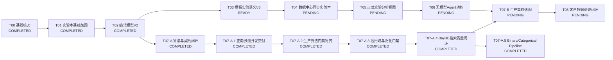

# AI配方预测与实验优化开发任务总表

> 文档状态：持续维护  
> 当前版本：V1.0  
> 最后更新：2026-08-27  
> 适用范围：模板中心、数据中心、实验本、AI配方预测、AI实验优化  
> 关联设计：[轻量版AI配方预测与实验优化详细设计方案_V1.0.md](./轻量版AI配方预测与实验优化详细设计方案_V1.0.md)

---

## 1. 文档用途

本文件是AI配方预测与实验优化后续开发任务的唯一维护入口。

- 后续调整任务范围、依赖、接口、状态和验收标准时，只修改本文件。
- T00、T01、T02已有实施报告继续作为完成证据，不再承担后续任务规划。
- 详细设计文档负责说明产品和技术方案，本文件负责说明“下一步开发什么、做到什么算完成”。
- 聊天中的讨论只有写入本文件后，才视为正式开发任务变更。
- 每完成一个任务，在本文件更新任务状态、实际变更、验证结果和下一任务入口。

状态定义：

| 状态 | 含义 |
|---|---|
| `COMPLETED` | 已实现并取得验证结果 |
| `IN_PROGRESS` | 当前正在开发，只允许一个任务处于该状态 |
| `READY` | 依赖已满足，可以开始开发 |
| `BLOCKED` | 存在明确阻断条件，暂时不能继续 |
| `PENDING` | 依赖尚未完成 |

---

## 2. 已确认的总体决策

### 2.1 客户功能

客户最终只使用两个AI功能：

1. **AI配方预测**：输入目标性能和限制条件，输出4个候选配方。
2. **AI实验优化**：选择现有实验或候选配方，输出下一轮最值得开展的4组实验。

客户不操作训练数据集、模型参数、训练任务、模型发布和模型版本。

### 2.2 数据职责

```text
模板中心发布模板
→ 数据中心选择模板并上传
→ Sheet、字段、异常和数据确认
→ 保存结构化字段及来源坐标
→ 按需同步为实验本DRAFT
→ 人工审核成为COMPLETED
→ Agent分析与后续建模
```

- 模板中心负责来源字段和结构的可复用解释。
- 数据中心是Excel物理解析、字段映射、校验和来源追溯的唯一责任点。
- 实验本不再独立实现一套Excel字段映射逻辑。
- 实验本是唯一正式实验主数据；只有`COMPLETED`实验版本可以进入AI统计和模型快照。
- `data.data_record/data.data_value`继续作为结构化字段明细和追溯数据，不等于正式实验。
- 现有`ai.training_dataset`和`ai.training_dataset_record`保留兼容，但新AI方案不消费它们。

### 2.3 Excel导入入口

- 数据中心保留现有复杂映射能力，不进行简化或重写。
- 数据中心仍由用户明确选择已发布模板，不自动替用户选择模板。
- 数据中心不增加“去模板中心新建模板”入口。
- 实验本中的Excel上传入口可以保留，但它只是数据中心导入工作台的入口。
- XLSX、XLS、CSV必须复用数据中心的解析、映射、校验和提交接口。
- Word、PDF和图片OCR暂时保留现有实验本直导流程，不纳入第一轮统一改造。

### 2.4 分类

以下分类继续独立，禁止按名称自动映射：

- 模板分类：模板中心归档模板。
- 来源归档分类：数据中心归档原始文件和导入结果。
- 实验分类：实验本组织研发实验。

同步实验本时必须明确选择目标实验分类。

### 2.5 迁移约束

- T01和T02未增加数据库迁移。
- 当前仓库已经存在`V45__knowledge_result_assets.sql`。
- T03不需要数据库迁移。
- T04如增加同步表和导入意图字段，迁移号固定从V46开始。

---

## 3. 任务依赖与当前状态



| 任务 | 名称 | 状态 | 主要交付 |
|---|---|---|---|
| T00 | 系统基线核对 | `COMPLETED` | 现状、缺口和复用结论 |
| T01 | 实验本代码基线加固 | `COMPLETED` | 来源、状态、权限和测试 |
| T02 | 实验编辑模型V2与版本锁定 | `COMPLETED` | V2模型、稳定itemId、无损保存 |
| T03 | 模板实验语义与V8导入契约 | `READY` | 实验模板语义和数据中心就绪信息 |
| T04 | 数据中心提交与实验本同步 | `PENDING` | 实验草稿组装、关联、幂等和冲突 |
| T05 | 正式实验分析视图与数据质量 | `PENDING` | `ExperimentAnalysisView`和质量门禁 |
| T06 | 无模型AI配方预测与实验优化 | `PENDING` | 案例、统计、规则和两个客户页面 |
| T07-A | 配方模型算法与契约闭环 | `COMPLETED` | 独立Python服务、模拟快照、评分模型和BayBE搜索 |
| T07-A.1 | 正向预测开发交付闭环 | `COMPLETED` | 内容寻址开发模型、X→多Y命令、HTTP实测和黄金契约 |
| T07-A.2 | 生产算法门禁对齐 | `COMPLETED` | 双Group CV、五模型竞争、统一UQ、Ordinal与配置化门禁 |
| T07-A.3 | 模型适用域与泛化门禁加固 | `COMPLETED` | OOD证据、嵌套Conformal、fold manifest、稳定性与批量基准 |
| T07-A.4 | AI实验优化与BayBE搜索质量闭环 | `COMPLETED` | 推荐前OOD门禁、四策略、冲突解释、多样性、空间统计和多轮回放 |
| T07-A.5 | Binary/Categorical Target Type扩展 | `COMPLETED` | 双Group CV分类竞争、OOF概率校准、分类Readiness/OOD；CENSORED_COUNT完整模型后置 |
| T07-B | 配方模型生产集成适配 | `PENDING` | T05/T06、数据库、异步任务和客户研究任务接入 |
| T08 | 客户数据接入与真实闭环验收 | `PENDING` | 客户数据清理、模型验证和回灌闭环 |

---

## 4. T00：系统基线核对

**状态：`COMPLETED`**  
**依赖：无**

### 目标

核对模板中心、数据中心、实验本、AI问答、异步任务、数据库和测试现状，确定哪些能力可以复用，哪些缺口必须补齐。

### 已完成内容

- 核对模板中心的结构识别、字段复核、版本和发布契约。
- 核对数据中心的模板选择、上传、解析、映射、异常、预览和提交。
- 核对`data_record/data_value/source_anchor`及遗留训练候选。
- 核对实验本的创建、编辑、审核、版本和审计。
- 核对Worker、Outbox、权限、项目关系和来源文件。
- 确认实验本是唯一正式实验主数据。
- 确认数据中心尚未同步实验本。

### 完成标准

- 形成可复用能力清单和P0缺口。
- 后续任务依赖和顺序明确。
- 不修改业务代码和数据库。

### 完成证据

[T00实施基线核对报告](./AI配方预测与实验优化_T00实施基线核对报告.md)

---

## 5. T01：实验本代码基线加固

**状态：`COMPLETED`**  
**依赖：T00**

### 目标

在模板和数据同步开发前，先稳定实验来源、状态机、版本保护、权限和审计契约。

### 已完成内容

- 统一实验来源：`PROJECT`、`TEMPLATE`、`MANUAL`、`EXCEL_IMPORT`、`OCR_IMPORT`。
- 禁止使用数据库不支持的`DATA_IMPORT`来源。
- 明确可编辑与不可编辑状态。
- 修复开始实验、提交、审核、退回、作废等权限映射。
- 修复创建审计操作者和实验负责人的混淆。
- 合并实验和项目同事的最新代码，清除冲突文件中的重复实现。
- 增加领域、服务、Repository和权限测试。

### 完成标准

- 状态转换只能经过统一状态机。
- 待审核、已完成和已作废实验不能原地修改。
- 来源值与数据库约束一致。
- 定向和全量测试通过。

### 完成证据

[T01实验本代码基线实施报告](./AI配方预测与实验优化_T01实验本代码基线实施报告.md)

---

## 6. T02：实验编辑模型V2与版本锁定修复

**状态：`COMPLETED`**  
**依赖：T01**

### 目标

保证未来从数据中心同步的配方、工艺、测试和来源字段在实验本保存时不丢失，并保护已完成版本。

### 已完成内容

- `edit_model_jsonb`增加`schemaVersion: 2`。
- 配方、工艺和测试项增加稳定`itemId`和`sourceRefs`。
- 配方项补充`materialId/materialCode/rawValue/rawUnit`。
- 测试项补充`testMethod/testCondition/substrate`。
- 后端通过深拷贝归一化保留未知扩展字段。
- 前端通过隐藏`itemId`列按原对象合并，避免行移动后来源字段串位。
- `PENDING_REVIEW`、`COMPLETED`和`VOIDED`禁止直接覆盖。
- 已完成实验必须创建修订草稿后修改。
- 历史V1模型兼容读取，不批量覆盖历史JSON。

### 验证结果

- 后端定向测试15项通过。
- 前端编辑模型测试6项通过。
- TypeScript、改动文件Lint和`git diff --check`通过。

### 完成证据

[T02实验编辑模型V2实施报告](./AI配方预测与实验优化_T02实验编辑模型V2实施报告.md)

---

## 7. T03：模板实验语义与V8导入契约

**状态：`READY`**  
**依赖：T02**  
**预计工程量：1～2周**

### 目标

基于现有模板中心和数据中心，明确“解析出来的字段将来如何进入实验本V2模型”，使数据中心能够判断某个模板是否具备生成实验草稿的条件。

T03只建立契约和就绪检查，不创建实验草稿。

### 7.1 V8模板级语义

新发布模板的导入契约升级为V8。历史V7契约保持不变并继续支持普通数据导入。

```json
{
  "importContractVersion": 8,
  "templateUsage": "EXPERIMENT_DATA",
  "experimentImport": {
    "recordMode": "BY_IDENTITY",
    "titleBindingId": "binding-title",
    "identity": {
      "identityType": "EXPERIMENT_NO",
      "sourceKind": "BINDING",
      "componentId": "component-basic",
      "bindingId": "binding-experiment-no"
    }
  }
}
```

固定枚举：

- `templateUsage`：`GENERAL_DATA`、`EXPERIMENT_DATA`。
- `recordMode`：`SINGLE_FILE`、`BY_IDENTITY`。
- `identityType`：`EXPERIMENT_NO`、`SAMPLE_NO`、`FORMULA_NO`、`BATCH_NO`。
- `sourceKind`：`BINDING`、`RECORD_IDENTITY`。

Excel中的实验编号是来源关联键，保存到`sourceExperimentNo`或`dynamicValues`；实验本内部`experimentNo`仍由系统生成。

### 7.2 复用现有数据区域

不增加独立`recordSet`实体。继续复用：

- `componentId`
- `parentBindingId`
- `recordIdentity`
- `recordAxis/repeatAxis`
- `recordProjection`
- `dataPath`

每个现有component增加：

```json
{
  "businessType": "FORMULA",
  "experimentScope": "DETAIL",
  "parentComponentId": "component-basic"
}
```

固定枚举：

- `businessType`：`BASIC`、`FORMULA`、`PROCESS`、`TEST`、`CONCLUSION`、`OTHER`。
- `experimentScope`：`DOCUMENT_CONTEXT`、`EXPERIMENT_RECORD`、`DETAIL`。

### 7.3 字段到实验V2的目标

需要进入实验本的binding增加`experimentField`，后端编译受控`targetPath`。

主要字段：

- 基础信息：来源实验编号、标题、目的、方案、日期、负责人。
- 配方：材料ID、编码、名称、比例、实际量、单位、原始值和原始单位。
- 工艺：步骤、操作、温度和时长。
- 测试：项目、结果、单位、判定、方法、条件和基材。
- 结论：结果状态、主要结论和失败分类。
- 其他字段：保存在`dynamicValues`，不得丢弃。

“实验目的”和“主要结论”不是模板发布和草稿生成的必填字段。缺失时由用户在提交实验审核前补齐。

### 7.4 模板中心改动

- 在现有识别复核页面增加模板用途和实验拆分方式。
- 在现有数据区域上增加业务类型和实验范围。
- `BY_IDENTITY`模式允许从现有字段或`recordIdentity`选择实验标识。
- 根据已确认`dataPath`、标准字段编码、字段名称和分组生成语义建议。
- 不增加新的识别Agent或新的大模型调用。
- 管理员只确认模板级选项和无法确定的字段。
- 发布时编译V8契约并生成确定性哈希。

发布阻断：

- 实验模板未选择拆分方式。
- `BY_IDENTITY`没有有效标识。
- `DETAIL`区域引用不存在的父区域。
- 多个字段映射到同一个单值实验字段。
- 明细区域没有稳定的记录边界。

缺少配方、工艺、测试、实验目的或结论只提示，不阻断通用实验草稿能力。

### 7.5 数据中心改动

`GET /api/v1/data/templates`增加：

```json
{
  "importContractVersion": 8,
  "templateUsage": "EXPERIMENT_DATA",
  "experimentImportReady": true
}
```

- 模板选择框显示“普通数据”或“可生成实验草稿”。
- 导入任务页只读展示实验拆分方式、标识字段和区域业务类型。
- V8契约语义进入预览和就绪检查，不改变现有解析与提交逻辑。
- T03提交数据后不得创建实验记录。

### 7.6 代码范围

后端重点：

- `TemplateImportContractCompiler`
- 模板发布校验和工作区服务
- `TemplateDataImportFacade`
- 数据中心模板列表和预览返回模型

前端重点：

- 模板识别复核和发布就绪提示
- 模板工作区类型
- 数据中心模板选择和导入任务语义摘要

### 7.7 测试

- 新发布模板生成V8契约和稳定哈希。
- 历史V7模板仍能解析和提交。
- 普通数据模板不要求实验语义。
- `SINGLE_FILE`不要求来源实验编号。
- `BY_IDENTITY`缺标识时不能发布。
- 行式、列式记录复用现有`recordIdentity`。
- 配方、工艺和测试区域正确生成目标字段。
- 未识别字段保留为动态值。
- 缺少实验目的和主要结论不阻止发布。
- T02全部回归测试继续通过。

### 7.8 真实页面验收

以“含氟树脂合成模板”的新修订版本验证：

1. 设置实验模板用途和实际拆分方式。
2. 确认基础信息、配方、工艺、测试和小结区域。
3. 发布V8模板。
4. 在数据中心明确选择该模板并上传真实数据。
5. 完成Sheet、字段、异常和提交操作。
6. 确认来源坐标和结构化值未改变。
7. 确认页面显示“可生成实验草稿”。
8. 确认本阶段没有创建任何实验。

### 完成标准

- V7兼容、V8可发布。
- 数据中心能判断模板是否可同步实验本。
- 不增加第二套区域或记录模型。
- 不增加数据库迁移。
- 前后端自动测试和真实页面测试通过。
- 生成独立T03实施报告并在本文件更新实际结果。

---

## 8. T04：数据中心提交与实验本同步

**状态：`PENDING`**  
**依赖：T03**  
**预计工程量：2～3周**

### 目标

把数据中心已确认并提交的结构化字段组装为实验本V2草稿，建立幂等、冲突和来源追溯关系。

### 8.1 数据库与任务

使用V46迁移增加：

- 导入任务的用途：`DATA_ONLY`或`EXPERIMENT_DRAFT`。
- 目标实验分类和同步选项。
- `data.import_experiment_link`。

关联表至少保存：

- `import_job_id`
- 稳定`source_record_key`
- `source_content_hash`
- 当前`data_record_id`，允许为空
- `experiment_id`
- `experiment_version_id`
- 同步状态
- 冲突原因和处理结果

增加异步任务：

- `DATA_TO_EXPERIMENT_SYNC`

### 8.2 统一入口

- 普通数据中心上传默认`DATA_ONLY`。
- 使用V8实验模板时，可以选择“仅保存数据”或“同时生成实验草稿”。
- 实验本Excel入口选择模板、实验分类和文件后，创建`EXPERIMENT_DRAFT`数据中心任务并进入现有导入工作台。
- 实验本不内嵌或复制一套映射页面。
- Word、PDF和图片OCR暂时继续走现有实验导入服务。

### 8.3 实验组装

实现`ExperimentAssembler`：

- `SINGLE_FILE`：一个文件组装一个实验草稿。
- `BY_IDENTITY`：按V8明确标识组装多个实验草稿。
- `DOCUMENT_CONTEXT`字段复制到文件内适用实验。
- `DETAIL`按父区域或相同标识进入对应实验。
- 配方、工艺和测试项生成稳定`itemId`和完整`sourceRefs`。
- 无法确定关联的数据保留为待关联，不自动猜测。

### 8.4 幂等和冲突

- 相同来源记录键和内容哈希：返回已有实验关联，不重复创建。
- 相同来源编号但内容不同：生成冲突，不覆盖已有实验。
- 目标实验仍是草稿：允许用户选择创建修订或新实验。
- 目标实验已完成：只能创建修订草稿或新实验。
- 无共同编号的多Sheet或多文件不能自动合并。
- 重新提交导致`data_record.id`变化时，关联仍以稳定记录键和内容哈希识别。

### 8.5 接口

```http
GET  /api/v1/data/import-jobs/{id}/experiments
POST /api/v1/data/import-jobs/{id}/experiment-links
POST /api/v1/data/import-jobs/{id}/experiment-sync
GET  /api/v1/data/import-jobs/{id}/experiment-sync-status
```

创建数据中心任务的请求增加导入用途和目标实验分类。旧客户端不传时默认`DATA_ONLY`。

### 8.6 权限

- 普通数据提交继续使用现有数据权限。
- 生成实验草稿还必须拥有`experiment.create`。
- 修改已有实验或创建修订必须拥有`experiment.update`。
- 用户只能同步自己有权查看的项目、来源数据和实验分类。

### 8.7 测试与完成标准

- 一行一个实验、一列一个实验均正确组装。
- 同Sheet多个区域正确关联。
- 多Sheet只按明确标识关联。
- 无共同编号时不合并。
- 重复导入幂等。
- 同编号不同内容产生冲突。
- 配方、工艺、测试及来源字段无损进入V2模型。
- 数据中心与实验本可以双向查看来源关系。
- 创建的实验状态只能是`DRAFT`。
- 自动测试和真实页面测试通过。
- 生成独立T04实施报告。

---

## 9. T05：正式实验分析视图与数据质量

**状态：`PENDING`**  
**依赖：T04**  
**预计工程量：1～2周**

### 目标

从`COMPLETED`实验版本生成统一只读分析视图，为相似实验、统计计算和后续模型提供唯一数据入口。

### 工作内容

- 实现非持久化`ExperimentAnalysisView`。
- 读取配方、工艺、应用条件、测试结果、结论和来源。
- 统一材料编码、别名和角色。
- 统一比例、质量、温度、时间、UV能量和膜厚单位。
- 同时保留测试原文和标准值。
- 区分测试方法、基材和应用条件。
- 建立配方谱系键和内容哈希。
- 实现案例质量门禁和模型质量门禁。

### 明确边界

- 不创建`ExperimentCase`数据库表。
- 不读取未完成实验作为正式案例。
- 不读取遗留`ai.training_dataset`。
- 未关联的数据中心记录只能用于原始文件问答和来源查看。

### 完成标准

- 每条分析记录可追溯到实验版本和来源单元格。
- 配方、工艺和测试缺失不会被错误补成0。
- `5B`、`OK`、外观和翘曲文本可以保留原文并生成标准表示。
- 不同方法、单位和基材不会错误混合。
- 自动测试通过并生成T05实施报告。

---

## 10. T06：无模型AI配方预测与实验优化

**状态：`PENDING`**  
**依赖：T05**  
**预计工程量：2～3周**

### 目标

在不依赖机器学习模型的情况下，先用正式实验、相似案例、简单统计和硬规则交付两个客户功能。

### 工作内容

- 实现相似实验强制过滤和加权排序。
- 实现加权中位数、范围、配对实验趋势和数据覆盖说明。
- 实现材料、比例、总量、组合、工艺、成本、库存和权限硬规则。
- 生成对照、保守、平衡和探索4类候选。
- 输出高、中、低可信度及降级原因。
- 实现研发Agent工具编排，但不建设算法工作台。
- 新增客户页面：
  - `/assistant/formula-prediction`
  - `/assistant/experiment-optimization`
- 候选只能由用户主动创建为实验本草稿。

### 客户接口

```http
GET  /api/v1/ai/formulation-readiness
POST /api/v1/ai/formula-predictions
POST /api/v1/ai/experiment-optimizations
GET  /api/v1/ai/research-runs/{runId}
POST /api/v1/ai/research-runs/{runId}/experiment-drafts
```

### 完成标准

- 没有模型时也能输出4个有证据、可解释、通过规则的候选。
- 无可行候选时返回冲突条件，不输出违规配方。
- 大模型不能编造材料比例和性能数值。
- AI结果不能自动成为正式实验或正式配方。
- 自动测试和真实页面测试通过并生成T06实施报告。

---

## 11. T07：配方预测模型与BayBE增强

**状态：T07-A、T07-A.1、T07-A.2、T07-A.3、T07-A.4、T07-A.5 `COMPLETED`；T07-B `PENDING`**  
**依赖：T07-A.5仅依赖现有T07-PRE算法核心；T07-B依赖T05、T06、T07-A.5及足够的正式实验数据**  
**预计工程量：3～5周**

### 11.1 分期边界

- `T07-A`、`T07-A.1`、`T07-A.2`、`T07-A.3`、`T07-A.4`、`T07-A.5`可与T03—T06并行，完成`jsd-aird-ai`独立计算服务、
  `formula-model.v1`契约、UV/PU任务档案、快照校验、五模型竞争、Ordinal预测、统一UQ、
  适用域/OOD证据、模型包、评分、BayBE推荐、容器和黄金数据测试；不增加Flyway，
  不修改客户页面。
- `T07-B`在T05/T06分支合并后完成正式`ExperimentAnalysisView`、案例基线和规则
  接入，以及数据库、对象存储授权、异步任务、激活/回退和客户研究任务增强。
- 详细设计见[T07_AI配方预测模型与BayBE增强_详细设计方案_V1.0.md](./T07_AI配方预测模型与BayBE增强_详细设计方案_V1.0.md)。

### 11.2 T07-A已完成内容

- 新增独立`jsd-aird-ai`服务、只读根文件系统/非root CPU容器和Compose配置。
- 建立`formula-model.v1` JSON Schema、Python Pydantic契约、Java传输DTO和UV/PU任务档案。
- 完成快照哈希、Parquet、source-map、配方总量、主树脂互斥、材料边界、共享工艺和
  序数值合法性校验。
- 完成按谱系5折GP/RF比较、分组相似案例基线、90%区间、逐目标双门槛和不可变模型包。
- 完成Sobol可行候选池、BayBE 0.15适配、四策略选择、冠军模型重评分和候选多样性约束。
- 原自定义Parquet由PyArrow读取为0行；已保留原件并从原始XLSX生成标准PyArrow验收副本。

### 11.3 T07-A验证结果

- Python测试14项通过，覆盖契约、快照、真实0/缺失、谱系隔离、四目标训练、
  序数目标降级、评分、推荐、生产阻断、鉴权和模型包防篡改。
- 修复快照核对为400行、40个谱系、67个来源Sheet；模拟快照始终保持
  `production_eligible=false`。
- 四个连续目标均达到开发门槛并产生模型卡；该指标只证明模拟数据算法闭环，不能
  作为生产效果证明。
- Java DTO已通过JDK 21隔离编译。仓库级Maven测试被现有RND代码
  `ResearchTestService:47`调用不存在的`parseSourceFile(...)`阻断，T07未修改该代码。
- Compose配置、容器安全边界静态测试、Python字节码编译、editable安装和`pip check`通过；
  当前机器Docker daemon未运行，因此实际镜像构建/容器探活需在Docker环境补跑。

### 11.4 T07-A、T07-A.1、T07-A.2、T07-A.3、T07-A.4与T07-A.5完成证据

[T07-A完整实施报告](./AI配方预测与实验优化_T07-A完整实施报告.md)

[T07-A.2实施报告](./AI配方预测与实验优化_T07-A.2实施报告.md)

[T07-A.3实施报告](./AI配方预测与实验优化_T07-A.3实施报告.md)

[T07-A.4实施报告](./AI配方预测与实验优化_T07-A.4实施报告.md)

T07-A.5的Binary/Categorical实现、分类黄金指标与验收结果已合并进入T07-A完整实施报告，
不再另建分散报告。

### 11.5 T07-A.1正向预测开发交付闭环

- 已用400条UV/PU模拟数据按当前任务档案完成训练，并生成SHA-256内容寻址的不可变
  开发模型包；活动指针只保存在本地`.runtime`，不提交Git。
- 已提供训练、本地直接评分和HTTP评分三个命令。示例X一次返回4个连续Y的期望值和
  90%区间；T07-A.2后序数硬度同步返回业务等级、等级概率和90%等级区间。
- 本地直接评分与真实FastAPI HTTP评分响应完全一致；服务无数据库配置启动，实测后已停止。
- 新增脱敏的共享黄金请求/响应，Java DTO、Python Pydantic和JSON Schema共用同一夹具。
- Python测试共17项通过，其中5项为黄金数据测试；模拟模型始终为
  `production_eligible=false`，不得用于生产激活。

### 11.6 T07-A.2生产算法门禁对齐

- 连续与序数目标均执行Lineage Group CV和Source Sheet Group CV；随机KFold只保留为
  默认关闭的诊断项，任何生产门禁不得读取随机KFold结果。
- 生产门槛、模型参赛样本门槛和近似平局顺序已集中到任务档案。当前连续/序数/二分类
  的生产样本门槛分别为80/100/80，三种Boosting模型的参赛门槛均为150。
- 连续目标统一比较GP、RF、LightGBM、XGBoost、CatBoost；同一目标共用相同数据行、
  相同Lineage/Sheet外层fold、相同开发KNN Baseline和相同指标。
- 五类连续模型均以group-isolated OOF残差校准90% conformal区间；GP额外保留原生后验
  区间，其他模型不伪造原生区间。
- 硬度改为累计Logistic序数分类，保留H/2H/3H/4H业务等级；CENSORED_COUNT已有契约与
  训练阻断，完整删失模型留待后续任务。
- 400条固定Synthetic快照训练完成，四个连续目标的冠军均为GP；该结论只描述固定开发
  快照，不能外推为客户真实数据的算法优劣。所有目标仍不可生产激活。

### 11.7 T07-A.3模型适用域与泛化门禁加固

- 每个目标按自身有效行构建独立适用域；数值训练范围、稳健分位边界、已知类别和
  跨谱系且跨Sheet最近邻距离共同决定`IN_DOMAIN/NEAR_BOUNDARY/OUT_OF_DOMAIN`。
- 正向预测逐目标返回最近训练行、距离阈值、未知类别、越界/临界字段和模型可用性；
  任一目标明确OOD时，整行标记`modelUsable=false`并给出未来T06降级所需原因。
- 连续目标90%区间改为内层Group OOF残差校准、外层Group独立验收，Lineage/Sheet
  分别统计真实PICP，禁止以外层验证目标参与本折区间半径校准。
- 模型卡固化有效行哈希、两套fold哈希及折大小、折间NMAE波动、依赖版本和算法等价
  哈希；训练/预测耗时作为运行观测返回但不进入核心制品身份。
- 提供多seed固定快照回放和1/20/100/1,000/20,000行批量评分基准工具；在线模型包
  仍只保存并加载每目标冠军，不常驻challenger。

### 11.8 T07-A.4 AI实验优化与BayBE搜索质量闭环

- 每个候选在冠军评分前执行逐目标适用域检查；任一目标`OUT_OF_DOMAIN`即剔除，
  `NEAR_BOUNDARY`只允许作为带风险标识的`EXPLORATORY`候选；只检查本次请求目标，
  模型包内未请求的Y不得影响候选淘汰。
- 推荐响应记录原始候选、材料约束淘汰、重复、OOD、Near Boundary、可评分空间、
  BayBE短名单和空间不足原因；固定值不得覆盖任务档案材料上下限。
- `CONTROL/CONSERVATIVE/BALANCED/EXPLORATORY`分别承担复测、低风险改善、多目标折中和
  信息增益职责；CONTROL明确返回精确baseline或最近可行替代来源；公式预测与实验优化
  使用不同排序路径。
- 候选输出配方差异、逐目标90%区间、域证据、历史/批次距离、改善/退让、结构化冲突、
  保守理由和探索价值，不输出因果化特征解释。
- 完成100条Round 0、5轮只读Synthetic回放，对比AI、随机可行和局部扰动；原快照前后
  SHA-256一致；保存共同最小预算、4/8/12/16预算检查点及探索点加入前后的held-out误差、
  PICP、区间、域覆盖和最近距离。结果只验证算法链，不能作为真实客户实验效率证明。

### 11.9 T07-A.5 Binary/Categorical Target Pipeline

- Binary与Categorical均支持LogisticRegression、RF、LightGBM、XGBoost和CatBoost公平竞争；
- 复用Lineage/Sheet双Group CV、统一有效行、OneHot/CatBoost原生类别双Feature Pipeline；
- 概率校准只读取外层训练折内部的Group OOF概率，分别记录raw/calibrated log loss、Brier/ECE；
- Binary门禁包含少数类数量、PR-AUC/F1/概率质量，Categorical包含每类数量、macro-F1、
  balanced accuracy和概率质量；单类别或类别严重不足返回`MODEL_NOT_READY`；
- Categorical冻结策略以双CV worst-side `selectionScore`最低值为冠军；近似平局带仅诊断，
  不能用固定算法名称覆盖数值更优模型；真实同分时依次比较双CV稳定性、概率质量、计算成本，
  最后才使用确定性模型顺序；当前固定Synthetic黄金冠军为XGBoost；
- 分类评分保留业务类名和全类别概率，并复用A.3 OOD；OOD时`modelUsable=false`；
- 使用独立120行Synthetic分类fixture验证算法，不修改原400条Continuous/Ordinal黄金快照；
- CENSORED_COUNT完整模型继续后置，当前不得静默转普通回归。

### 目标

在案例模式已经可用的基础上，增加配方性能评分模型和BayBE约束搜索，提高候选排序和下一轮实验选择质量。

### 工作内容

- 从`COMPLETED`实验版本生成不可变建模快照。
- 快照包含`measurements.parquet`、`source-map.parquet`和`manifest.json`。
- 建设轻量Python计算服务，不访问业务数据库。
- 首期建立一个`UVPU_APPLICATION_FORMULATION`模型包。
- 比较高斯过程和随机森林代理模型。
- BayBE负责约束搜索、多目标平衡和下一轮实验推荐。
- 模型只对候选评分，不绕过硬规则，不直接发布配方。
- 实现模型验证、启用、保留旧模型、失败降级和自动回退。

### 最低门槛

- 单个目标至少30条有效结果。
- 至少5个独立配方或实验分组。
- 测试方法、单位和上下文一致。
- 模型必须优于相似案例基线，否则继续案例模式。

### 完成标准

- Python只读取并验证不可变快照。
- 模型失败时无感退回案例、统计和规则模式。
- 历史模型、快照和预测结果不被覆盖。
- 模型候选全部经过Java硬规则复核。
- 自动测试通过并生成T07实施报告。

---

## 12. T08：客户数据接入与真实闭环验收

**状态：`PENDING`**  
**依赖：T07**  
**预计工程量：2～3周，不含客户数据确认等待时间**

### 目标

使用客户真实历史实验和新实验结果，完成从上传、审核、分析、推荐到结果回灌的真实闭环。

### 工作内容

- 盘点客户Excel模板、材料别名、单位、测试方法和编号完整性。
- 优先处理UV/PU应用配方任务。
- 建立必要的模板修订和材料映射。
- 批量导入历史数据并同步实验本草稿。
- 由客户审核形成正式实验版本。
- 验证案例模式和模型模式结果。
- 用真实实验验证4组建议并回灌结果。
- 校正门槛、规则、可信度和提示文案。

### 完成标准

- 每条建模记录都能追溯到`COMPLETED`实验版本。
- 至少一个客户目标通过模型门槛。
- AI配方预测输出4个合规候选。
- AI实验优化输出下一轮4组实验。
- 新实验结果可以关联原推荐并用于下一轮分析。
- 模型不合格时保持案例模式，不为验收强行启用。
- 形成客户验收报告和运维说明。

---

## 13. 后续维护规则

每次开始任务前，在本文件完成：

1. 核对上一任务状态和验收结果。
2. 将当前任务从`READY`改为`IN_PROGRESS`。
3. 根据最新代码调整文件范围和兼容边界。
4. 不依赖聊天中的旧结论覆盖仓库事实。

每次完成任务后，在本文件补充：

1. 实际完成内容。
2. 未完成或顺延内容。
3. 数据库迁移和接口变化。
4. 自动测试、构建和真实页面测试结果。
5. 实施报告链接。
6. 下一任务的准确入口。

如果本文件与旧版设计文档、旧实施报告或聊天记录冲突，以本文件中最后更新的任务定义为准；已完成任务的客观实施结果仍以对应实施报告和代码为准。
