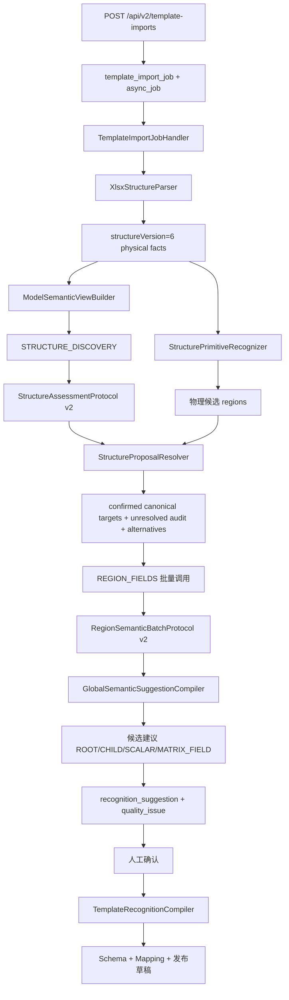

# Excel 模板导入识别后端代码审查

> 审查范围：`jsd-aird-api` 的 Excel 模板导入、物理结构解析、大模型结构识别、区域字段识别、结构裁决、候选编译、审计入库和人工确认链路。  
> 结论基于当前工作区代码；实例生产单 Excel/照片导入属于 `mfg.ingest` 独立链路，本文只在最后说明隔离关系。

## 1. 先给结论

当前后端不是“把 Excel 直接丢给大模型，然后相信模型输出”，而是一个双源识别系统：

1. Apache POI 先把 OOXML 转成版本化的物理事实。
2. 规则识别器只根据边框、合并、输入面、重复方向和公式等事实提出物理候选。
3. 第一阶段大模型只看压缩后的物理事实，独立提出业务结构，不看到后端候选。
4. `StructureProposalResolver` 对物理候选和模型提议做严格签名比较、完整分区检查；置信度只用于排序/审计，不决定 canonical。
5. 第二阶段只向模型发送最终 confirmed canonical targets，一次批量识别区域名称、行属性、字段关系、可编辑性和数据来源。
6. 编译器将模型语义、物理表头和行属性回退合并成可审查的候选；只有明确接受且满足绑定规则的候选才进入模板 Schema/Mapping。
7. 每次模型调用、自动重试、响应校验、结构冲突和质量问题都有独立审计记录。

因此，页面上看到的“字段”“结构候选”“质量问题”不是同一层数据。最容易造成误解的是：

- 结构根节点、`SEMANTIC_MODEL`、运行时矩阵列槽位不是普通字段。
- 模型独有区域保留在 `unresolvedStructureTargets` 审计中，不进入正式第二阶段。
- 核心表可以完成 `REGION_FIELDS`，但只要还有页眉/页脚或结构冲突未解决，整次运行仍然是 `REVIEW_REQUIRED`。

## 2. 总体调用链



入口代码：

- 创建、查询、建议、调用、删除和重试 API：[`TemplateImportController.java`](../jsd-aird-api/src/main/java/com/jsd/aird/tpl/adapter/in/web/TemplateImportController.java#L20-L118)
- 异步任务分发：[`TemplateImportJobHandler.java`](../jsd-aird-api/src/main/java/com/jsd/aird/tpl/application/TemplateImportJobHandler.java#L13-L49)
- 主流程：[`TemplateImportService.java`](../jsd-aird-api/src/main/java/com/jsd/aird/tpl/application/TemplateImportService.java#L307-L770)

## 3. 第一层：Excel 物理解析

### 3.1 `XlsxStructureParser` 做什么

[`XlsxStructureParser.parse`](../jsd-aird-api/src/main/java/com/jsd/aird/tpl/infrastructure/XlsxStructureParser.java#L42-L222) 使用 Apache POI 读取每个工作表，保留：

- 单元格值、公式和值类型；
- 合并区域；
- 行高、隐藏行、列宽、隐藏列；
- 边框、粗体、填充、数字格式和锁定状态；
- 数据验证；
- 原生 Excel Table 和命名区域；
- 可供 Univer 编辑器回填的 `initialEditorSnapshot`。

输出的结构摘要固定为 `structureVersion=6`。这是后续协议的硬门槛：

```java
if (format == TemplateFormat.XLSX && structureVersion != 6) {
    throw new IllegalStateException("Excel 识别仅支持 structureVersion 6");
}
```

### 3.2 物理事实不是业务字段

[`WorkbookPhysicalFactsBuilder`](../jsd-aird-api/src/main/java/com/jsd/aird/tpl/infrastructure/WorkbookPhysicalFactsBuilder.java#L25-L80) 将原始单元格整理成：

- `semanticCells`：`VALUE`、`FORMULA`、`INPUT_CANDIDATE`；
- `layoutSpans`：连续样式带；
- `borderSegments`：边框连续带；
- `rowProfiles`/`columnProfiles`：行列上的值、公式、样式空白统计；
- `structureHints`：工作表范围、隐藏表等事实提示。

空单元格只有同时具备下列证据，才会被识别为输入候选：未锁定、边框/填充/数字格式、数据验证、邻接标签或重复数据模式。代码见 [`looksLikeInput`](../jsd-aird-api/src/main/java/com/jsd/aird/tpl/infrastructure/WorkbookPhysicalFactsBuilder.java#L233-L294)。

这层不应该根据“光引发剂”“树脂”“测试”等业务词判断表类型。它只回答：

> 哪些格子有值？哪些格子可能可填？哪些格子重复？哪些边框/合并/公式形成了拓扑？

### 3.3 发给模型的是压缩物理视图

[`ModelSemanticViewBuilder`](../jsd-aird-api/src/main/java/com/jsd/aird/tpl/application/ModelSemanticViewBuilder.java#L28-L88) 会删除样式内部 ID、填充详情、数字格式等噪声，只保留模型需要的事实：

```json
{
  "structureVersion": 6,
  "factsViewVersion": 2,
  "structureProposalInput": "PHYSICAL_FACTS_ONLY",
  "sheets": [
    {
      "id": "sheet-1",
      "usedRange": "A1:J27",
      "semanticCells": [],
      "mergedRanges": [],
      "borderSegments": [],
      "rowProfiles": [],
      "columnProfiles": []
    }
  ]
}
```

第二阶段会在同一构建器上追加 `semanticRegions`，并带上只读的 `canonicalBlockType`、`canonicalBlockRange`、`canonicalStructure`。模型不能修改这些几何值。

## 4. 物理结构识别：ROW_TABLE、COLUMN_TABLE、MATRIX

### 4.1 `StructurePrimitiveRecognizer`

[`StructurePrimitiveRecognizer.recognize`](../jsd-aird-api/src/main/java/com/jsd/aird/tpl/application/StructurePrimitiveRecognizer.java#L39-L59) 按每个 Sheet 依次检测：

1. 矩阵/网格表面；
2. 普通表单区域；
3. 重复行；
4. 静态说明和文本区域。

它只输出 `PROVISIONAL` 物理候选，不会直接产生标准字段或正式 Mapping。

### 4.2 拓扑分类器

启用 `template-recognition.topology-v2.enabled` 后，`TableTopologyClassifier` 只判断重复方向：

```java
if (evidence.explicitColumnMemberCount() >= 2
        && evidence.leftLabelRowCount() >= 2
        && evidence.crossSurfacePresent()) {
    return Topology.MATRIX;
}

if ("COLUMN".equals(evidence.recordAxis())
        && evidence.explicitColumnMemberCount() == 0
        && evidence.leftLabelRowCount() >= 3
        && evidence.dataColumnCount() >= 3
        && evidence.bodyRowCount() >= 4) {
    return Topology.COLUMN_TABLE;
}
```

当前通用规则的关键语义是：

- 左侧是属性、右侧每列是一个对象：`COLUMN_TABLE`；
- 行成员和列成员都是业务轴、交叉格表达同一个度量：`MATRIX`；
- 只有一轴/二轴证据不足：`UNKNOWN`，进入人工复核。

`COLUMN_TABLE` 输出 `recordAxis=COLUMN`、`headerRange`、`dataRange`、`recordProjection.mode=COLUMN_RECORDS`；不再携带矩阵四范围。真实矩阵必须同时具备 `cornerRange`、`rowHeaderRange`、`columnHeaderRange`、`crossDataRange`，并通过严格宽高校验。

### 4.3 这一步能避免什么错误

例如 `A4:H19` 的左侧是行属性、右侧是多个记录列时，拓扑 v2 应输出：

```json
{
  "blockType": "COLUMN_TABLE",
  "range": "A4:H19",
  "structure": {
    "headerRange": "A4:H4",
    "dataRange": "A5:H19",
    "recordAxis": "COLUMN",
    "semanticMode": "COLUMN_RECORDS",
    "recordProjection": {
      "mode": "COLUMN_RECORDS",
      "recordColumns": ["C", "D", "E", "F", "G", "H"]
    }
  }
}
```

它不应被误拆成多个 `MATRIX`。对应回归测试见 [`StructurePrimitiveRecognizerTest`](../jsd-aird-api/src/test/java/com/jsd/aird/tpl/application/StructurePrimitiveRecognizerTest.java#L12-L97)。

## 5. 第一阶段大模型：`STRUCTURE_DISCOVERY`

### 5.1 请求构造

[`OpenAiCompatibleRecognitionClient.requestBody`](../jsd-aird-api/src/main/java/com/jsd/aird/tpl/infrastructure/OpenAiCompatibleRecognitionClient.java#L488-L530) 调用 OpenAI-compatible：

```text
POST {app.model.base-url}/chat/completions
Authorization: Bearer {api-key}
```

请求特点：

- `temperature=0.0`；
- 默认 `response_format=json_schema`；
- 结构阶段使用 `template_structure_proposal_v2`；
- 默认结构思考预算 4096，最大完成 token 12000；
- 视觉模式开启时，向 user message 追加渲染图；
- 请求和响应都经过脱敏，审计保存哈希和压缩后的 payload。

### 5.2 Prompt 约束

结构阶段 system prompt 明确要求模型只能返回：

```json
{
  "recognitionProtocolVersion": 2,
  "proposals": [],
  "qualityIssues": []
}
```

模型必须返回：

- `ROW_TABLE`：`headerRange`、`dataRange`、`recordAxis=ROW`；
- `COLUMN_TABLE`：`headerRange`、`dataRange`、`recordAxis=COLUMN`；
- `MATRIX`：四个矩阵范围和完整轴；
- `FORM_REGION`：表单区域；
- 不确定时 `UNKNOWN`。

模型不能返回 `candidateRef`、`fieldRelations`、`bindings`、`recordProjection` 等后端派生字段。这样做是为了避免模型看到后端候选后只“盖章确认”。

### 5.3 协议校验

[`StructureAssessmentProtocol`](../jsd-aird-api/src/main/java/com/jsd/aird/tpl/infrastructure/StructureAssessmentProtocol.java#L19-L143) 会逐项检查：

- 顶层 key 和协议版本；
- `proposalId` 唯一；
- Sheet 存在；
- range 在 usedRange 内；
- 所有子范围在总范围内；
- 普通表必须有 header/data 和正确 recordAxis；
- 矩阵四个范围齐全、列标题与交叉区等宽、行标题与交叉区等高。

非法项不会让整次响应失败，而是转成 `INVALID_STRUCTURE_PROPOSAL`、`MISSING_TABLE_GEOMETRY` 或 `MISSING_MATRIX_GEOMETRY` 质量问题并保留原始提议审计。

## 6. 结构裁决：为什么不会再把三块区域做“三选一”

核心类是 [`StructureProposalResolver`](../jsd-aird-api/src/main/java/com/jsd/aird/tpl/application/StructureProposalResolver.java#L34-L222)。它按以下顺序处理：

### 6.1 精确一致

`signature` 包含：

- Sheet；
- 类型；
- 总范围；
- 矩阵 corner/rowHeader/columnHeader/crossData；
- 普通表 header/data/total；
- `recordAxis`。

只有签名完全一致才写入：

```json
{
  "canonicalStatus": "CONFIRMED",
  "structureStatus": "CONFIRMED",
  "modelAssessmentVerdict": "MODEL_AGREES"
}
```

### 6.2 严格模型分区

如果一个物理候选与多个模型区域相交，代码会检查：

1. 同 Sheet；
2. 每个模型区域范围合法；
3. 模型区域两两不重叠；
4. 每个模型区域都与物理候选相交；
5. 交集面积总和等于物理候选面积；
6. 非矩阵物理候选不允许被多个错误 `MATRIX` 替换。

满足时，结构方案不是“三选一”，而是：

```json
{
  "resolutionStatus": "AUTO_RESOLVED",
  "resolutionReason": "MODEL_PARTITION_EXACT_COVER",
  "selectedAlternativeId": "...-model-partition",
  "alternatives": [
    {"alternativeId": "...-physical", "regions": [{"type": "MATRIX", "range": "A4:J6"}]},
    {"alternativeId": "...-model-partition", "regions": [
      {"type": "FORM_REGION", "range": "A1:J5"},
      {"type": "ROW_TABLE", "range": "A6:J22"}
    ]}
  ]
}
```

被否决的物理误判进入 `suppressedRegions`，模型分区的每个成员分别进入 canonical regions，并且都带有同一个 `resolutionGroupId`/`resolutionAlternativeId`。

### 6.3 双源严格一致

物理候选和模型候选不一致时，不以置信度决定 canonical。Resolver 始终
生成物理方案与模型方案的 `STRUCTURE_CONFLICT`，等待人工选择。只有两种
几何不变量可以自动确认：

- `EXACT_SIGNATURE_AGREEMENT`：Sheet、类型、范围、表头/数据区、记录轴和矩阵几何全部一致；
- `MODEL_PARTITION_EXACT_COVER`：模型分区同 Sheet、合法、互不重叠，交集并集完整覆盖物理候选。

高置信度只作为物理提议的排序和审计信息，不会抑制模型提议，也不会生成
旧版物理优先自动裁决记录。

### 6.4 普通冲突和模型独有区域

不能严格证明一致时，才生成真正需要人工选择的 `conflictGroups`。模型只提出而物理没有对应区域的，进入 `regions` 但状态是：

```text
canonicalStatus=PROVISIONAL
structureStatus=UNRESOLVED
pendingReason=MODEL_ONLY_STRUCTURE
```

它们进入 `unresolvedStructureTargets` 审计数组，不会进入正式
`semanticTargets`，也不会调用 `REGION_FIELDS` 或计入 coverage。

## 7. 第二阶段大模型：`REGION_FIELDS`

### 7.1 调度条件

当前实现只有 confirmed canonical target 才会执行一次批量区域语义调用：

```java
if (!semanticTargets.isEmpty() && globalSucceeded) {
    var batchContext = semanticViewBuilder.build(...);
    var semanticRegions = batchContext.putArray("semanticRegions");
    for (var region : semanticTargets) {
        semanticRegions.add(semanticRegionContext(region));
    }
    var batch = recognitionModelClient.recognize(
        new RecognitionModelClient.RecognitionRequest(
            importJobId, recognitionRunId, format, sourceFileName,
            "workbook-regions", batchContext, visualInput, "REGION_FIELDS"
        )
    );
}
```

这段逻辑位于 [`TemplateImportService.recognizeInStages`](../jsd-aird-api/src/main/java/com/jsd/aird/tpl/application/TemplateImportService.java#L664-L765)。因此：

- 已确认核心表会获得正式语义候选；
- 模型独有的基本信息/字段区保留结构方案，必须人工选中后才调用；
- 页脚未确认不会阻塞已确认核心表调用，但不计入已覆盖区域；
- 任何第二阶段返回没有匹配 `regionId/blockId/candidateRef` 的结果都会生成 `SEMANTIC_REGION_NOT_CANONICAL`，不进入正式 Mapping。

### 7.2 v2 批量语义协议

[`RegionSemanticBatchProtocol`](../jsd-aird-api/src/main/java/com/jsd/aird/tpl/infrastructure/RegionSemanticBatchProtocol.java#L14-L160) 要求：

```json
{
  "recognitionProtocolVersion": 2,
  "regions": [
    {
      "regionId": "后端提供的稳定 ID",
      "businessName": "生产明细",
      "rowDimensions": [],
      "rowAttributes": [],
      "fieldRelations": [],
      "qualityIssues": []
    }
  ],
  "qualityIssues": []
}
```

模型只能补充业务含义，不能修改几何。字段关系的 `labelRange`/`valueRange` 必须在区域范围内；`editability` 与 `valueSource` 分开判断；矩阵 `fieldRelations` 强制清空，矩阵轴/指标由后端矩阵编译器生成。

### 7.3 模型漏返回时的回退

[`addMissingSemanticFallbacks`](../jsd-aird-api/src/main/java/com/jsd/aird/tpl/application/TemplateImportService.java#L963-L992) 会为没有语义结果的 target 生成待复核结构候选，并标记：

```json
{
  "semanticFallback": true,
  "nameSource": "PHYSICAL_HEADER_FALLBACK",
  "reviewRequired": true,
  "pendingReason": "SEMANTIC_REGION_NOT_RETURNED"
}
```

这保证模型漏答不会导致页面完全没有区域，但也不会伪装成已识别成功。

## 8. 字段语义编译

### 8.1 普通字段

[`GlobalSemanticSuggestionCompiler.relation`](../jsd-aird-api/src/main/java/com/jsd/aird/tpl/infrastructure/GlobalSemanticSuggestionCompiler.java#L431-L514) 将字段关系编译成 `SCALAR_FIELD`：

- 稳定 `relationId`、`fieldId`、`bindingId`；
- `fieldName`、`fieldCode`、`dataPath`；
- `valueType`、`required`、`editability`、`valueSource`；
- 标准字段匹配状态；
- `locator.labelRange/valueRange`；
- `nameSource`、`semanticFallback`、`reviewRequired`。

字段名称优先使用模型业务名称；模型返回空名称时从物理标签范围推断。推断成功标记 `PHYSICAL_HEADER_FALLBACK`，不能匹配标准字典时标记 `UNMATCHED`。

### 8.2 ROW_TABLE/COLUMN_TABLE

表格先生成一个 `ROOT` 区域，再生成独立的 `TABLE_CHILD_FIELD`。子字段继承：

```json
{
  "regionId": "父区域",
  "blockId": "父 block",
  "parentBlockId": "父 parentBlock",
  "candidateRef": "父候选",
  "parentRelationId": "父关系",
  "parentFieldId": "父 fieldId",
  "parentBindingId": "父 bindingId",
  "mappingKind": "REPEAT_FIELD"
}
```

代码见 [`tableChildren`](../jsd-aird-api/src/main/java/com/jsd/aird/tpl/infrastructure/GlobalSemanticSuggestionCompiler.java#L775-L910)。这样第二阶段即使返回多个表字段，也不会丢失父区域身份。

对于 `COLUMN_TABLE`，如果模型没有返回 `rowAttributes`/`fieldRelations`，编译器从左侧最近的物理标签带生成列字段：

```json
{
  "name": "测试项目",
  "sourceRange": "A5:A5",
  "role": "ROW_ATTRIBUTE",
  "nameSource": "PHYSICAL_HEADER_FALLBACK",
  "semanticFallback": true,
  "reviewRequired": true
}
```

再把标签范围与 C:H 记录列组合成每个字段的值范围。这是解决“应用测试报告很多字段没有”的通用回退，不依赖文件名或固定坐标。

### 8.3 MATRIX

矩阵由 `CanonicalMatrixCompiler` 生成：

- `rowSlots`：行成员/行维度；
- `columnSlots`：列成员运行时槽位；
- `matrixModel`：轴和交叉指标；
- `recordProjection`；
- `longTableModel`；
- `MATRIX_FIELD`：命名的行轴、行属性、交叉指标待复核项。

不会把每个交叉单元格变成一个普通字段。`tableChildren` 对矩阵直接返回空列表，避免旧问题“外观 B6、粘度 B7、列成员1、列成员2……”污染字段列表。

## 9. 正式 Mapping 的边界

模型结果只是候选。最终编译见 [`TemplateRecognitionCompiler.compile`](../jsd-aird-api/src/main/java/com/jsd/aird/tpl/application/TemplateRecognitionCompiler.java#L35-L220)：

```java
suggestions.stream()
    .filter(item -> "ACCEPTED".equals(item.decision()))
    .filter(item -> !"SEMANTIC_MODEL".equals(item.suggestionType()))
    .filter(item -> !isProtocolRejected(item.payload()))
    .filter(this::isFormalSuggestion)
    .filter(item -> parentStructureResolved(item, suggestions))
    .forEach(this::compileIntoSchemaAndMapping);
```

`RecognitionCandidatePolicy` 还会拒绝：

- `candidateOnly=true`；
- `reviewRequired=true`；
- `physicalStructureOnly=true`；
- `structureConflict=true`；
- `semanticConflict=true`；
- `requiresStandardConfirmation=true`；
- 协议拒绝或结构未确认候选。

因此“页面显示待复核”与“正式模板已发布”是两个不同状态，不能用字段数量推断发布成功。

## 10. LLM 调用、自动重试和审计

### 10.1 自动重试不是人工重试

配置：

```yaml
app:
  model:
    auto-retry-count: 2
```

含义：首次调用失败后，最多追加 2 次，总计 3 次。仅对以下情况自动重试：

- 网络连接失败；
- 读取超时；
- HTTP 408、429；
- HTTP 5xx。

不对 400/401/403/404、JSON 协议错误、字段协议错误、空响应、截断响应和业务语义非法重试。实现见 [`OpenAiCompatibleRecognitionClient.recognizeInternal`](../jsd-aird-api/src/main/java/com/jsd/aird/tpl/infrastructure/OpenAiCompatibleRecognitionClient.java#L163-L430)。

每次尝试独立生成 `callId`，并在 `recognition_call` 中记录：

```text
attempt=1, status=FAILED, httpStatus=500
attempt=2, status=SUCCEEDED, parentCallId=<attempt-1-callId>
```

### 10.2 人工重试

人工使用现有接口：

```http
POST /api/v2/template-imports/{importJobId}/retry
Content-Type: application/json

{
  "source": "CURRENT_DRAFT_SNAPSHOT",
  "baseWorkspaceHash": "..."
}
```

它校验：

- 导入任务状态为 `PARSED` 或 `FAILED`；
- 有本任务生成的 DRAFT 模板；
- 草稿是 XLSX；
- `baseWorkspaceHash` 未过期；
- 同一任务没有并发识别。

当前没有人工次数上限；`retry_count` 只是审计统计。人工重试会创建新的 `recognition_run`，通过 `parent_run_id` 指向上一运行，不修改历史运行。

## 11. 数据库持久化口径

主要表定义见 [`V2__template_center.sql`](../jsd-aird-api/src/main/resources/db/migration/V2__template_center.sql#L191-L430)：

| 表 | 作用 |
|---|---|
| `tpl.template_import_job` | 一次上传/识别任务 |
| `tpl.recognition_run` | 一次完整识别运行，人工重试新增一行 |
| `tpl.recognition_call` | 每次 LLM 尝试，含 attempt/parentCallId |
| `tpl.recognition_suggestion` | 规则、物理、模型和人工候选 |
| `tpl.recognition_trace` | 协议恢复、结构冲突等追踪事件 |
| `tpl.template_quality_issue` | 可修复/需复核的质量问题 |
| `tpl.template_version`/`tpl.template_mapping` | 人工确认后的正式模板定义 |

`JdbcTemplateImportRepository` 的列表查询用 LATERAL 选择同一任务最新 run，建议和质量问题默认只统计最新运行；历史 run 仍保留。`replaceModelSuggestions`/`replacePhysicalSuggestions` 只删除同一个 run、同一个 source 的候选，不会覆盖旧 run。

质量问题写入前会把内部的 `OPEN/PENDING` 映射成数据库允许的 `DETECTED`，避免 PostgreSQL check constraint 错误：

```java
private String qualityIssueStatus(String status) {
    return switch (status == null ? "" : status) {
        case "DETECTED", "AUTO_APPLIED", "CONFIRMED", "IGNORED", "ROLLED_BACK", "FAILED" -> status;
        case "OPEN", "PENDING", "" -> "DETECTED";
        default -> "DETECTED";
    };
}
```

## 12. 状态如何解释

### 12.1 运行状态

| 状态 | 含义 |
|---|---|
| `RUNNING` | 识别仍在执行 |
| `COMPLETED` | 模型调用和协议完成，但不代表所有字段已发布 |
| `PARTIAL` | 有调用成功但有失败/恢复诊断 |
| `FAILED` | 识别调用失败且没有可用建议 |

### 12.2 结果状态

| 字段 | 含义 |
|---|---|
| `recognitionStatus=COMPLETE` | 所有期望区域均覆盖且无结构诊断 |
| `recognitionStatus=REVIEW_REQUIRED` | 仍有未覆盖、冲突、模型独有或回退区域 |
| `canonicalStatus=CONFIRMED` | 全部正式结构区域已确认 |
| `publicationReadiness=READY` | 可以进入正式模板编译/发布 |
| `modelStatus=COMPLETED/PARTIAL/TRUNCATED` | LLM 传输/协议层状态，不等价于业务完整度 |

因此，生产任务单出现“核心明细已经有字段，但总体还是 REVIEW_REQUIRED”是设计结果：核心区域可先覆盖，页脚/基本信息等 target 仍需复核。

## 13. 当前实现的优点

1. **没有客户/文件名/固定坐标特判。** 结构判断基于事实和拓扑；模型名称只作为提示上下文，不参与 resolver 的自动确认条件。
2. **物理和模型解耦。** 模型第一阶段看不到后端候选，避免“模型确认模型自己的输入”。
3. **结构和语义分两阶段。** 结构协议不允许字段关系；区域协议不允许改几何。
4. **冲突可审计。** 自动采用、被抑制候选、替代方案、质量问题和调用轨迹均保留。
5. **矩阵和普通表分开。** 矩阵是轴/指标/槽位，ROW/COLUMN 表是记录集合和子字段。
6. **字段空名称不会静默进入正式 Mapping。** 物理表头/行属性回退带 `reviewRequired`。
7. **LLM 自动重试有边界。** 协议错误不会被重复调用掩盖；瞬时失败有 attempt 链。
8. **历史 run 不覆盖。** 重新识别默认只让最新 run 参与列表统计。

## 14. 仍需关注的风险和改进建议

这些不是“再给某个模板加规则”，而是值得纳入通用收口的工程项。

### P0：把识别结果和发布结果在接口层明确分开

当前 `recognitionStatus=COMPLETE` 只表示覆盖完成，正式 Mapping 仍要经过 `decision=ACCEPTED` 和 `RecognitionCandidatePolicy`。建议 API 响应中明确增加：

```json
{
  "recognitionComplete": true,
  "canonicalStructureConfirmed": true,
  "acceptedMappingCount": 12,
  "pendingReviewCount": 4,
  "publicationReady": false
}
```

否则前端容易把“识别完成”显示成“模板已经可用”。

### P1：限制配置异常导致的重试风暴

代码把 `autoRetryCount` 下限限制为 0，但没有上限。建议在配置绑定层限制为 `0..5`，并记录实际最大尝试次数。人工重试仍保持不限次数，但每次需要新 run 和 workspace hash。

### P1：`region_count` 的零区域口径

当前仓储层使用 `Math.max(1, regionCount)` 写入 `recognition_run.region_count`。空白工作簿或只有表单外文本时会被记成 1。建议改为允许 0，并在报表中区分 `NO_PHYSICAL_TABLE`。

### P1：模型独有区域的统计分层

未确认区域不进入 `semanticTargets`，但仍计入 coverage 的 expected/unresolved。前端应同时显示：

```text
核心 canonical 区域：2/2 已覆盖
模型独有待复核区域：2
整体识别状态：REVIEW_REQUIRED
```

不要只显示一个“覆盖率 50%”，否则用户会误以为核心表没有执行第二阶段。

### P1：矩阵生成名称的视觉提示

`matrixFields` 对没有名称的 MEASURE 会生成“交叉值”，同时标记 `GENERATED_PLACEHOLDER` 和 `reviewRequired=true`。这不会进入正式 Mapping，但前端必须显示“占位名，待命名”，不能显示成已识别字段。

### P2：网络错误和模型协议错误的监控分开

建议按 `phase`、`outcomeCode`、`errorType` 统计：

- `MODEL_OUTPUT_TRUNCATED`：token/提示过长；
- `INVALID_STRUCTURE_PROPOSAL`：模型提议几何非法；
- `SEMANTIC_REGION_NOT_CANONICAL`：第二阶段 ID 协议问题；
- `HTTP_429/5xx`：供应商瞬时错误；
- `EXACT_SIGNATURE_AGREEMENT`：双源签名一致自动确认次数；
- `MODEL_PARTITION_EXACT_COVER`：精确分区次数。

这样下一次问题可以定位到拓扑、模型、协议还是前端统计，不需要无限增加业务规则。

## 15. 建议的回归验收矩阵

### 15.1 自动化测试

```powershell
cd G:\Projects\jsd-aird\jsd-aird-api
& .\mvnw.cmd test
```

重点测试类：

- [`TableTopologyClassifierTest`](../jsd-aird-api/src/test/java/com/jsd/aird/tpl/application/TableTopologyClassifierTest.java)
- [`StructurePrimitiveRecognizerTest`](../jsd-aird-api/src/test/java/com/jsd/aird/tpl/application/StructurePrimitiveRecognizerTest.java)
- [`StructureProposalResolverTest`](../jsd-aird-api/src/test/java/com/jsd/aird/tpl/application/StructureProposalResolverTest.java)
- [`StructureAssessmentProtocolTest`](../jsd-aird-api/src/test/java/com/jsd/aird/tpl/infrastructure/StructureAssessmentProtocolTest.java)
- [`GlobalSemanticSuggestionCompilerTest`](../jsd-aird-api/src/test/java/com/jsd/aird/tpl/infrastructure/GlobalSemanticSuggestionCompilerTest.java)
- [`RecognitionCoverageValidatorTest`](../jsd-aird-api/src/test/java/com/jsd/aird/tpl/application/RecognitionCoverageValidatorTest.java)
- [`OpenAiCompatibleRecognitionClientTest`](../jsd-aird-api/src/test/java/com/jsd/aird/tpl/infrastructure/OpenAiCompatibleRecognitionClientTest.java)
- [`TemplateRecognitionCompilerTest`](../jsd-aird-api/src/test/java/com/jsd/aird/tpl/application/TemplateRecognitionCompilerTest.java)

必须覆盖：

| 场景 | 预期 |
|---|---|
| 物理 `COLUMN_TABLE` 与错误 `MATRIX` | 物理 canonical，模型 suppressed，无冲突组 |
| `A4:J6` 与 `A1:J5`+`A6:J22` | 严格完整覆盖，模型分区两个 canonical |
| 分区有空洞/重叠 | 两个方案集合，人工复核 |
| 真实二维矩阵 | 保留四范围和矩阵轴 |
| 模型空字段名 | 物理表头/行属性回退，`reviewRequired=true` |
| 第二阶段错误 regionId | `SEMANTIC_REGION_NOT_CANONICAL`，不保存正式字段 |
| 500/429/超时 | 自动重试并记录 parentCallId |
| 400/协议错误/截断 | 单次失败，不重复调用 |

### 15.2 数据库验收 SQL

把 `{import_job_id}` 替换成真实任务：

```sql
-- 最新运行和状态
SELECT id, status, run_reason, parent_run_id,
       region_count, call_count, succeeded_call_count, failed_call_count
FROM tpl.recognition_run
WHERE import_job_id = '{import_job_id}'
ORDER BY created_at DESC, id DESC
LIMIT 1;

-- 本次运行的阶段调用
SELECT phase, attempt, status, http_status, outcome_code,
       response_truncated, parent_call_id, started_at
FROM tpl.recognition_call
WHERE recognition_run_id = '{latest_run_id}'
ORDER BY started_at, attempt;

-- 核心字段、模型独有字段和结构候选分开看
SELECT suggestion_type, source, decision,
       payload_jsonb->>'fieldName' AS field_name,
       payload_jsonb->>'regionId' AS region_id,
       payload_jsonb->>'kind' AS kind,
       payload_jsonb->>'pendingReason' AS pending_reason,
       payload_jsonb->>'nameSource' AS name_source
FROM tpl.recognition_suggestion
WHERE recognition_run_id = '{latest_run_id}'
ORDER BY suggestion_type, created_at;

-- 质量问题只看最新运行
SELECT issue_type, severity, status, sheet_id, address, title
FROM tpl.template_quality_issue
WHERE recognition_run_id = '{latest_run_id}'
ORDER BY severity, created_at;
```

### 15.3 真实模板验收

至少重新导入以下结构事实：

1. 光引发剂对比测试：`A4:H19` 应为 `COLUMN_TABLE`；
2. 应用测试报告：两个纵向属性区共享记录列时应合并成 `COLUMN_TABLE`；
3. 生产任务单：核心 `ROW_TABLE`、基本信息 `FORM_REGION` 和字段区分别可见；
4. 真实二维矩阵：列成员、行成员和交叉数据完整时仍为 `MATRIX`；
5. 空白运行时列成员：显示 slot，不生成六个普通字段。

验收时不要只看页面。应同时确认：

- `recognition_call.phase` 有一次 `STRUCTURE_DISCOVERY` 和一次 `REGION_FIELDS`；
- `REGION_FIELDS` 的请求包含全部 semantic targets；
- 核心区域有 `TABLE_CHILD_FIELD`/`MATRIX_FIELD` 或普通 `SCALAR_FIELD`；
- 结构冲突组数不把 suppressed audit 算进去；
- 字段名称不为空，也不以 `column01`/`column02` 冒充业务名；
- 只有用户确认后，`tpl.template_mapping` 才增加正式绑定。

## 16. 与生产单实例导入的隔离

模板识别链路使用：

```text
tpl.template_import_job
tpl.recognition_run
tpl.recognition_call
tpl.recognition_suggestion
tpl.template_quality_issue
```

生产单 Excel/照片实例导入使用 `mfg.ingest` 的独立任务、实例识别客户端和实例值结果，不应创建模板识别 run，也不应修改已发布模板 Mapping。两条链路可以复用 Excel 解析器和多模态传输，但不能复用结构识别响应协议。

## 17. 最终判断

当前代码已经从“不断为某个模板加特判”收敛到通用规则：

- 物理层只识别拓扑；
- 模型层只提出结构和业务语义；
- resolver 只在严格证据下自动确认；
- 区域字段阶段不再被未确认页脚阻塞；
- 空字段名有物理回退且仍要求人工确认；
- 人工重试与 LLM 瞬时错误重试完全分开。

剩余问题主要是展示口径、统计分层、监控和少数边界条件，而不是继续增加客户模板特判。验收时应以“最新 recognition run + 阶段调用 + canonical/suppressed/semanticTargets + accepted mapping”四层数据联合判断。
